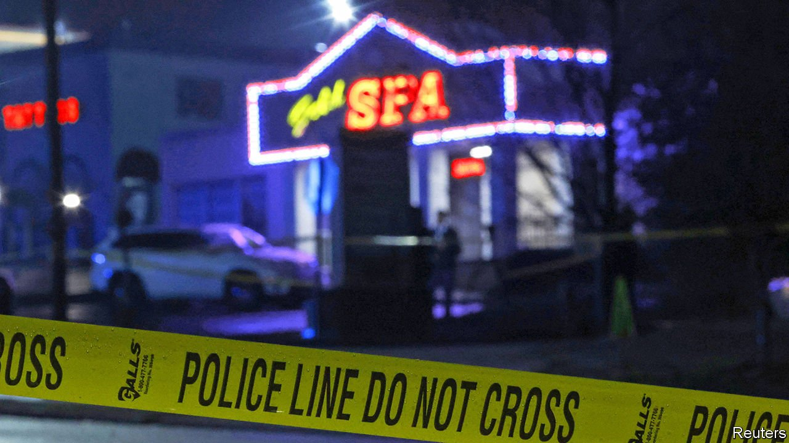

###### Murder in Atlanta

# A gruesome shooting in Atlanta leaves Asian-Americans frightened 

##### Hate crimes against Asians have surged during the pandemic 

 

> Mar 20th 2021 


THE STRETCH of Piedmont Road in north-east Atlanta is usually quiet and dreary. Cracked asphalt and faded street signs give the area a rundown look, and blacked-out windows suggest illicit activity. This is Atlanta’s red-light district. At night, multicoloured lights flash from shopfront windows in a futile effort to brighten the atmosphere.


On the evening of March 16th the colourful signage and lights illuminated a crime scene. Police officers guarded the perimeter of two spas, on opposite sides of the street, as other officers investigated a pair of shootings that left four people dead. An hour earlier another shooting, at Young’s Asian Massage in a nearby suburb, also killed four. Six of the eight dead were women of East Asian descent; the alleged shooter is a white man. Across the country, Asians and Asian-Americans wondered the same thing: was this yet another racially motivated crime against them?


Shameful episodes of anti-Asian discrimination litter American history. The Chinese Exclusion Act, signed into law in 1882, barred Chinese immigrants from citizenship until 1943. During the second world war around 120,000 Japanese Americans were put in concentration camps.


Anti-Asian sentiment has emerged again during the pandemic. The Centre for the Study of Hate and Extremism, a think-tank, found that whereas, overall, hate crimes dropped by 7% from 2019 to 2020, those against people of Asian descent rose by nearly 150%. Similarly, the Pew Research Centre, a pollster, reported in June 2020 that roughly two-fifths of Americans said that people expressed racist views about Asians more often than before the pandemic. Many fault Donald Trump, who referred to covid-19 as the “Chinese virus”, for emboldening people to act upon their prejudices.


Perpetrators often target Asian women. Stop AAPI Hate, a coalition of Asian advocacy groups, received 3,795 reports of anti-Asian incidents between March 2020 and February 2021—most of them from women. The incidents ranged from verbal harassment to being spat upon, a particularly vile act during a pandemic caused by a virus that spreads through respiratory droplets. The report contends that these are “only a fraction” of the incidents that have actually occurred. 


On the afternoon of March 17th police officers said that the alleged shooter—Robert Aaron Long, a 21-year-old charged with eight counts of murder and one of aggravated assault—appeared to have been motivated by sexual addiction. Online reviews of the attacked massage parlours indicate that they may have offered sexual services. At a press conference the day after the shootings, authorities said that he had “a bad day”, and saw the spas as a “temptation” that had to be eliminated. 


But the possibility that his actions were fuelled by racism has not been ruled out. The House Judiciary Committee announced it will hold a hearing on anti-Asian violence on March 18th. Even as a semblance of post-pandemic normality appears on the horizon, fear continues to grip America’s Asian communities. ■

