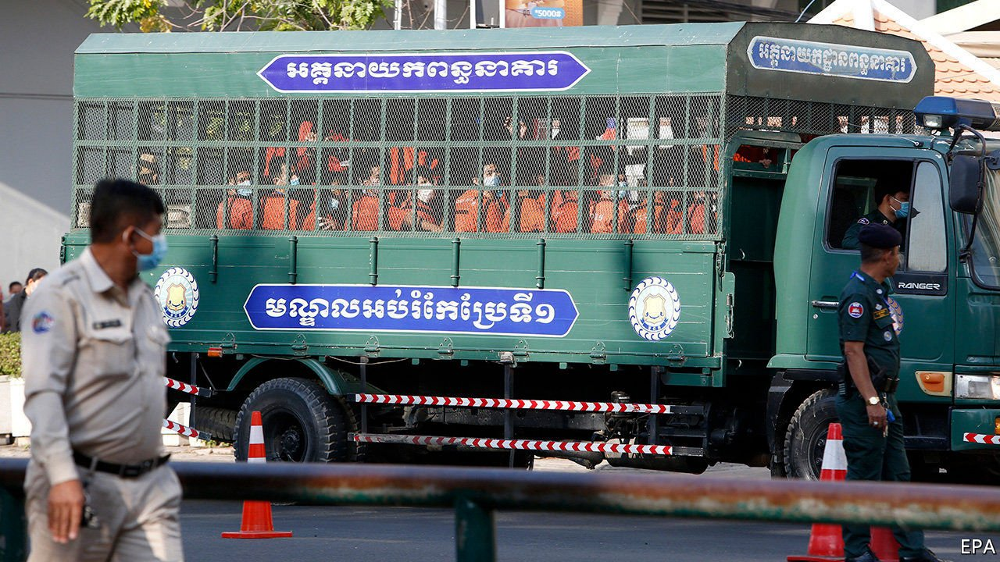

###### Stack ’em high

# Cambodia’s strongman is trying opposition politicians en masse 

##### But one lucky critic seems to be getting gentler treatment 

 

> Mar 25th 2021 

IT IS DIFFICULT for anyone to argue that Sam Rainsy, Cambodia’s leading opposition figure, is not guilty of the crimes for which he was sentenced on March 1st to 25 years in prison. That is because the charges were so nebulous as to encompass almost everything an opposition politician does. He was accused of attacking the country’s institutions, and encouraging others to do the same.

It is even harder for Mr Sam Rainsy to defend himself in person, since the government will not let him into the country. The prime minister, he explains, has threatened to shoot down any plane bringing him home from exile in France, “meaning I was not welcome”.


At the same trial, the municipal court in Phnom Penh, the capital, sentenced eight other senior members of the banned Cambodian National Rescue Party (CNRP), all of whom were absent, to between 20 and 22 years’ imprisonment. Some 150 lower-ranking members of the party are still on trial. To make the mass hearings more manageable, the defendants have been clumped into three different groups, of roughly 20, 60 and 70. Nobody is quite sure of the exact numbers. Chak Sopheap of the Cambodian Centre for Human Rights, a pressure group, calls it the “political instrumentalisation of the justice system”. Another observer describes it as “rule by law” rather than “rule of law”.

After the CNRP nearly unseated the ruling Cambodian People’s Party in national elections in 2013, Hun Sen, Cambodia’s strongman since 1985, set about dismantling it methodically. First he had the Supreme Court ban the party outright in 2017. After that the authorities began hounding its members. Even low-ranking activists in the provinces have been threatened or hauled into court. “People are really intimidated,” says Mr Sam Rainsy. “If they demonstrate they are met with violence. And if they continue they will be arrested.”

Yet one trial, against Kem Sokha, who founded the CNRP with Mr Sam Rainsy, is proceeding oddly slowly. Like other leaders of the party, he was barred from politics for five years when it was banned in 2017. But the authorities suspended a different case against him last year, ostensibly because of the dangers of holding hearings amid the pandemic. (Confusingly, the mass trials do not seem to worry anyone in that respect.) While he waits for the proceedings to resume, the courts have freed him from house arrest.

Most observers interpret all this as a transparent attempt to divide the opposition. The Khmer Times, a government mouthpiece, gleefully noted recently that supporters of the two founders “are becoming increasingly divided”.

Mr Hun Sen may be hoping to lure a faction of the CNRP to participate in municipal elections next year. The most recent general election, in 2018, at which the ruling party won 125 out of the 125 seats in the national assembly, was slightly embarrassing. The participation of some genuine opposition figures might help the next look like less of a sham.

But the European Union, at least, does not appear to have been fooled. On March 11th the European Parliament said it was “appalled” by human-right violations in Cambodia. Last year the EU imposed tariffs on about 20% of imports from Cambodia in protest at the government’s repression. Mr Sam Rainsy thinks more targeted measures are needed. The elite park their money, send their children to study and take agreeable holidays in the West, he says. “If measures affect their personal interest, they will react.” ■

