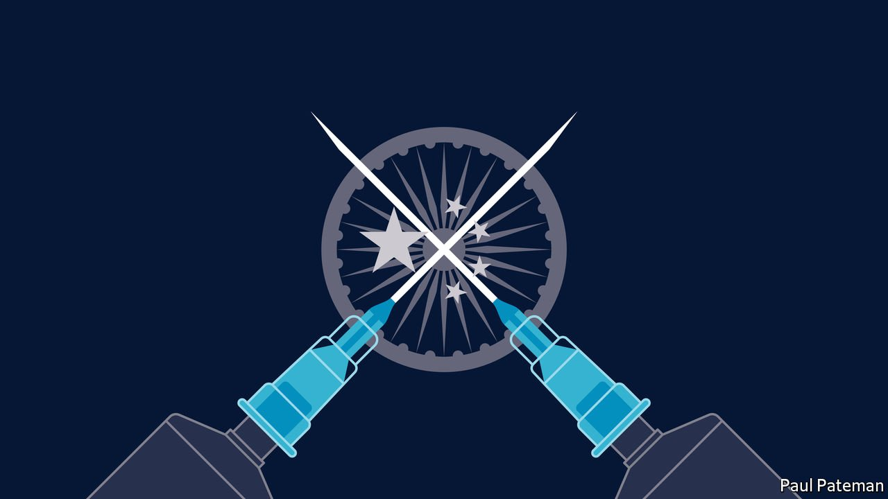

###### Banyan

# India and China are finding vaccine diplomacy tricky 

##### Helping both their own citizens and foreigners is an immense task 

 

> Mar 27th 2021 

A YEAR AFTER China barred entry to most foreigners as the covid-19 pandemic spread, its embassies in India and a score of other countries have just declared that they will make it easier for expatriates who had been living in China to return. They must be vaccinated first. But there is a bigger catch: only those who have received made-in-China shots need apply. India, for one, has not approved the use of any Chinese vaccine.

It is something of a public-relations own goal—a reminder of how the altruism that China’s “vaccine diplomacy” is intended to showcase is often undermined by grubbier calculations and missteps. Months ago China recognised that rich countries would be too busy getting their own populations jabbed to give serious thought to poorer places. China could both earn gratitude and present itself as a scientific, diplomatic and even moral powerhouse. More cynically, vaccine diplomacy was a tool to rewrite history: to change the narrative of China as the source of the plague to the world’s saviour from it.


Urged on by President Xi Jinping, the state pumped money into vaccine development and signed deals with dozens of countries. With vaccines that its leaders claimed would be cheaper and easier to store than those being developed in the West, China would change the course of the pandemic. The two leading producers, Sinovac and Sinopharm, claimed to be able to produce 2bn doses a year between them.

Yet China’s vaccine diplomacy has stumbled, and not only because of delayed production and shipment. China’s eagerness for countries to take its vaccines is matched by its reluctance to share the data from clinical trials. That is presumably because Chinese vaccines are less effective than Western ones. It all erodes trust. Singapore paid for the option of the Sinovac shot, among several ordered from around the world. Yet China “blew it”, in the words of an insider, when its embassy trumpeted the arrival of a Sinovac consignment last month before the Singaporean government had approved the drug. It will not do that without the data China declines to provide.

The Philippine government, which threw in its lot with China when coronavirus vaccinations began in March, is struggling to persuade a population badly hit by the pandemic to accept Chinese jabs. A scandal concerning a black market for unregulated shots, aimed mainly at Chinese workers, has not helped. Nor has the recent discovery of 200 Chinese vessels occupying a reef within what the Philippines considers its territorial waters. China, says Ronald Mendoza of Ateneo de Manila University, is not doing well at winning hearts and minds.

China has not blown it everywhere. A Chinese shot in the arm is surely much better than none at all. And countries such as Indonesia and Malaysia, which did not secure enough Western vaccines, are glad of Chinese help. Yet China is not the only Asian country capable of mass-producing vaccines and hoping to generate goodwill as a consequence. India is a vaccine giant, sitting at the heart of medical supply chains. Its manufacturers already play a big role in the production of AstraZeneca’s vaccine against covid-19. Russia depends on India for the global roll-out of its Sputnik vaccine.

India has been ramping up shipments to neighbours such as Bangladesh, Nepal and Sri Lanka. In fact, it has exported more doses (60m) than it has used at home (44m). In theory, its vaccine diplomacy was turbocharged at a recent virtual summit of the “Quad” grouping of Australia, India, Japan and the United States. The foursome agreed to fund the production of 1bn Indian-made vaccines for distribution to countries in need by the end of 2022.

Yet even more than China, India faces a tension between vaccinating its own vast population and helping other countries. A suffocatingly statist approach that initially excluded the private sector meant a slow start to its own vaccination programme, especially among the poor. This week it froze all exports of the AstraZeneca vaccine to ensure bigger supplies at home, amid a surging second wave of infections—an own goal of its own.

Shivshankar Menon, a former Indian foreign secretary, doubts that efforts at vaccine diplomacy alone, even when deftly handled, will do much to increase either China or India’s influence or standing. People see through claims of altruism, he says. But at least the Quad reflects an effort to do something for the global good—a collective response that has been all too rare in this pandemic.

