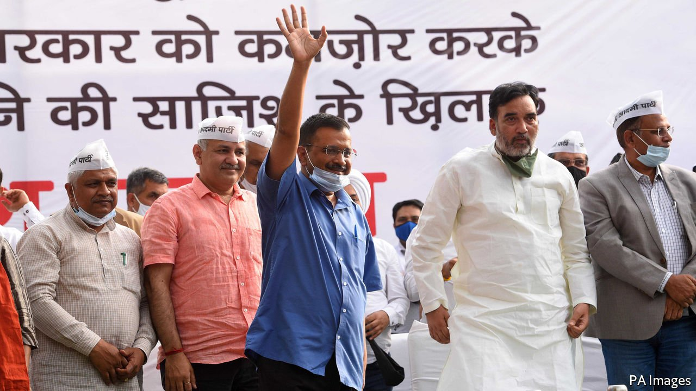

###### Downgrading Delhi

# India’s ruling party finds a new way to hamstring the opposition 

##### If you cannot win an election, just strip the winners of their powers 

 

> Mar 25th 2021 

WHEN NARENDRA MODI, India’s prime minister, stripped Kashmir of its statehood in 2019, most Indians cheered. The Muslim-majority territory had long been troublesome. The triumphal consensus was that Kashmir’s special autonomy, which Mr Modi abolished using all kinds of constitutional tricks, had only encouraged “anti-national” attitudes, and that Kashmir had got what it deserved.

Pratap Bhanu Mehta, an academic and columnist for the Indian Express, a national newspaper, was one of the few to raise misgivings. A government that gleefully twisted the law and suspended local democracy in one place could surely do the same in another. Mr Modi proposed to “Indianise” Kashmir, noted Mr Mehta. “Instead, what we will see is potentially the Kashmirisation of India.” 


Sooner and closer to home than anyone expected, Mr Mehta’s prediction has come to pass. On March 22nd Mr Modi’s Bharatiya Janata Party (BJP) rushed a bill through the lower house of parliament to strip the elected government of Delhi, the capital, of much of its power and hand this instead to the lieutenant-governor, an official who represents the central government. It won the approval of the upper house on March 24th. It is as if the state of New York, the population of which is similar to Delhi’s, were suddenly to be placed under the authority not of its legislature or elected governor, but of a bureaucrat appointed by a hostile Congress.

Even before Mr Modi’s power-grab, the administration of Delhi was convoluted. Formally it is one of India’s eight “union territories”, not one of its 28 fully fledged states. Yet since independence in 1947 the city had gained increasing powers of self-rule, including its own legislature and chief minister. In 2018 the Supreme Court further limited the role of the lieutenant-governor, affirming the primacy of the locally elected government. 

The new law adds to the contortions, but its intent is clear. “All executive action”, it says, must now be approved by the lieutenant-governor. The city’s legislature may no longer “consider matters of day-to-day administration” or inquire into administrative decisions. All rules or inquiries ever made by the body are retroactively void. 

There are multiple ironies in this affront to democracy. One is that for decades the BJP itself has noisily demanded full statehood for Delhi. Another is that Arvind Kejriwal, leader of the opposition Aam Aadmi party and the city’s chief minister since 2015, loudly praised Mr Modi’s usurpation in Kashmir. He is now paying a price not only for repeatedly beating the BJP in elections in Delhi, but also for having the temerity to support protesting farmers and to try to build a following in Mr Modi’s home state of Gujarat, among other places.

It does not help that among other inquiries, Delhi’s legislature has probed the sectarian riots in the city that left 53 people dead last year, mostly Muslims. The police, under the control of the central government, have painted an Islamist conspiracy as the cause, but glaring evidence points instead to incitement by Hindu nationalists, including stalwarts of the BJP.

Mr Kejriwal’s demotion serves as a blunt warning to those who stand in the BJP’s way. Under Mr Modi the party has not merely won thumping majorities in two national elections, but also powered to victory in state elections across the country. In states where it has lost elections, it has repeatedly taken control by persuading legislators to defect from other parties. The downgrading of local governments in Kashmir and now Delhi marks a third route to power. 

What does Mr Mehta, the lonely voice over Kashmir, say now? Earlier this month he resigned from Ashoka University, a private institution on the outskirts of Delhi. “My public writing in support of a politics that tries to honour constitutional values of freedom and equal respect for all citizens is perceived to carry risks for the university,” he said in his resignation letter. It is not just nettlesome politicians that the BJP finds ways to sideline. ■

