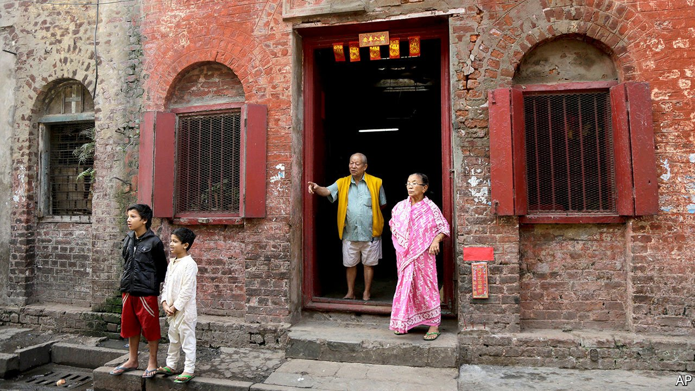

###### The Kolkata clan

# While India and China bicker, ethnic-Chinese Indians move away 

##### Kolkata’s Chinese community is a shadow of its former self 

 

> Mar 25th 2021 

THE SUNFLOWER beauty salon on Russel Street in Kolkata has been gutted for renovation, but a row of elegant Indian ladies sits perched inside its temporary digs, an air-conditioned cargo container. The hairdressers, sisters-in-law named Winnie and Patsy, snip away while chatting to their clients in Hindi, Bengali and English—and to each other in Hakka, a language of southern China. Prettified heads can look through makeshift windows at signs in Chinese across the street, which announce the Shanghai Company, a laundry in an art-deco pile from the 1930s. At the street corner a club offers a Chinese thali, a form of trans-Himalayan fusion cuisine. In the city’s two Chinatowns red lanterns herald Taoist temples and clan associations.

Kolkata has long been home to India’s largest Chinese community. At its peak, when Calcutta (as it then was) was the capital of imperial India, it was home to 50,000 ethnic Chinese. But relations between the two Asian giants are often testy. In 1962, when they fought a brief border war, about 15,000 Chinese from Kolkata were rounded up. Thousands were interned in prison camps in the desert in far-off Rajasthan. When they made their way back home, they found the government had auctioned off their property. Winnie lost her father and her chance of schooling, but managed to open her salon in 1968.


Indian and Chinese forces have been fighting along the Himalayan border again over the past year, in the worst clashes since the 1960s. On June 15th 20 Indian soldiers were beaten to death. In response nationalist groups called for a boycott of Chinese goods and even of Chinese food (although that is invariably cooked by Indians). The national government banned a series of popular Chinese-owned mobile-phone apps. The Global Times, a belligerent state-run newspaper in China, reported a “wave of anti-China sentiment in India”.

Few residents of Kolkata have turned on their ethnic-Chinese compatriots, however. To show where their loyalties lay, a group of Chinese-Kolkatans organised a sing-along of a patriotic Indian songs. Chinese temples flew the Indian tricolour, as usual. Older locals still favour Chinese carpenters, dentists and cobblers.

Yet the Chinese community is wilting, anyway. It now numbers perhaps 2,500. Many more “Calcutta Chinese” live in Markham, a city in Canada, than in Kolkata. At the Sunflower, Winnie’s niece gossips at the till about Canadian visas.

Patrick Lee wishes any of his children would come back from abroad to keep his family’s business going. He and his brothers make eco-friendly leather and bottle spicy sauce for the Pou Chong brand. India, he feels, has been a good home to his family, though his in-laws were incarcerated in 1962. “Overnight they lost everything, entire life’s earnings, everything. So there is some fear.” ■

