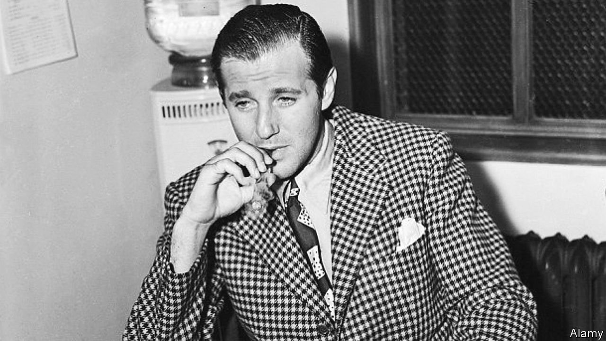

###### American gangsters

# Bugsy Siegel’s life of crime 

##### He got his start on the Lower East Side—and helped create Las Vegas 

 

> Mar 25th 2021 

Bugsy Siegel: The Dark Side of the American Dream. By Michael Shnayerson. Yale University Press; 248 pages; $26 and £16.99

ONE MORNING in the early 1940s Sandra Lansky discovered a pair of monsters. Their faces were shrouded; one had strapped his cheeks and chin with elastic. Sandra, who was six, screamed in terror. She did not recognise her father’s friends, Esther and Ben, in sleeping masks and the latest anti-wrinkle technology. They weren’t monsters. At least, Esther wasn’t.


Ben Siegel is another story. He was better known (though never to his face) as Bugsy. Born in 1906, he got his start in what was then the teeming shtetl of New York’s Lower East Side. Tough, shrewd, handsome and fearless, he became—along with Sandra Lansky’s father, Meyer—one of the 20th century’s pre-eminent Jewish-American gangsters. But while Lansky was relatively mild in temperament and content to conduct his affairs discreetly, Siegel was an impresario with a violent temper. In the view of Michael Shnayerson, author of this pacey and thoughtful biography, “Siegel himself killed roughly a dozen men; according to one gangster, he oversaw the contract killings of far more.” 

This book is part of Yale University Press’s excellent Jewish Lives series; Stan Lee, creator of Spider-Man, and Irving Berlin are among other recent subjects. Siegel is one of just two listed in the “Business” category, the other being Julius Rosenwald, a philanthropist and part-owner of Sears, Roebuck and Company, who would have been horrified at the association. Yet in Mr Shnayerson’s telling, Siegel’s was a familiar story of Jewish striving.

His parents, Max and Jennie, emigrated from what is now western Ukraine, and worked their whole lives for paltry pay. Siegel wanted more. Along with some other new Americans—a few Jews, including Lansky and Arnold Rothstein, and Italians such as Lucky Luciano—he seized the opportunities Prohibition presented. By 21 he was rich, favouring “jackets of houndstooth plaid, high-waisted pants with pegged cuffs, and custom-made alligator shoes”, and making the rounds of New York’s speakeasies while his father sweated in a trouser factory. After bootlegging he turned to enforcement—paid by factory owners to break strikes, then hired by the unions for violent revenge against the owners, including leg-breaking and arson.

When Prohibition ended, he followed the path laid by previous Americans in search of opportunity and a chance at reinvention: he headed west. The Syndicate—the association of Jewish, Italian and Irish crime gangs, led by Luciano with Lansky and Siegel not far behind—sent him to Los Angeles to squeeze the movie industry, take bets at the Santa Anita track and maybe run a little heroin up from Mexico. Siegel fell in with Hollywood society, entertaining Clark Gable and befriending Jean Harlow, but found his real fortune in Nevada. The Flamingo Hotel, which he opened in 1946, was the first ritzy hotel-casino on what became the Las Vegas Strip.

Siegel’s toughness and bravado have appealed to generations of American Jewish writers, so thoroughly does he refute stereotypical images of the nebbish, the nice Jewish boy, the obedient scholar. Mr Shnayerson, though, does not romanticise him. After an inevitable sticky end, Siegel’s funeral was brief and barely attended. He died in debt. Coursing through the book, and perhaps his life, is a recognisably Jewish sort of melancholy. Siegel’s brother Maurice, a doctor whose education he financed, probably paid for a memorial plaque at his family synagogue in New York, just as Ben had probably done for his father. “The relationship between father and son”, Mr Shnayerson notes, “had been based on the pact that Max and Jennie never allude to the source of Ben’s largesse.” ■

A version of this article was published online on March 24th 2021

