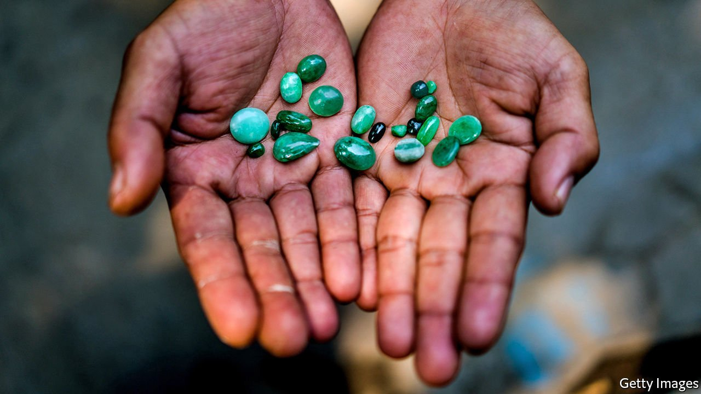

###### Shards of light

# Listening to Myanmar’s secrets 

##### Daniel Combs travelled from its fecund lowlands to remote mountains 

 

> Mar 27th 2021 

Until the World Shatters. By Daniel Combs. Melville House; 400 pages; $28.99 and £25

THE BURMESE army has always described itself as the defender of the nation, and of the truth. For the nearly 50 years that Myanmar was under military rule, the generals censored all media and assembled a vast network of informants, the better to ensure that the right things were being said. But when it ceded some control to a civilian government in 2011, the army’s iron grip on the truth began to slacken—a shift that the victory of Aung San Suu Kyi and her party in the election of 2015 seemed to confirm.


As tongues began to loosen, Daniel Combs, an American researcher, was listening in. He travelled the length and breadth of Myanmar, from the sweltering, fecund lowlands to remote mountains brimming with jade, meeting a wide array of characters who include a punk-rocker, a monk and a photojournalist. In “Until the World Shatters” he explores a country that was, at last, beginning to find its voice.

In deeply religious Myanmar, where 90% of the population is Buddhist, nobody has a bigger megaphone than the monks. At lectures that are sometimes attended by thousands, devotees collect slips of paper listing the speaker’s photo and qualifications—like “little monk baseball cards”, writes Mr Combs. The veneration is so great that the holy men are assiduously courted by the generals. Mr Combs introduces Kelasa, a Buddhist monk who lives next to a mosque and believes that “every Muslim is dangerous”.

Many devout Buddhists agree that their faith is under attack by Muslims. When in 2017 the army launched its pogroms against the Rohingya, a Muslim minority, driving 700,000 to flee to neighbouring Bangladesh, many Burmese cheered. Practically everything about the Rohingya, from their history to their name, is disputed in Myanmar, notes Mr Combs. When Rohingya women claimed that they had been raped by Burmese soldiers, many Burmese said they were making it up. Zahura, a Rohingya woman whom the author meets at a refugee camp, insists that her account of what happened to her is true.

The book’s most intriguing vignette concerns a humanitarian volunteer-turned-businessman from the Kachin ethnic group. For decades, Kachin insurgents have waged a war of independence in the region of the same name. The conflict is fuelled by jade, Myanmar’s most valuable natural resource: Kachin holds the world’s biggest high-quality deposits of the stuff, and neighbouring China cannot get enough of it. The army and local militias battle for control of the region’s precious mountains, yet elites on both sides have an interest in perpetuating the conflict. Since most of the jade is smuggled out of the country illegally, peace—and the rule of law—would be bad for the bottom line. 

When he first becomes involved in the jade trade, Mr Combs’s subject hopes to use his profits and power to help the impoverished Kachin. But he grows increasingly consumed by his quest to learn the secrets of the business, gradually giving up his fight to change the grubby industry from within. “Until the World Shatters” is a moving chronicle of a country that was just beginning to reveal secrets like these—until the army, in its coup of February 1st, decided to reprise its role as the ultimate arbiter of the truth. ■

