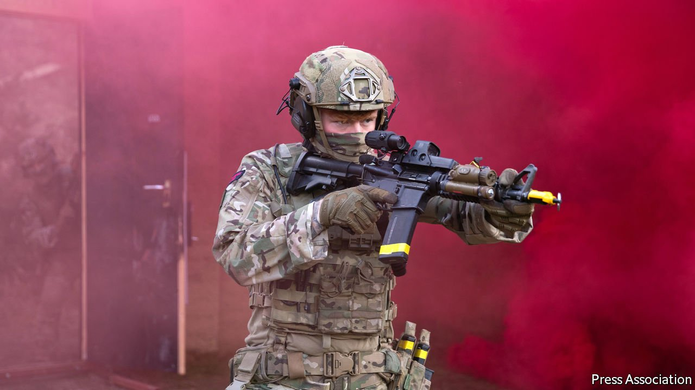

###### Power rangers

# Defence cuts make Britain’s armed forces leaner but not meaner 

##### The fat has gone; bone is being cut 

 

> Mar 27th 2021 

AT AN ARMY base in Dorset, 16 soldiers nestle in the woodland next to dune buggies. Drones, some of them no larger than a sparrow, weave through the conifers above, beaming footage to a phone strapped to each soldier’s chest. Specialists in electronic warfare hoover up enemy signals; a member of Britain’s 77 Brigade, dedicated to psychological operations, clutches a camera.

Light, high-tech and globally deployed troops like these lie at the heart of a command paper published by the Ministry of Defence on March 22nd, building on a review of foreign policy the previous week. The soldiers are part of a new £120m ($165m) “Ranger Regiment”, modelled on America’s Green Berets, which will train and accompany friendly foreign troops and rebels in “high-threat and hostile environments”. The 1,000-strong regiment will deploy its first battalion next year, probably to east Africa. 


The Rangers are the “vanguard” of a new “expeditionary posture”. Troops will no longer sit in barracks, springing forth in wartime, but will be deployed in hotspots, building influence and countering Russian and Chinese activity. British special forces like the SAS have done this for decades, most recently deploying covertly alongside Kurdish militia to fight Islamic State. The Rangers will do it more frequently, openly and in larger numbers.

The question is whether such “permanent and persistent global engagement” will bend the armed forces out of shape. The paper says the army’s mandated strength will shrink by 10,000 to 72,500 troops, its smallest size since 1714. General Sir Nick Carter, chief of the defence staff, insists that it would still be able to produce the same type of force, including the equivalent of an armoured brigade, that it did for the Iraq war 18 years ago. Adding in 30,000 reserves—available on six months’ readiness—will bulk out its size beyond 100,000.

It is true that a smaller force can be a more lethal one. Some of the new British units will have utility in a high-end war. The Royal Marines, for instance, are transforming from traditional amphibious infantry into a roving “Future Commando Force”, kitted out with kamikaze drones and advanced weapons previously confined to elite special forces. At an exercise in California last year, a company of British commandos defeated a force of 1,500 American marines by infiltrating their rear areas and striking command nodes.

Army cuts are also offset with new investments. Britain’s offensive cyber-capabilities will be offered to NATO. Admiral Tony Radakin, the First Sea Lord, notes that between 2015 and 2030 the Royal Navy’s tonnage will grow by 50%, with seven new classes of submarines and ships—including a new spy ship to monitor undersea cables—all of which will likely be built in Britain. “That level of shipbuilding in this country hasn’t been seen since the 1970s,” he says. Yet for all that, there is a tangible sense that Britain has long ceased cutting fat, and is now shaving off bone.

One problem is the loss of “mass”, in the military jargon. Consider the case of Britain’s tanks. The army will upgrade these, but cut the force to just 148—half as many as France. Two regiments of tanks would typically allow an armoured advance along just six kilometres of fighting front, says Jack Watling of the Royal United Services Institute. And if they run into trouble, there is nothing in reserve.

A lighter, nimbler and more global army also has other weaknesses. Traditionally, combat support—like logistics, engineering and artillery—has been handled centrally by large divisional headquarters, which lend those enablers out to smaller brigades which do the fighting.

Under the new plans, these enablers will be pushed down into new “brigade combat teams”. The advantage is that those teams can be deployed more widely, without relying on an unwieldy headquarters above them. The downside is that enablers are spread thinly. “It is a less efficient system for warfighting,” says Mr Watling.

The final problem is one of timing. Many of the cuts create gaps that will not be filled for years. The navy will shrink before swelling to its larger size. The withdrawal of all 700 Warrior infantry fighting vehicles without a comparably armed replacement or suitably long-range artillery leaves infantry dangerously vulnerable as they close with the enemy.

In many cases, it is not even clear what will fill these gaps. The defence paper is evasive on many details, including the size and timing of investment in drones and autonomous systems, and kicks many decisions down the road.■

