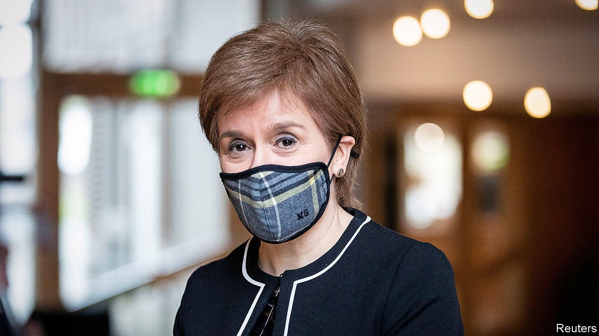

###### Defying gravity

# Nicola Sturgeon survives the Alex Salmond affair 

##### A report finds the first minister didn’t breach the ministerial code 

 

> Mar 27th 2021 

IT WAS MARCH 29TH 2018, and in an Edinburgh office building a civil servant’s birthday party was under way. After the cake and singing, Geoff Aberdein asked to speak to Nicola Sturgeon, the first minister of Scotland, alone in her office. What happened next is uncertain, for no one else was in the room.

Mr Aberdein says that during a ten- or 15-minute conversation, he revealed that Alex Salmond—his former boss and Ms Sturgeon’s predecessor—was subject to two complaints by former officials. Ms Sturgeon would later tell the Scottish Parliament she was first told of the claims four days later. She insists Mr Aberdein merely urged her to meet Mr Salmond, who was deeply distressed and threatening to resign from the Scottish National Party. “I had a general sense that it was something serious, something in the realms of a sexual complaint potentially,” she told James Hamilton, Ireland’s former public prosecutor, whom Ms Sturgeon had asked to investigate the claim that she had misled the Scottish Parliament.


Mr Hamilton’s report, published on March 22nd, put an end to a labyrinthine and grubby drama that has consumed Scottish politics for most of the past two years. Mr Salmond stood trial for charges of sexual offences against ten women, and was acquitted. Opposition politicians accused Ms Sturgeon of misleading Parliament by covering up what she knew of his conduct. Mr Salmond accused her inner circle, including her husband, of whipping up complaints in an effort to sink his career and put him in prison.

Mr Hamilton cleared Ms Sturgeon of four counts of breaching the ministerial code. Her omission of the birthday party meeting led to an “incomplete narrative of events”, but he accepted her claim that she had forgotten about it. On March 23rd, a second report, by a committee of the Scottish Parliament, split on party lines on the question of whether Ms Sturgeon potentially breached the ministerial code. Later that evening the Scottish Parliament held a confidence vote in Ms Sturgeon; she won by 65 votes to 31.

The affair has revealed an unflattering picture of Scottish politics, tainted by obfuscation, feuds and a conspiratorial culture. The committee found the Scottish government’s processes for handling complaints to be seriously flawed. It recommended the Parliament should be given more powers to scrutinise the executive; a majority of its members concluded they had been left to “drag” information out the government. The complainants told the committee that the inquiry had become a partisan circus.

Still, the two inquiries amounted to more thorough raking-over of alleged misconduct in office than is now customary south of the border. Ms Sturgeon claims that had Mr Hamilton found that she had breached the code, she would have resigned. Whether that is true is unknowable; what is known is that when Priti Patel, the United Kingdom’s home secretary, was found to have breached the code by bullying her staff, she refused to resign, and the prime minister declined to sack her. Sir Alex Allan, the government’s adviser on the code, resigned in protest. Lord Evans, a former head of MI5 and Mr Johnson’s independent adviser on ethics, has asked whether a “culture of impunity” is seeping into government.

On March 25th, campaigning begins for elections to the Scottish Parliament on May 6th. The Conservatives intend to tell voters an unaccountable SNP needs reining in, which will be less fruitful now. Mr Hamilton’s findings lend support to her portrayal of herself as a woman blamed for the sins of a man, and the confidence vote as an attempt to bully her out of office. The elections will be, as the SNP wants, mostly about independence. If the SNP returns to government, it will push ahead with legislation for a second referendum, and set the course for an ugly stalemate with the British government which intends to block it.

For a while, gravity appeared to be returning to Scottish politics. The SNP has been in power since 2007; Ms Sturgeon became deputy first minister while Tony Blair was still in Downing Street. Its record on running education and health is patchy. The Salmond affair painted a picture of a party soiled by too many years in office. Polls before Mr Hamilton’s report suggested that trust in the SNP had been dented among around a fifth of the party’s supporters. Mr Hamilton’s findings may halt the decline, and unleash another blast of hot gas into the balloon. ■

