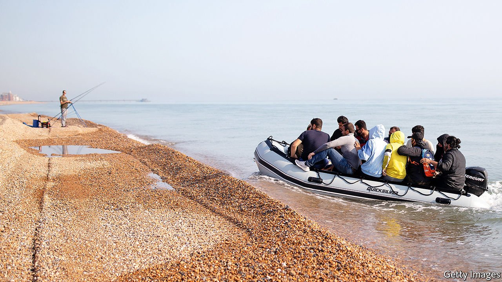

###### Asylum

# Priti Patel’s asylum changes will make life harder for refugees 

##### People who arrive in the country illegally will not be able to get permanent asylum 

 

> Mar 27th 2021 

THERE IS NO mention of using wave machines or water cannons to blast asylum-seekers crossing the Channel in flimsy boats. Those were reportedly among the ideas mulled by officials to stop the arrival of undocumented migrants. But deterrence remains the object of “the biggest overhaul of the UK’s asylum system in decades”, announced by the home secretary, Priti Patel, on March 24th. Even minus wave machines the proposals are radical.

At its heart is the idea that the treatment of asylum-seekers will depend on whether they arrived “legally”. The government will do its best to send back boat people and lorry stowaways to the safe countries through which they travelled. Those who manage to avoid deportation, and persuade the authorities that they are fleeing persecution, will get a right to remain for just 30 months. They will have fewer benefits than claimants who arrive by legal routes and will have “restricted” family-unification rights. The Home Office will “regularly” assess them for possible deportation.


The proposal is “cutting away at the whole principle of asylum”, says Steve Crawshaw of Freedom from Torture, an NGO. Under a widely accepted interpretation of the Refugee Convention, which turns 70 this year, a person’s mode of arrival has no bearing on whether he or she is entitled to asylum. People fleeing violence and persecution do not tend to apply for visas and travel by aeroplane: officials are reluctant to issue visas to people they think might claim asylum, and oppressive regimes may stop them from leaving by normal routes. Critics say Ms Patel is creating a two-tier system, which will discriminate against some refugees purely on the basis of their itinerary. 

She contends that she is battling people smugglers, saving migrants’ lives and defending women and children who are “elbowed out of the way by young men”, and that she wants to create “safe and legal” ways for refugees to come. She has in mind an expansion of the programme under which since 2015 Britain has plucked 25,000 refugees, mainly Syrians, from refugee camps and resettled them. Such favoured arrivals will immediately be given indefinite leave to remain in Britain—an “unalloyed good”, says Colin Yeo of Free Movement, an immigration-law website.

But Ms Patel’s focus is on keeping out less worthy claimants and getting rid of those already in the country. In 2019 Britain deported just 7,400 people, the lowest number on record. Ms Patel wants to boost that number. Her “end-to-end” reforms of the asylum system will penalise would-be refugees for making claims that the government deems to be in bad faith and set a more rigorous standard for determining whether they face persecution at home. The result, say the refugees’ defenders, will be to subject them to more uncertainty than they have already endured.

Although boatloads of refugees arriving on British beaches make headlines, the country is not being flooded by asylum-seekers. The pandemic has disrupted migration but in 2019, 36,000 people applied for asylum, a third as many as in France. Ms Patel’s new rules are unlikely to reduce the number of people seeking refuge in Britain, but they may succeed in treating some of them more shabbily.■

