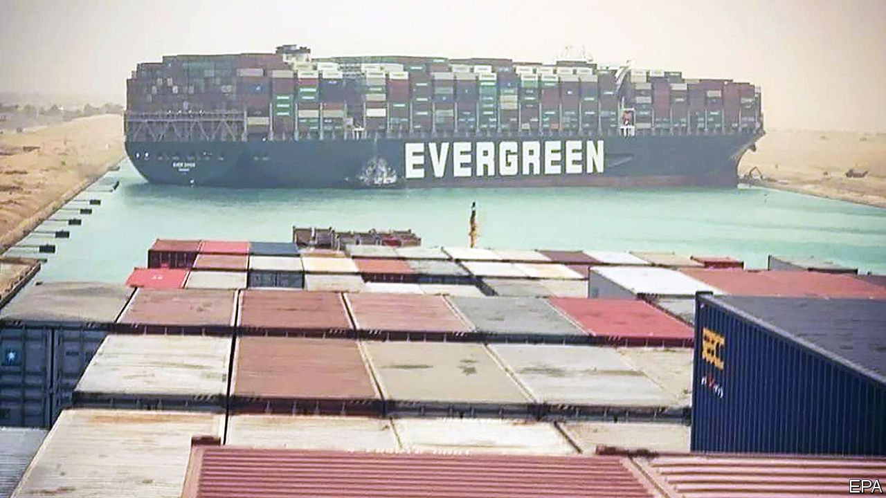

###### Chokehold

# A giant container ship accidentally blocks the Suez Canal 

##### The disruption to world trade could be large 

 

> Mar 27th 2021 

THE FLOTILLA of tugs and a giant digger look tiny against the backdrop of Ever Given, reflecting the scale of their task. One of the world’s largest container ships was wedged athwart the Suez Canal on March 23rd, blown off course by high winds. The problem for global shipping seems as immense.

Nearly 19,000 vessels plied the 193km maritime shortcut last year, carrying 12% of global trade by volume and around 10% of the world’s oil. Even a short closure of the bottleneck threatens severe disruption; supply chains linking Asia and Europe are “stretched to the limit” as it is, notes Greg Knowler of JOC, a research firm. The price of crude shot up by 5% on news of the accident.


The blockage of a big source of foreign earnings will have worried Egypt’s government. It has been trying to drum up more business for the canal. In 2015 it spent $8bn on an expansion project to cut waiting times. Despite the pandemic revenues dipped only slightly in 2020 compared with the year before, to $5.6bn. That is in part because Egypt cut transit fees last year for some vessels—of as much as $700,000 for an Ever Given—to stop them choosing the alternative route around the Cape of Good Hope, which takes a week longer but is affordable thanks to low fuel prices.

More oil may eventually travel by different means. Pipeline deals like a proposed one between Israeli and Emirati investors look plausible as relations between the Jewish state and its Arab neighbours thaw. A thawing Arctic may open up other routes that compete with Suez. But in the short run the canal is likely to remain a conduit for crude, and much else besides. Once, that is, Ever Given is back on course.

