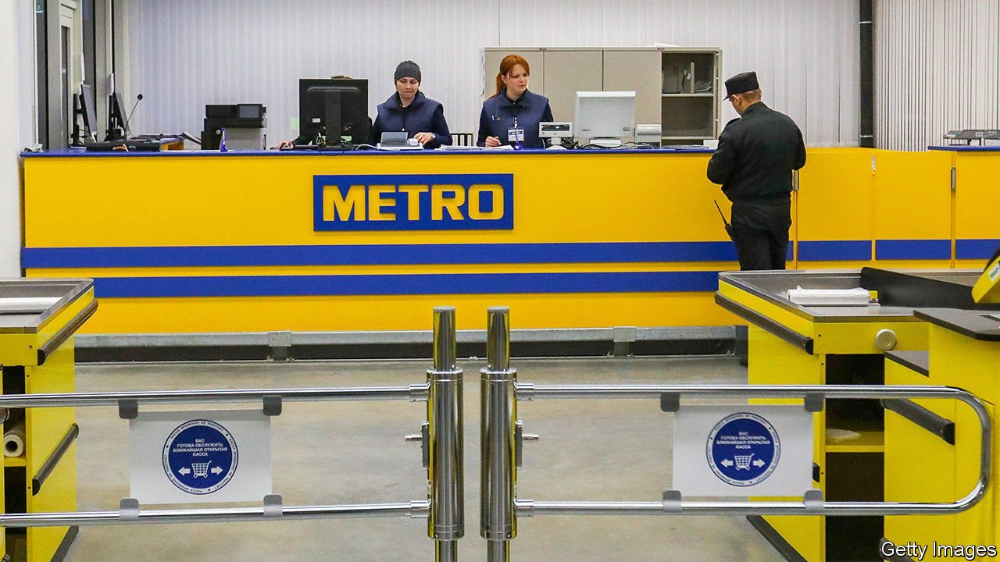
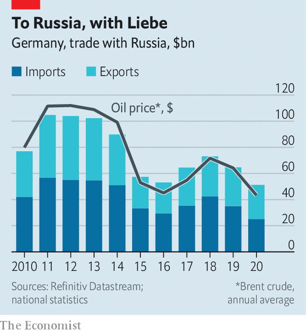

###### German-Russian business

# Deutschland AG’s enduring bet on Russia 

##### German companies with Russian operations are undaunted by covid-19, a stagnating economy and sanctions 

 

> Mar 27th 2021 

EVER SINCE Ostpolitik was conceived in the 1970s, Germany has preferred engagement with Russia to confrontation. Now political relations are at a low point after an attempt last year by Russian security agents to poison Alexei Navalny, a prominent opposition politician, who was flown to Germany for treatment. So is trade. In the wake of sanctions imposed after Russia’s annexation of Crimea and its incursion into Ukraine in 2014, the country’s trade with Germany dwindled in value to €45bn ($54bn) last year, from €80bn in 2012. In 2007 Germany was Russia’s biggest trading partner. Today it is a distant second behind China, which exchanged goods worth $104bn with Russia last year.

Look closer, though, and German-Russian business ties remain tight. Much of the recent fall in trade can be attributed to a weak rouble and sinking prices of oil and gas, which Russia sells to Europe. After falling in the wake of the Crimea crisis, German exports to Russia have held steady for the past six years. Annual German foreign direct investment into Russia actually increased to €3.5bn in 2015, after the sanctions were imposed. In 2018 it reached €3.8bn. Around 4,000 German firms have a presence in Russia, mostly churning out products for Russia’s 145m consumers. No other European country comes close to the German presence. Most of these companies have no intention of leaving. On the contrary, more may be piling in.


German firms see Russia as a decent-sized market with plenty of cheap labour and, thanks to a Soviet-era obsession with maths and science, the skilled variety, too, especially in information technology. The membership of AHK Russland, the German-Russian chamber of commerce, rose by more than 10% last year to around 1,000 firms. Some of the increase was due to firms already in Russia seeking assistance as tensions rise. But plenty were newcomers. In a survey of AHK’s members at the end of last year 70% reported that the dramatic deterioration in political relations has not put them off doing business in Russia. Around 30% are planning to hire more Russian employees.

 


Businesses are adapting to the geopolitical tensions. The Russian operations of Metro, a giant German supermarket chain, were hurt by Western sanctions over Crimea, then by Russia’s reprisal, when the Kremlin barred the firm from importing some fresh produce from the EU, America, Norway, Canada and Australia, recalls Martin Schumacher, Metro’s boss in Russia. Sales at its 93 shops began to dwindle in 2016 and fell in each of the next three years. But in 2020 they picked up again. Metro had found alternative suppliers in northern Africa, cut prices, spruced up its shops and offered its 12,000 employees better pay. “I am now confident about our opportunities in Russia,” says Mr Schumacher.

Far from cutting their Russian exposure, some German companies are increasing it. After an investment of €120m in 2015 Claas, a Westphalian maker of agricultural machines, is further expanding its production site in Krasnodar. Globus, another big German grocer, has managed to increase sales in Russia since 2016. It now employs 10,000 people in its 17 hypermarkets and last year invested €73m in a new logistics centre in Pushkino, near Moscow. Bionorica, a maker of plant-based medicines, recently finished building a €40m factory in Voronezh in central Russia. Knauf, a family firm that is world’s leading maker of gypsum boards with 4,000 workers at 15 factories in the country, is also planning to expand. Nikolaus Knauf, the firm’s 84-year-old patriarch, maintains a cordial relationship with Russia’s president, Vladimir Putin, whom he used to meet regularly.

Volkswagen, the biggest German company in Russia by sales, is also staying put. Its outspoken boss, , is a vocal critic of Western sanctions, asserting that the carmaker does not want to be a “vehicle of government policy”. It plans to launch two new vehicles in the Russian market this year. The group has invested more than €2bn in Russia over the years. It directly employs 6,000 workers in two factories in Kaluga and Nizhny Novgorod. Russia is the third-biggest market worldwide for Skoda, one of its marques, and the fourth-biggest for its flagship VW brand.

In private, German managers grumble about obstructive Russian bureaucrats but praise regional governors and other members of the political elite as generally helpful (though would rather not discuss the subject of rampant corruption). Russia’s creeping authoritarianism is a worry. But German businesses can, like most Western ones, live with authoritarian regimes, as they do most notably in communist China. Many adopt Mr Diess’s position that “corporations cannot topple dictatorships”. They are more concerned about Russia’s own eastward turn.

Once market share in Russia is lost to Chinese rivals it will be very hard to win back, German executives fret. As important, Wandel durch Handel (change through trade) continues to make sense, insists Oliver Hermes, president of the German Eastern Business Association, a lobby group: “The economic bridge is the only one that is still intact.” ■

