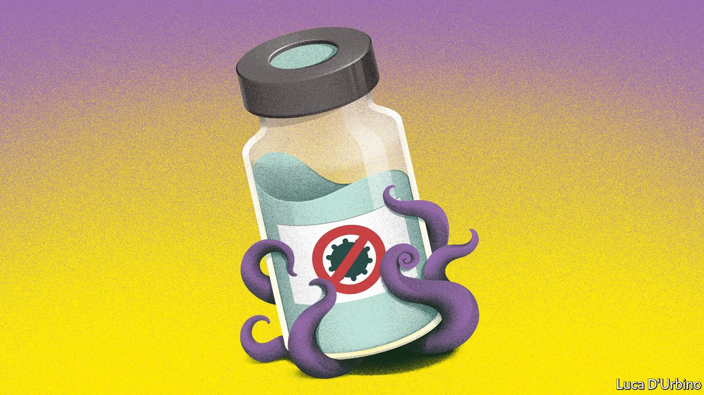

###### To have and to hold

# The EU supports tighter rules on covid-19 vaccine exports 

##### Political opportunism proved too hard to resist 

 

> Mar 25th 2021 

EVEN BEFORE cases of covid-19 started to surge again, the slow supply of vaccines in the European Union was a political problem. Companies based in the EU have produced plenty of vaccines; unfortunately for the bloc’s citizens, they have often ended up elsewhere. By the end of this week the EU will have distributed 88m doses of vaccines within the bloc since December. It has so far exported 77m doses. On March 25th European leaders gave qualified support for stricter controls on anyone trying to send vaccines out of the bloc. The plan will let the EU halt exports to countries that are not exporting any to the EU in return, such as Britain or America, or block deliveries to places that have vaccinated proportionally more people than the EU has.

It beefs up rules agreed on in January, under which firms wishing to export vaccines from the EU must seek permission, resulting in extra paperwork, missed flights and delays. The move triggered ripples of concern around the world. Ngozi Okonjo-Iweala, head of the World Trade Organisation, expressed dismay. The new controls were applied for the first time earlier this month, when Italy blocked the export of 250,000 doses of AstraZeneca’s vaccine that were destined for Australia. Even the Netherlands, usually among the bloc’s staunchest free-traders and a hub for vaccine manufacturing, says it is ready to prevent the export of the same vaccine to Britain if required. About two-thirds of all vaccines used in Britain so far have been produced in the EU—a statistic that Ursula von der Leyen, the under-fire president of the European Commission, hammered home to leaders during a video summit. 


Although the fight with Britain has drawn much of the attention, the EU is also cross with America, which is not letting drug firms export vaccines at all. Furthermore, it has imposed controls on the export of various parts and materials needed to make the vaccines. These controls are already delaying the arrival of crucial items needed in Europe (and elsewhere) to make jabs. Merck, in Germany, must now expand the production of specialist bags that are used to manufacture vaccines and which are running short. America has aggravated matters by not (so far) giving the EU any supplies from a large stockpile of the AstraZeneca vaccine that it has not yet authorised for use. It has, though, sent doses to Canada and Mexico.

If the EU were to get tough with America over vaccine exports, any retaliation would be likely to have grim consequences for global vaccine production. Little wonder, perhaps, that Germany’s chancellor, Angela Merkel, issued a warning on March 23rd that the EU needed to be “very careful” with export bans. Even Britain has the power to gum up production of the Pfizer-BioNTech vaccine by withholding an essential raw ingredient, a specialist fat that is needed to make the shot and which is supplied by a firm in Yorkshire. Whether it would take such a drastic step is another matter.


At the moment, only AstraZeneca is in the EU’s crosshairs when it comes to export controls. The Anglo-Swedish pharmaceutical company has fallen markedly behind its planned production. It had agreed to supply 300m doses in the first half of the year, but will manage only 100m. After the meeting, Mrs von der Leyen was blunt: “Companies have to honour their contract to the European Union before they export to other regions in the world.” It was, she added, simply a matter of Europeans getting their “fair share”.

Deploying export controls could damage the EU’s reputation. Last year pharmaceutical firms invested in new vaccine-production capacity around the world in order to improve the global supply. A lot of that investment went to Europe. Koen Berden, a trade expert at Vaccines Europe, which represents the industry across the continent, says it was made on the assumption that the bloc was a champion of the open trading system. Firms felt secure knowing that their factories could be used to make vaccines for the whole world.

Richard Hatchett, head of the Coalition for Epidemic Preparedness Innovations, a group that finances vaccine R&amp;D, also warns of the dangers of trying to win any vaccine trade war. He says it is hard for political leaders to see every part of a complex supply chain. So the consequences of tit-for-tat exchanges are hard to predict. The knock-on effects of Europe’s threats are already being felt. Britain has sent an envoy to India to hunt for additional doses of vaccine from the Serum Institute. But any success will delay the supply of vaccines to the poorest countries that are waiting for supplies from the same source. Both Britain and the EU have given a great deal of financial support to the Covax initiative, which is shipping vaccine from the Serum Institute to poor countries.

Ursula von der Leyen, the European Commission’s head, promised last year to keep the world united against the coronavirus and even helped create a group to promote global collaboration on items such as vaccines. Reality is now biting. But many Europeans look enviously at much higher vaccination rates in America, Britain, Israel and elsewhere, or at the sight of vaccines being exported to countries, such as Australia, that are not facing serious waves of the virus. The temptation to hold on to just a few extra vaccines, if only to fend off political pressure at home, may prove hard to resist. ■

Dig deeper

All our stories relating to the pandemic and the vaccines can be found on our . You can also listen to , our new podcast on the race between injections and infections, and find trackers showing ,  and the virus’s spread across  and .

: This article was updated after the EU leaders’ meeting on March 25th.

