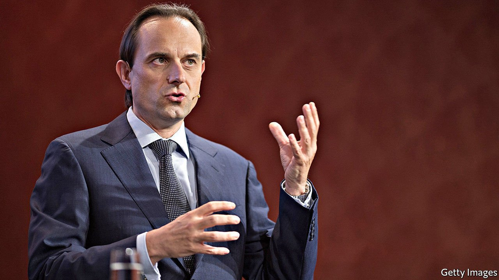

###### After Wirecard and Greensill Bank

# Battered Bafin’s new boss Branson 

##### Cleaning up after the Wirecard scandal 

 

> Mar 27th 2021 

IT TOOK Olaf Scholz weeks to persuade Mark Branson to take the job as the next head of BaFin, Germany’s financial regulator. He was offering less pay for a bigger and tougher job than Mr Branson’s current role as boss of Finma, the Swiss financial watchdog. But in the end Germany’s finance minister won over the 52-year-old Briton, who perfectly fits his idea of the next BaFin boss: an outsider with international experience who knows the banking industry. Before joining Finma in 2010, Mr Branson worked for UBS and Credit Suisse.

BaFin has been under fire ever since the collapse of Wirecard in June 2020, which followed the Bavarian company’s admission that €1.9bn ($2bn) of funds, nearly a quarter of its balance-sheet, “probably do not exist”. It was again the target of criticism after it took control on March 3rd of Greensill Bank, a Bremen-based lender run by Greensill Capital, an Anglo-Australian provider of supply-chain financing that filed for insolvency a few days later. Critics say BaFin ignored several red flags and took a blinkered view of just the bank rather than the entire Greensill construct (just as it did in the case of Wirecard’s bank).


BaFin insists that it fulfilled its mandate with Greensill Bank, but the federal association of German banks (BDB) says that it alerted BaFin back in early 2020 about the risk posed to Greensill Bank by its loans to theGFG Alliance, a group controlled by Sanjeev Gupta, an Indian-born industrialist. BDB was alarmed by the explosive growth of Greensill Bank’s assets, which rose more than tenfold between 2015 and 2019 to €3.8bn. “Financiers flock to Germany because they know supervision is lax and its deposit-insurance scheme is very attractive,” says Michael Peters of Finanzwende, a German watchdog.

The Greensill debacle is likely to cost German banks a packet. The insolvent bank is a member of Germany’s voluntary deposit-guarantee fund, to which commercial banks contribute in proportion to their size. The bank is also covered by the German Deposit Guarantee Act that vouches for deposits up to €100,000. The voluntary fund is expected to be on the hook for about €2bn, whereas the compulsory fund will probably need to part with €1bn.

The hope is that Mr Branson can transform the regulator. In February Mr Scholz announced an overhaul of BaFin to make it a “focused-oversight body” that supervises complex companies in their entirety. A financial task-force will carry out forensic audits of companies suspected of fraud. And complaints from whistle-blowers will be taken seriously rather than scornfully dismissed, as was the case with Wirecard.

This week the German press reported that BaFin plans to add 158 jobs to its staff of 2,772. Banks and insurers argue that BaFin should improve its operation rather than hire new people. Around 1,700 banks and 670 financial-services groups pay for its running costs, which are not funded by the government. And even though they lament the costly Greensill compensation payments, they would prefer to skimp on the reform of the agency that could have prevented them. No wonder Mr Branson hesitated before he accepted the job. ■

