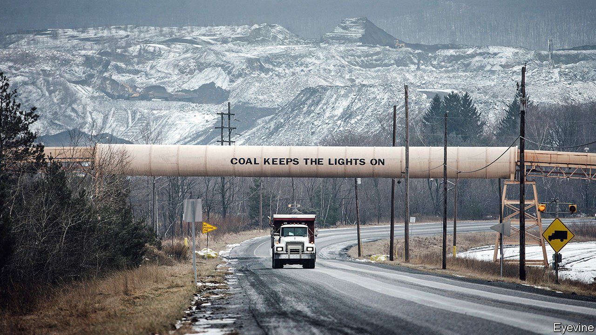

###### Climate change

# The impact of green investors 

##### Sustainable investing faces up to the sceptics 

 

> Mar 27th 2021 

SUSTAINABLE INVESTING is in the firing line, as two recent events have shown. Last week, the board of Danone, a French food-maker, fired its boss, Emmanuel Faber, who had long championed the benefits of stakeholder capitalism and sustainability. Shareholders were unhappy with the firm’s languishing share price.

The next day USA Today published an opinion piece by Tariq Fancy, a former head of sustainability at BlackRock, the world’s biggest asset manager, which says it puts climate change at the centre of its investment strategy. Mr Fancy called investing that takes into account ESG (environmental, social and governance) factors “little more than marketing hype, PR spin and disingenuous promises”. He pointed to ESG funds which invest in big polluters, such as oil firms. (BlackRock has said it disputes the claims.)


One argument in defence of holding shares in polluting firms is that it is the only way to engage with a business and make it change. Divestment, the reasoning goes, would only raise polluters’ capital costs, and make spending on carbon-cutting projects less likely. This is the thinking behind Climate Action 100+ (CA100+), a global investor-engagement group. Founded in 2017, it now has 575 members, together holding over $50trn-worth of assets. They include asset owners, such as Japan’s Government Pension Investment Fund, as well as asset managers.

So far the CA100+ has mostly asked companies to do three things: set decarbonisation targets, disclose their climate risk and improve governance around those risks. Initially CA100+ investors focused their efforts on the 100 publicly listed firms which were the biggest emitters (hence the 100). Most of them are oil giants, utilities or industrials. It has since added another 60 or so firms (hence the “+”). This week it announced a set of criteria, such as green capital spending, which it will use to judge the progress of the firms.

The CA100+ has notched up some successes. In February Shell, an Anglo-Dutch oil company, announced that it will reduce the emissions from its operations and all its products to net zero by 2050. The CA100+ claimed much credit for that, as it did for similar pledges made by BP and Total, two other oil groups.


But it is hard to separate the impact of CA100+ from changes that would have happened anyway. Green corporate pledges are coming thick and fast. Since 2018, the number of firms that have signed up to set emission goals in accordance with the Science-Based Targets Initiative (SBTi), a consortium of NGOs which ensure firms’ green commitments are rigorous, has increased from 216 to over 1250 today. Meanwhile, firms committed to reporting data along the lines of the recommendations of the Task Force on Climate-related Financial Disclosures (TCFD), a climate-risk reporting standard favoured by regulators and investors, have grown from 580 to 1,884.

To measure the actual effect of the CA100+, The Economist has created a portfolio of about 100 firms that are large emitters but are not engaged by the investor group. The portfolio roughly matches the CA100+ firms in terms of sectors and regions represented. Judged by two criteria, climate-risk disclosure and target setting, the impact of CA100+ looks modest. About 30% of CA100+ firms have joined the SBTi, compared to around 25% in our portfolio. And roughly 40% of CA100+ firms have signed up for TCFD, compared to about 30% in the control group.

In both groups, the firms that set a green goal tend to be the small polluters. Among CA100+ firms, those which have set targets represent about a third of the market value but only a fifth of the carbon footprint. By contrast almost half of the CA100+ consumer-goods firms, such as Unilever and Procter &amp; Gamble, have set targets.

Advocates of CA100+ say it will take more time for the benefits of the group to show. The group has set an example to the wider market, argues Stephanie Pfeifer, of CA100+ and some firms outside the group’s focus will have seen the pressure from CA100+ and started acting. Still, $50trn-worth of investor pressing does not seem to result in much change. ■

For more coverage of climate change, register for The Climate Issue, our fortnightly , or visit our 

: This article originally described Stephanie Pfeifer as the head of Climate Action 100+. She is in fact on the steering committee. Sorry.

