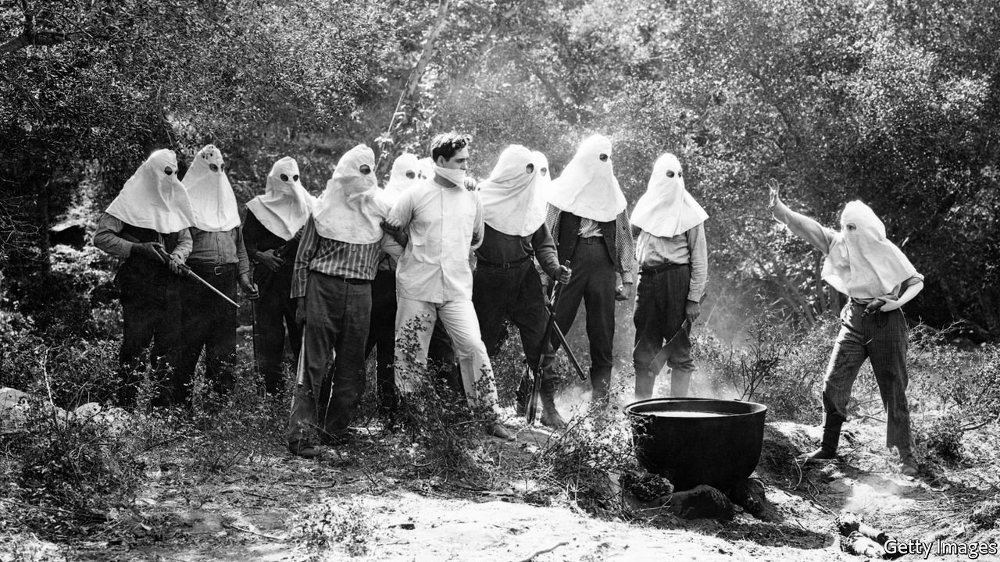
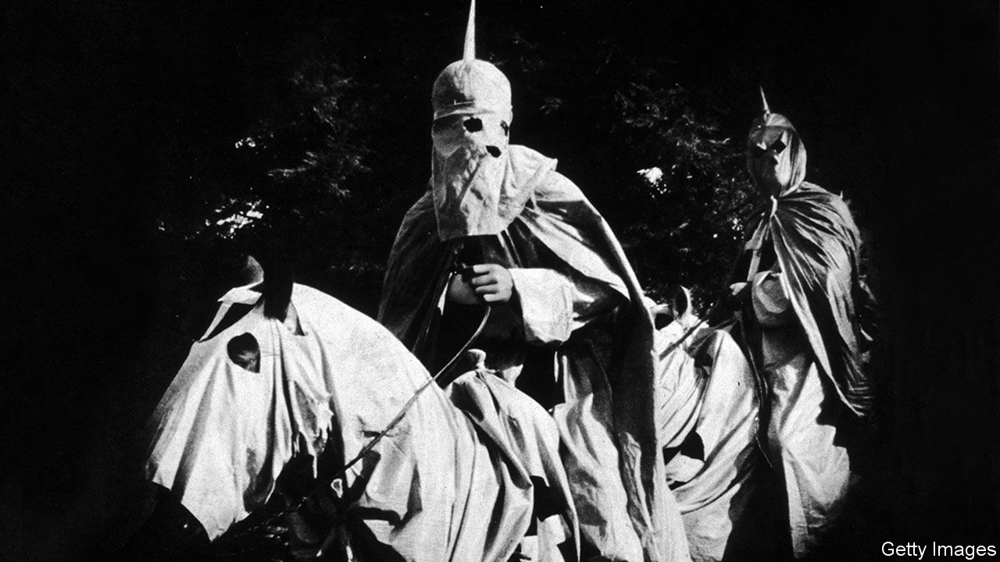

###### A tarnished silver screen

# How a racist film helped the Ku Klux Klan grow for generations 

##### Lynchings rose fivefold after “The Birth of a Nation” came to town 

> Mar 27th 2021 


“TRIUMPH OF THE WILL”, a Nazi propaganda film, proved how cinematographic innovation could spread evil. Yet long before Leni Riefenstahl filmed Hitler’s troops, an American motion picture tested the toxic power of the new medium.

In 1915 “The Clansman” opened in California. Soon re-titled “The Birth of a Nation”, it was the first film to use extras or a musical score, and among the first of feature length. One in ten Americans saw it.


“The Birth of a Nation” was overtly racist. Its pro-Southern take on the civil war and its aftermath paints African-Americans (played by whites in blackface) as lecherous brutes, and lauds a lynching by the Ku Klux Klan (KKK), a white-supremacist terror group. The KKK began burning crosses and wearing white hoods only after those symbols appeared in the film.

 


 


Black activist groups protested against the silent film, saying it would incite violence. But lynchings and race riots were already common, making it hard to distinguish hate crimes specifically caused by the film. Did “The Birth of a Nation” merely reflect violent racism, or exacerbate it?

A new working paper by Desmond Ang of Harvard University unearths firm evidence of the film’s noxious impact. First, he studied how rates of racist violence changed when its jazzy “road show” came to town. On average, lynchings in a county rose fivefold in the month after it arrived.


Second, although the road show visited 606 counties, it skipped thousands more. This let Mr Ang test whether KKK chapters (“klaverns”) were particularly likely to sprout in places where the film was shown.

Areas full of racists might have been especially prone to play the film. To isolate its effect, Mr Ang accounted for local factors like demography, numbers of historical lynchings and the vote share of Woodrow Wilson, the bigoted president who played it at the White House (another first). Overall, counties with more cinemas in 1914 than you would expect based on these variables were also more likely to have had klaverns by 1930 than the variables implied. The exception was Kansas—the only state to ban the film throughout its tour.


The film’s effect on white-supremacist activity was just as durable as its impact on cinematography. Among otherwise similar counties, the chances of having an active klavern in 2000 were 18 percentage points greater in places on the road show’s itinerary than in those it passed over.■

Source: “The Birth of a Nation: Media and Racial Hate”, by D. Ang, Harvard University, 2020


