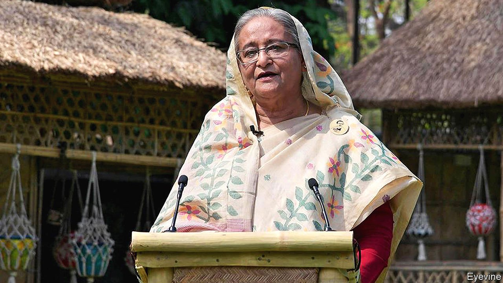

###### Mid-life crisis

# Bangladesh’s growth has been remarkable, but is now at risk 

##### The government is moving away from the openness and moderation of the past 50 years 

 

> Mar 25th 2021 

“WON’T YOU give some bread to get the starving fed? We’ve got to relieve Bangladesh,” sang George Harrison, a former Beatle, in 1971. His pleading was warranted. No sooner had local politicians declared the independence of the eastern half of Pakistan (as Bangladesh had previously been) on March 26th of that year than the Pakistani army initiated a brutal war to crush the separatists, at a cost of somewhere between 500,000 and 3m lives. The fighting, along with devastating floods and cyclones, had turned the new country into one of the most destitute spots on Earth.

Fifty years on, the improvement in the lives of ordinary Bangladeshis has been remarkable. In 1972 GDP per person was almost 40% lower in  than in Paki-stan. Now it is more than 40% higher. The economy was growing by around 8% a year before the pandemic struck—the fastest pace in Asia. The country’s proliferating garment factories provide a decent livelihood for millions. By the World Bank’s reckoning, Bangladesh has graduated from “least developed” to “developing” or “lower middle-income”—a huge advance on the wasteland of 1971.


By other measures, Bangladesh is doing even better. Infant mortality, which used to be higher than in both Pakistan and India, is now lower. A typical Bangladeshi lives three years longer than the average Indian, and five years longer than the average Pakistani. Bangladeshi women, in particular, have seen their circumstances improve dramatically: they are more likely to have gone to school, to be able to read and to have a job than their counterparts in India and Pakistan. They also have fewer children—although with 170m people, Bangladesh is nonetheless the eighth-most-populous country in the world.

This remarkable turnaround is not thanks to administrative stability or far-sighted leadership. On the contrary, since Bangladesh’s birth its politics have been violent and tumultuous, marred by thuggish parties, frequent coups and extreme polarisation. The current prime minister, Sheikh Hasina Wazed (pictured), has been in office since 2009 and centralised power, eroded all checks on her authority and systematically undermined or co-opted independent institutions that might serve as rival sources of prestige.

However, despite the constant political upheaval, two things have stood Bangladesh in good stead. The first is the moderation and practicality of ordinary Bangladeshis. Cultural conservatism in both India and Pakistan has impeded women from working outside the home. But in Bangladesh the share of women in the workforce has risen steadily, from 3% in 1974 to 36% in 2019. It is these women who staff the garment factories, and so have enabled the rapid economic growth of recent years.

The second factor behind Bangladesh’s good fortune has been the openness of successive governments to outside assistance. This stance was born of necessity: the war of independence left the country, including all levels of administration, in such tatters that there was little alternative but to take whatever help was on offer, be it from returning expats, aid agencies or former Beatles. The energy and creativity of the many charities and NGOs, in turn, helped propel rapid improvements in the health and welfare of ordinary Bangladeshis long after the immediate damage of the war had been repaired. Microcredit—helping the poor improve their lot by giving them tiny loans, even though commercial banks would not have considered them creditworthy—was pioneered in Bangladesh. NGOs have also worked closely with the government on everything from insulating farmers from the consequences of bad harvests to distributing contraceptives.

Sheikh Hasina, daughter of the hero of independence, Sheikh Mujibur Rahman, is making much of the country’s 50th birthday. Yet her increasingly authoritarian ways are damaging the very traits that have made it so successful. Big NGOs have been brought to heel. After Muhammad Yunus, who won the Nobel peace prize for his work on microfinance, mused about starting a political party, he found himself ejected from Grameen Bank, the biggest provider of small loans to the needy. By the same token, to court devout voters Sheikh Hasina has allied with doctrinaire Muslim groups, which have agitated against secularism, women’s rights and sexual freedoms. A group of such radicals, along with members of the ruling party’s youth wing, recently ransacked a Hindu village after an inhabitant criticised their leader on Facebook.

The record of the past 50 years provides an enormous amount to celebrate. But Sheikh Hasina does not seem to understand the legacy she has inherited. Bangladesh has not come so far thanks to a strong, intolerant, centralised government, but rather for the lack of one. ■

