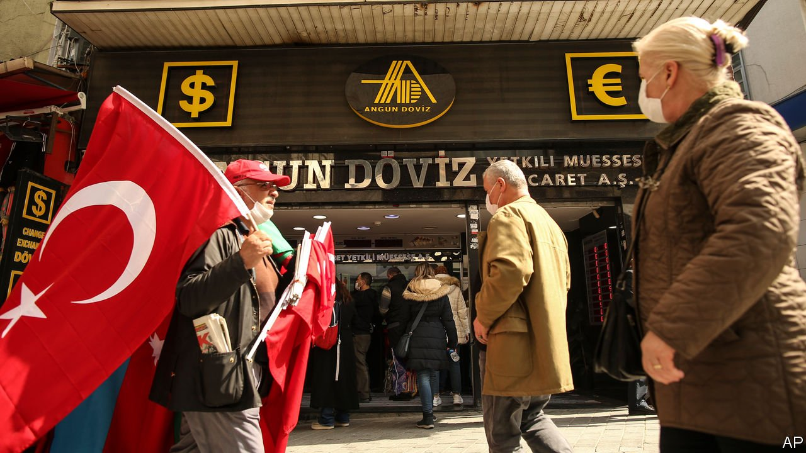
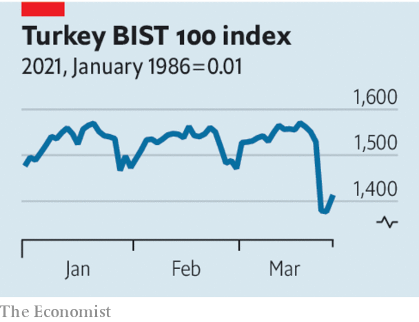

###### Turkey and emerging markets

# Turkey’s economic woes should be a warning for other countries 

##### Not all emerging markets are like Turkey. But they should all beware its example 

 

> Mar 25th 2021 

ISTANBUL’S STOCK exchange does not open until shortly before 10am, a more civilised hour than most bourses. Investors therefore had time to brace themselves on March 22nd before discovering the full cost of President Recep Tayyip Erdogan’s reckless decision to fire Turkey’s admired central-bank governor, Naci Agbal, over the preceding weekend. The selling frenzy triggered an automatic suspension of trading twice in the first 45 minutes. Combined with a deep fall in the lira, Turkey’s stocks declined by over 16% in dollar terms by the end of the day.

Turkey has grown faster than most emerging markets over the past decade, and even managed to eke out a modest expansion last year. But as Mr Erdogan’s party has accumulated power and audacity, it has eroded the institutional constraints that once ensured economic stability, including the autonomy of the central bank. Mr Agbal was unceremoniously sacked for doing too much to stop inflation. His predecessor was fired for failing to steady the lira. Mr Erdogan has yet to grasp that a central bank cannot avoid one of these improprieties without committing the other. He has now  in two years.


Mr Erdogan’s macroeconomic muddles and meddling reflect both his own intellectual confusion and the inconsistent demands of his supporters. Turkey’s construction industry, which ensures growth and jobs, thrives on easy credit. That contributes to inflation and a flight from the lira. But Turks, especially merchants and small-business folk, who keep much of their money in dollars or euros, vehemently oppose exchange controls. The result is an unstable currency and unstable prices. Turkey is trying to emulate China’s growth strategy (featuring state-backed credit for property and infrastructure investment) without the benefit of its docile depositors and trapped savings.

 


Such considerations are the burden Turkey alone must bear. But the country’s problems also reflect broader concerns that weigh on emerging markets in general. The interest-rate rise that cost Mr Agbal his job was partly a response to a common threat. As the world economy revives, commodity prices recover and American bond yields rise, so  could start to face a squeeze. Inflation will move mechanically higher as the depressed prices of last year give way to a more normal pattern this year. If that rise in prices raises expectations of sustained future inflation, central banks will have to respond, as Brazil’s central bank did last week when it raised interest rates more than expected. If they do not, inflation will begin to feed on itself.

Fortunately, the holders of emerging-market assets can take some comfort. In most other big markets central banks have larger amounts of hard-won credibility to draw on. Russia’s respected monetary-policy chief has been in her job for almost eight years. Brazil has just passed a law that formalises the central bank’s independence. The average inflation rate among the 27 members of MSCI’s benchmark emerging-market equity index is only about 4%, compared with over 15% in Turkey. Indeed, in countries like Thailand and Malaysia, prices are still falling. Partly because the lira cannot hold its value, Turkey is also unusually reliant on borrowing in other people’s currencies. The combined foreign-currency debts of its government, banks and companies amounted to over 80% of GDP at the end of 2020. In Brazil the figure was only half that.

For all these reasons, other emerging markets should be able to withstand any temporary fallout from the fuss in Turkey. Nevertheless, they should heed the country’s cautionary tale: if you rely on foreign capital it is risky to compromise central bank independence, especially when global interest rates are rising. Emerging-market investors will treat Turkey as an unfortunate exception only for as long as emerging-market policymakers learn from its unfortunate example. ■

