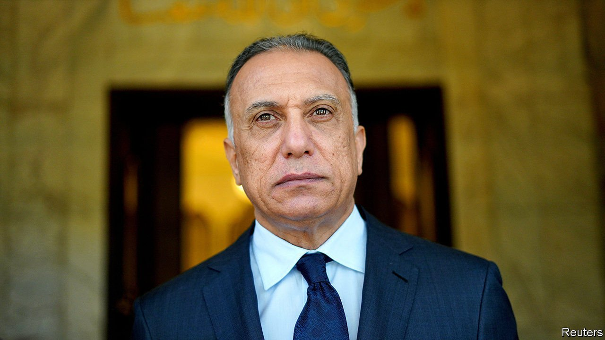

###### Trouble with the neighbours

# Iraqis are getting fed up with Iran 

##### But curbing its influence is a challenge 

 

> Mar 27th 2021 

“A STAIN ON Iraq’s sovereignty.” That is how an Iraqi army officer describes the billboard glorifying Qassem Suleimani, a stunningly successful Iranian commander who was killed in an American air strike on Iraqi soil in January 2020. The hoarding looms over Baghdad’s administrative district, known as the Green Zone. Many Iraqis once hailed Suleimani as hero for mobilising local forces that beat back the jihadists of Islamic State. But public sentiment in Iraq has turned. The masses who cheered Iran as a liberator increasingly see it as an occupying power. Iraqi politicians are trying to loosen its grip.

Iranian-backed militias still hold sway in much of Iraq. Many were involved in the violent suppression of anti-government protests that erupted in 2019. Lately, though, they have lowered their profile. They hang fewer placards celebrating their ayatollahs and generals, and appear less often in the streets. They miss the guidance of Suleimani and Abu Mahdi Muhandis, the Iraqi head of an umbrella group of pro-Iranian militias, who was killed in the same air strike. With no clear chain of command, the militias are splintering. They were expected to mark the anniversary of the air strike with a show of force. Thousands of Iraqis marched in Baghdad; the wreck of the car in which Suleimani was killed was displayed. But there were no big retaliatory strikes on American targets.


Iran has long used Shia politicians in Iraq to assert influence. (Shias are a big majority in Iran and a smaller one in Iraq.) But Iraq’s Shia prime minister, Mustafa al-Kadhimi, is not playing ball. Unlike most of his predecessors, Mr Kadhimi is not from a party that is close to Iran. Since taking office in May he has enforced American sanctions, preventing Iran from repatriating the billions of dollars it earns from exports to Iraq. (Ali Shamkhani, the head of Iran’s national-security council, summons Iraqi officials to Tehran, Iran’s capital, and curses them for not transferring the cash.) The prime minister has also annoyed the militias by restoring state control at some border crossings and removing their men from security posts. At his behest NATO is sending 3,500 new troops. “These [Iranian-backed] groups are feeling extremely threatened,” says Maria Fantappie of the Centre for Humanitarian Dialogue, a conflict-resolution group based in Geneva.

Such is the level of distrust that foes of Mr Kadhimi, a former intelligence chief, accuse him of passing Suleimani’s location to the Americans, enabling the air strike. Militiamen have assassinated Mr Kadhimi’s confidants and chased some of his advisers abroad. A group called Kataib Hizbullah, with links to Iran, surrounded his residence in June with pickup trucks full of armed men after he moved to arrest some of its members suspected of killing protesters. “He was lucky to escape without his head on a plate,” says an observer in Baghdad. Since then Mr Kadhimi has shied away from confronting the militias directly. His cabinet includes ministers from pro-Iranian factions, who are trying to increase the number of militiamen (already in the tens of thousands) on the government payroll. An Iraqi official recalls the prime minister fretting: “If you don’t pay them, they’ll bomb the Americans.”

Sometimes they do anyway. Twice this year Iranian-backed militias have fired rockets at American and allied personnel in Iraq. They have also targeted Saudi Arabia: in January explosive-laden drones launched from inside Iraq crashed into a palace in Riyadh, the kingdom’s capital. Iraqi officials say militias are massing near the border with Saudi Arabia, armed with 1,400 missiles. Were Mr Kadhimi to become more aggressive, that might also invite a stronger response from Iran, which supplies electricity and gas to Baghdad and other big Iraqi cities. If it cut supply during the summer, unrest would undoubtedly follow. The Iraqi officer peeved by billboards has even bigger worries. If Mr Kadhimi tore down the pictures of Suleimani, he says, Iran might use its proxies to grab Iraq’s (mainly Shia) southern provinces.

Mr Kadhimi’s advisers believe that most Iraqis support his efforts to curtail Iran’s influence. But in recent elections, they say, the disillusioned masses stayed at home while voters supporting pro-Iranian parties turned out. Another election is scheduled for October. If Mr Kadhimi’s men were to do a better job of rallying voters—and if the UN sent monitors to try to ensure a fair poll (a move it is considering)—the political landscape might change in a way that would make his job easier. In the meantime, he has called for a national dialogue that might even include groups under American sanctions. Talking, he seems to have concluded, is better than picking fights he may lose.■

