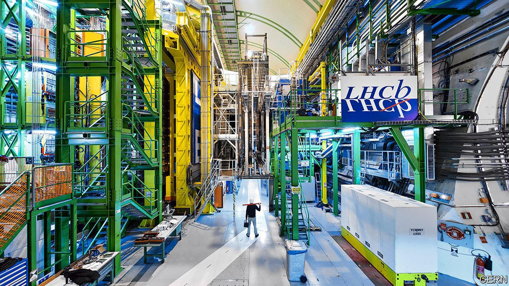

###### Fundamental physics

# A route to the much-sought “new physics” may have opened 

##### An odd result from the LHC cannot easily be explained away 

 

> Mar 25th 2021 

THE STANDARD MODEL of particle physics is one of the most powerful theories in science. It is, though, incomplete. It describes a suite of fundamental particles and the forces through which they interact, but it fails to include gravity and dark matter (mysterious stuff detectable at the moment only by its gravitational pull), and also cannot explain why there is more matter than antimatter in the universe.

For these reasons, physicists have spent decades searching for ways to extend it, or at least for results that may provide a means of doing so. And on March 23rd, at a meeting called the Moriond Electroweak Physics Conference, a team from Europe’s particle-physics laboratory, CERN, in Geneva, reported that they might have some.


The details are arcane. But they concern particles called beauty quarks which, themselves, form part of other particles called B-mesons. When beauty quarks decay, the daughter particles produced sometimes include a pair of what are known as charged leptons. These may be an electron and its antimatter equivalent, a positron, or two heavier leptons, a muon and an antimuon. The Standard Model predicts equal numbers of such pairs. But an analysis of results from the LHCb experiment (pictured), a purpose-built detector fitted to CERN’s Large Hadron Collider (LHC), suggests electron-positron pairs are more abundant than muon pairs.

If confirmed, this could be the much-sought crack into which researchers can insert a metaphorical crowbar to prise the Standard Model open and reveal what it is hiding—perhaps a fifth force of nature to go alongside gravity, electromagnetism and the strong and weak nuclear forces.

In public, those involved are cautious. Calculations suggest there is one chance in 1,000 the result is a fluke. In many fields of science that would be enough to declare victory and go home, but particle physicists are choosier. They require one chance in 3.5m. Privately, however, things are different. As Mitesh Patel of Imperial College, London, who is one of the team members, put it, “we were actually shaking when we first looked at the results, we were that excited. Our hearts did beat a bit faster.”

