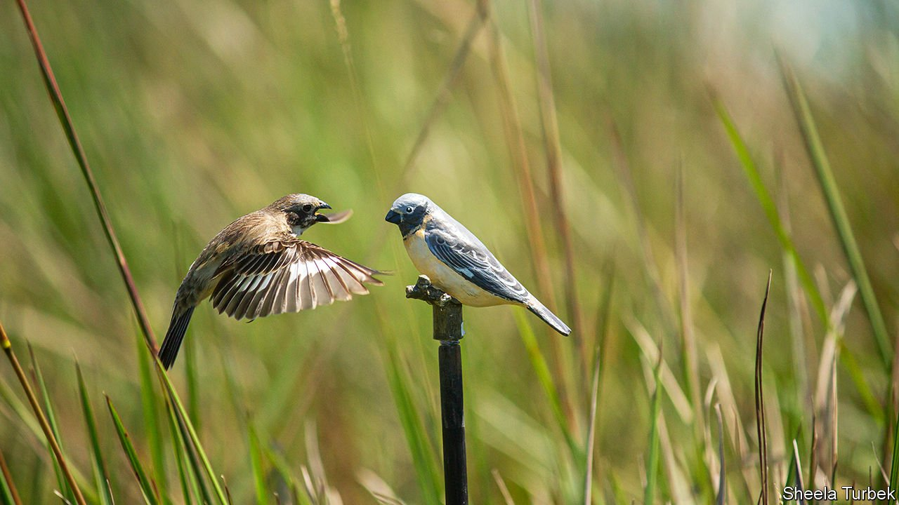

###### Speciation

# How female choice creates new species 

##### If a male looks wrong, he is wrong 

 

> Mar 27th 2021 

NATURAL SELECTION, as propounded in Charles Darwin’s master work, “On the Origin of Species”, explains how organisms evolve and adapt to their circumstances. Paradoxically, though, it is a bit hazy on the actual subject of its title, namely how parent species spin off new, daughter species. Darwin recognised that diverse ecological niches encourage speciation (though he did not use those as-yet-uninvented terms). But he did not ask how incipient daughter species were prevented from remixing before they had properly separated.

Somehow, barriers need to be erected against miscegenation. They might be geographical—fish in different lakes, for example. Or they might be ecological, such as a shift in food preferences causing insects formerly of the same species to feed in different types of tree. But sometimes species form in circumstances where no such barriers are apparent. That is puzzling.


One established exception to the rule that speciation requires separation is hybridisation. This is a common source of new plant species, but is rarer for animals. It is, though, thought to explain several brightly coloured animal groups, including the cichlid fish of Africa’s Great Lakes, the heliconid butterflies of South and Central America, and the southern capuchino seedeaters, a family of songbirds that also live in the New World tropics. Now, Sheela Turbek of the University of Colorado, in Boulder, has taken matters a step further, by showing that a process called sexual selection plays a role in what is going on.

Picky, picky

Sexual selection, a phenomenon first described scientifically by Darwin, occurs when one sex (usually the female) chooses another (usually the male) on the basis of a distinctive genetically derived characteristic. The classic example is a peacock’s tail. But sexual selection could also serve to separate species in what is more-or-less a one-step process, by the sudden appearance of such a characteristic. And that, as she describes in a paper in Science, is what Ms Turbek thinks has happened in the case of the Iberá and tawny-bellied seedeaters.

These two birds live, among other places, in the San Nicolás Reserve, in Argentina. They forage on the same grasses, breed at the same time, and have breeding territories which may be as close as 50 metres from one occupied by the other species. They are also similar enough to interbreed successfully in captivity. But, as far as is known, they never do so in the wild.

Genetic sequencing shows just how similar these species are. Only 12 of their genes differ—less than 0.1% of their genomes. Intriguingly, one of the 12 is part of one of the sex chromosomes, hinting at a role for sexual selection. Another three of them play a role in the colouration of male plumage, which is also suggestive. For, although the species are of similar sizes and shapes, adult male tawny-bellied seedeaters, as their name implies, have brownish-orange chests, while male Iberá seedeaters have black throats and sandy-coloured bodies. Their songs are distinct, too. They use the same range of frequencies, but different syllables.

First, Ms Turbeck and her colleagues established that females of both species did, indeed, regularly select the right mates. Observation of pairs suggested so, and genetic testing of young (needed because more than half the females under study mated with extra males in addition to their long-term partners) did not find any exceptions, either. That done, they looked at males’ abilities to distinguish conspecific rivals from heterospecific neutrals. During the 2019 breeding season they mounted decoy males in the territories of 40 male tawny-bellied seedeaters and 36 male Iberá seedeaters. They then monitored the residents’ responses when a female was around (see picture).

They used four decoys. One had the plumage and song of a male Iberá seedeater. One similarly resembled a male tawny-bellied seedeater. The other two had, in one or other combination, the appearance of one species and the song of the other.

If a resident male viewed a decoy as competition he would act aggressively, by flying to and pecking at it. And males could certainly tell the difference. They were most aggressive towards decoys that resembled their own species, moderately so towards decoys that combined features of both, and least towards those that resembled the other species. Since these were not real birds, it must have been the colouration and the song that were the cues.

The differences between the species’ songs may be cultural, and have come about after the split. But the differences in plumage are clearly genetic. What is more, they are so small that they could have happened on a single occasion as a result of an accidental hybridisation, for similar genetic differences are found in varying combinations throughout southern capuchino seedeaters. Also, what happened once could presumably have happened often. It therefore seems plausible that Ms Turbeck has uncovered the nub of the mechanism by which this group has become so diverse. If so, then she has helped write another page in that as-yet-unpublished volume, “The Real Origin of Species”. ■

