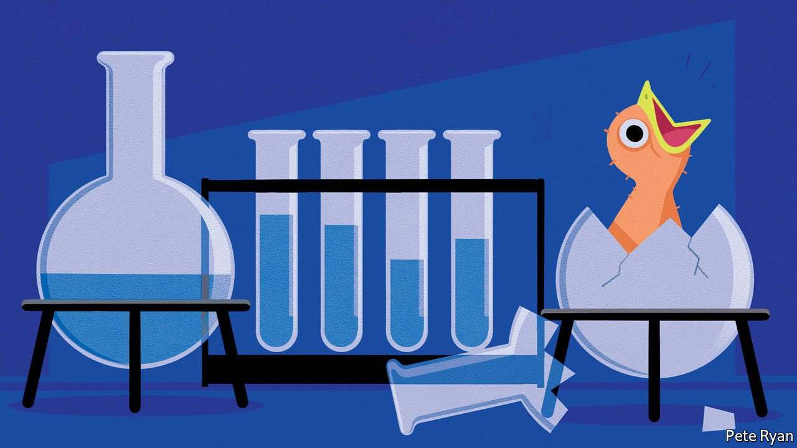

###### The year of learning dangerously

# Covid-19 has shown what modern biomedicine can do 

##### It can move very quickly, but needs to be well applied 

 

> Mar 23rd 2021 

THE NUMBER of deaths officially attributed to covid-19 now stands somewhere over 2.5m. It is a terrible toll, but hardly an unprecedented one. The ongoing HIV/AIDS pandemic has killed between ten and 20 times as many worldwide. The death toll from the influenza pandemic of 1968 is believed to have been similar to that of covid-19, with a range of 1m to 4m, and until the past year you would have been hard put to find a mention of it outside a medical text. Similarly the flu of 1957. Yet covid-19 has had social, economic and political impacts beyond those of any other health crisis in modern history.

There is no starker illustration of the fact that, in the body politic as in the bodies the virus infects, the host’s response can matter far more to the course of the disease than the direct action of the pathogen itself. An infection which many do not even notice causes in some an immune response which can be fatal. Pandemics, too, are shaped by and reveal the particulars of the world they hit.


The covid-19 pandemic struck in an age more thoroughly interconnected and information-saturated than any which has come before. Though China was shamefully opaque early on, there was no way the situation could be kept from the world for long. In 1957 Britain’s Ministry of Health suppressed estimates that that year’s flu might infect a fifth of the population; it would be, in the words of a junior minister, “a heaven-sent opportunity for the press during the ‘silly season’”. Many politicians have lied and prevaricated about covid-19. None has been able to simply keep schtum.

The policy response, too, has been one only possible in the information age. The closing of workplaces and shops would have been impossibly disruptive just ten years ago. The shortcomings of Zoom, Microsoft Teams, Amazon and all the other services that the well-off world has relied on are manifest. But their benefits have been vital.

The greatest technological revelation, though, has been the medical and public-health responses. That the internet has changed the world is not news. That basic biomedical science is now in a position to do so is. Labs were running specific tests for a never-before-seen virus barely a month after the first cases were reported. Crucial information on which therapies, old and new, did and did not work was available by the middle of the year. The evolution of the virus was revealed as it happened by genome sequencing on a scale to which no previous pathogen had ever been subjected. Most remarkably of all, a range of safe and effective vaccines based on various novel approaches was available within a year. One of the technologies used—directly injected mRNA—opens up all sorts of further possibilities.

This Technology Quarterly will examine how the response to covid-19 has revealed the true potential—and, sometimes, the failings—of these various technologies. It is not, yet, a tale of triumph. But the pandemic has laid bare a hard-won corpus of technological achievement just waiting to be harnessed to the cause of a better future.■

Dig deeper

All our stories relating to the pandemic and the vaccines can be found on our . You can also listen to , our new podcast on the race between injections and infections, and find trackers showing ,  and the virus’s spread across  and .

