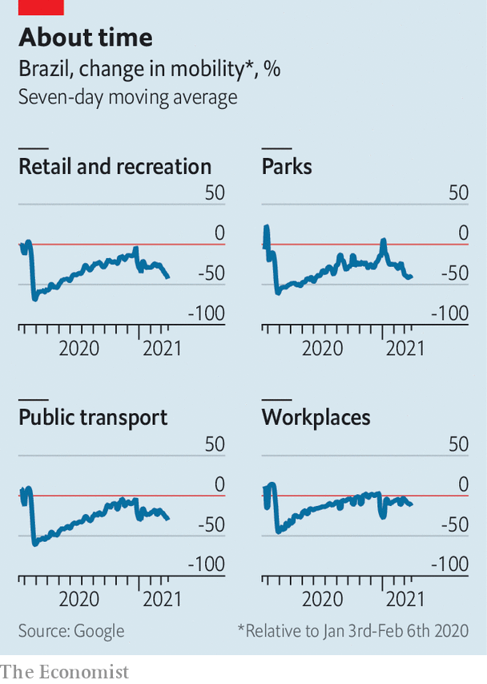
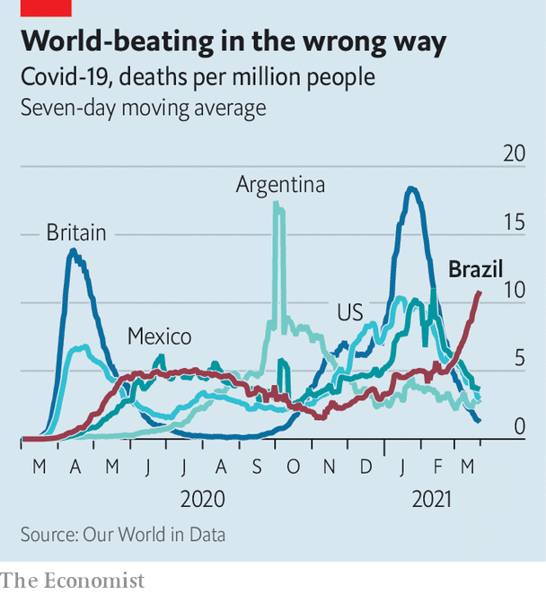

###### Fighting the P.1 variant

# Brazil’s mismanagement of covid-19 threatens the world 

##### Jair Bolsonaro has a lot to answer for 

 

> Mar 27th 2021 

SéRGIO OLíMPIO GOMES, better known as Major Olímpio, was a policeman who entered politics 15 years ago. In 2018 he managed the campaign in the state of São Paulo of Brazil’s current president, Jair Bolsonaro, and was elected to the national Senate. On March 18th this year he died of covid-19, aged 58. He is the third sitting senator to have died from the disease. Nearly 4% of the legislature’s upper house has perished in the pandemic.

That has brought home to the political class a shock that millions of Brazilians are now experiencing. The country is suffering a second covid wave far worse than the first. Its recorded death toll, averaging over 2,300 a day, is a quarter of the world’s total. This is despite the fact that Brazil has less than 3% of the world’s people.


The health system is in a state of “collapse” for patients with severe cases of covid-19, says a bulletin published on March 23rd by Fiocruz, a public-sector research institute. In 25 of the 27 states more than 80% of intensive-care beds are occupied. Eighteen states have shortages of drugs such as neuromuscular blockers, used when patients are put on ventilators. In six states oxygen supplies are dangerously low, according to the health ministry. The National Forum of Governors warns that shortages threaten to cause “a collapse within the collapse”.

 


Bahia, a state in Brazil’s north-east, is experiencing “pressure”, not complete failure, says its health secretary, Fábio Vilas-Boas. But that is bad enough. The number of patients needing oxygen has “exploded”. Some hospitals are treating covid-19 patients in emergency rooms because their intensive-care units (ICUs) are full.

Brazil’s second wave is thought to be mostly caused by a variant of the novel coronavirus, called P.1, which was probably born in the Amazonian city of Manaus. More contagious than the original, and able to reinfect people who have already had covid-19, P.1 has alarmed not just Brazil but the rest of the world. It has been detected in 33 countries. Some vaccines are less effective against P.1 than against other major variants of the virus in Europe and the United States.

The country’s neighbours are slamming shut their doors. Peru and Colombia stopped flights from the country. Just two of Brazilians’ top ten destination countries remain open to them. “If Brazil is not serious, then it will continue to affect all the neighbourhood there and beyond,” warned Tedros Adhanom Ghebreyesus, the head of the World Health Organisation.

But seriousness, like muscle blockers, is in short supply. Mr Bolsonaro has touted quack cures, railed against lockdowns and tried to thwart the publication of data. He has just bid farewell to the third health minister (an army general) since the pandemic began. Vaccines are not for him, Mr Bolsonaro has claimed. His government was slow to order them, even though manufacturers such as Pfizer and Janssen had tested them in Brazil.

Governors and mayors, who implement lockdowns, have largely followed the president’s lead. After clamping down at the beginning of the pandemic most quickly eased up. But even when restrictions are in place, Mr Bolsonaro’s rhetoric can scupper their enforcement. In Bahia’s poor neighbourhoods life has continued as normal, at least until very recently. “We can’t impose on those who live in favelas the obligation of being inside a hot small house,” says Dr Vilas-Boas. The state does not have enough police to ensure that bars stay closed.

That a variant like P.1 was born in Manaus comes as no surprise, says Natalia Pasternak, a microbiologist who leads Instituto Questão de Ciência, which advocates the use of science to shape policy. The city’s first wave was so severe that some thought it had reached herd immunity. Residents thronged riverside beaches at the first opportunity, giving P.1 a fast start in life. When it left the forest, other parts of the country made it equally welcome. Although Brazil does too little gene sequencing to know for sure how widely it has spread, studies in São Paulo state identify the variant in 80-90% of cases.

 


P.1 is frightening because it may be both more contagious than earlier versions and able to reinfect people. One study suggested that it could be up to twice as transmissible and could reinfect 25-61% of people who have had covid-19. P.2, a worrying variant from Rio de Janeiro, is also spreading.

The shock of the second wave is changing people’s behaviour. Governors and mayors are now tightening restrictions and people are obeying them more. From March 22nd a nightly curfew in Bahia begins at 6pm rather than 10pm. Bahians have recently cut in half the distance they travel, according to mobile-phone data. This is slowing covid-19’s spread. Dr Vilas-Boas estimates that the number of active cases in Bahia has dropped from 21,000 to 17,000. The number of patients waiting for beds in ICUs fell from 513 on March 12th to 280 ten days later.

This month the federal government finally agreed to buy Pfizer’s vaccine and the one-dose jab from Janssen. They will supplement the AstraZeneca and Chinese CoronaVac vaccines already being administered. Brazil has begun domestic production, too. Fiocruz has delivered its first homemade doses of AstraZeneca; the Butantan Institute in São Paulo has begun making CoronaVac. Some 8% of adults have had a first jab. “For the first time,” says Ms Pasternak, “I’m hopeful.”

On March 23rd, when the daily death toll reached a record 3,158, Mr Bolsonaro went on television to boast of Brazil’s vaccination progress. Yet as long as social distancing is needed the president will remain a menace to Brazilians’ health. He has filed suits in the Supreme Court against three states, including Bahia, that have tightened lockdowns. His actions are bad for Brazil—and for the world.■

Dig deeper

All our stories relating to the pandemic and the vaccines can be found on our . You can also listen to , our new podcast on the race between injections and infections, and find trackers showing ,  and the virus’s spread across  and .

