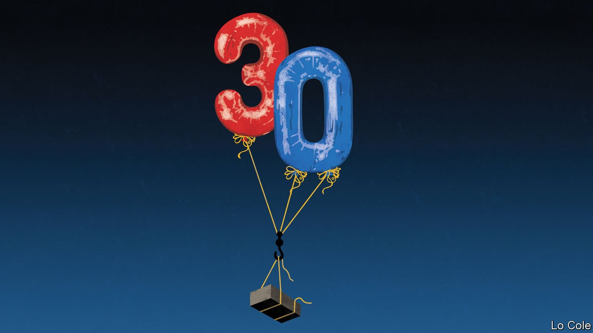

###### Bello

# Can Mercosur reverse decades of backsliding? 

##### The South American trade group marks an unhappy 30th birthday 

 

> Mar 25th 2021 

THIRTY YEARS ago South America had only recently emerged from dictatorships and protectionist isolation. It seemed like a revolutionary step when in 1991 the presidents of Argentina, Brazil, Paraguay and Uruguay sat down in Asunción and signed a treaty setting up a free-trade area that soon became Mercosur, a customs union of 200m people and a combined GDP of $1trn. Coinciding with a wave of market-freeing reform, the philosophy behind it was known as open regionalism. “With regional integration, we’re going to be able to take part in world trade and world decision-making in the next century,” Fernando Henrique Cardoso, then Brazil’s president, told your columnist in 1996.

Yet on March 26th, when the group’s current presidents mark Mercosur’s 30th birthday, there will not be much to celebrate beyond its mere survival. A first decade of rapid progress in integration was followed by two more of backsliding and protectionism. Trade within the bloc peaked as a share of its members’ total trade at 25% in 1997. Today that figure is just 14%. True, the members’ overall trade has expanded greatly, but most of that growth has been in exporting commodities to Asia.


Mercosur has also struggled to stick to its own rules. Its common external tariff is littered with exceptions. Internal barriers are plentiful, too. The crudest was when Argentina’s government encouraged protests against paper and pulp mills in Uruguay that blocked a key border bridge for years.

There have been periodic efforts to revive Mercosur. The most recent involved trade-facilitation measures agreed on in 2017, with pro-business governments in Argentina and Brazil. Conscious of its isolation from global value-chains, Mercosur belatedly tried to reach trade agreements with the outside world. It now has zero-tariff agreements with all South American countries except the Guyanas. It is talking to several Asian countries. Most important, after 20 years of negotiations it struck a trade-and-co-operation agreement in 2019 with the European Union (EU).

But Mercosur faces deep-rooted problems. They include macroeconomic volatility, as well as poor transport infrastructure. The biggest stumbling-block is political. No government is prepared to cede much sovereignty. Left and right, as currently represented by the governments of Argentina and Brazil respectively, often disagree radically about what regional integration means. Jair Bolsonaro’s authoritarian but economically liberal government in Brazil wants to cut Mercosur’s high external tariff; Alberto Fernández’s leftist populist administration in Argentina, grappling with a deep slump, does not. They have few values in common.

The 30th birthday party will be held online because of the pandemic (Mr Bolsonaro and Mr Fernández also dislike each other and have yet to meet in person). Uruguay will use the occasion to call for “flexibility” to negotiate its own trade agreements, a euphemism for Mercosur turning into a free-trade area rather than a customs union. That would involve changing the treaty, something neither Argentina or Brazil is likely to accept, thinks Rubens Barbosa, who was Brazil’s first Mercosur co-ordinator.

Mercosur’s future will be defined by whether or not the EU agreement is ratified. Proponents see this as sealing a strategic alliance in a world of tensions between China and the United States. Mr Fernández’s government is not enthusiastic. But it is Mr Bolsonaro who could be an insurmountable obstacle to ratification. The rampant deforestation in the Amazon, which has occurred on his watch, makes the agreement politically toxic in Europe, and gives an excuse to governments, such as France, which want to shield their farmers from Mercosur’s more efficient ones.

The European Commission is trying to draw up new rules on preventing deforestation to present to Mercosur. This is “an attempt to keep the thing alive”, says Susana Malcorra, a former Argentine foreign minister. Realistically, conditions for ratification are unlikely until 2023, after elections in Germany, France and Brazil, and when Spain, a proponent, will hold the EU presidency.

The agreement would bind Mercosur more tightly to its own rules. Without it, what would be the group’s future? “I don’t think any of the countries will pay the political price of scrapping Mercosur,” says Mr Barbosa. Instead, it would risk becoming another relic of Latin America’s persistent failure to integrate, now for more than half a century.

