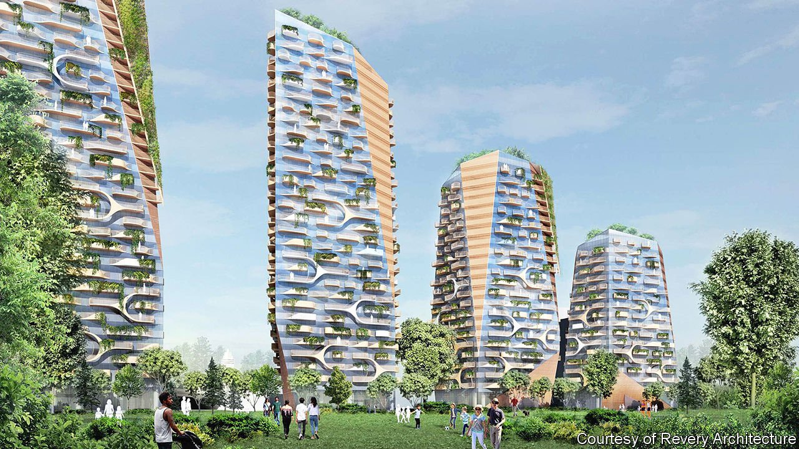

###### It was their backyard first

# How a Canadian indigenous group could outwit NIMBYs 

##### The Squamish Nation are free to build bigger, faster and cheaper than other landowners 

 

> Mar 27th 2021 

“IT’S EASIER to elect a pope than to approve a small apartment building in the city of Vancouver,” says Ginger Gosnell-Myers, of Nisga’a and Kwakwak’awakw heritage, and formerly the city’s first-ever indigenous-relations manager. Such is the power of local NIMBYs that it is difficult to build new homes, and legions of young people are doomed to live with their parents for years, if not decades. But on some land the normal rules do not apply. No one can tell the Squamish First Nation, an indigenous group, what to build on their territory.

One patch of its reserve is in Kitsilano, a ritzy part of Vancouver. Despite being close to the city centre, it is full of single-family homes and duplexes. Residents fiercely resist the construction of tall buildings. But they cannot stop the Squamish from erecting 59-storey skyscrapers. This year could see the ground broken for Senakw—12 towers containing 6,000 flats, mostly for renting. It would be the largest private indigenous development in Canada.


Extra homes are sorely needed. Vancouver is the second-most-expensive city in the world, after Hong Kong. Tough zoning rules mean that the supply of new homes cannot meet demand. The Squamish, however, are free to build bigger, faster and cheaper than other landowners. Khelsilem (who goes by one name), the Squamish’s spokesman, says a typical project of this size would spend five to ten years in the planning process. He expects Senakw to take two, provided the federal government responds quickly to the Squamish’s request for a long lease on their land. Unlike other building projects, Senakw is not required to provide details to the public or hold town-hall meetings.

The Squamish hope the project will bring in roughly C$20bn ($16bn) over 99 years. They could use the money. On average, Squamish people earn less and die earlier than other Canadians. The revenue from Senakw could be used for education and health care.

If all goes to plan, Senakw could set a precedent. Urban reserve land is rare because indigenous people were pushed out of desirable areas by settlers in the 19th century. But a law passed in 2019 makes it easier to expand or create new reserves. That could lead to similar development opportunities for other indigenous groups.

In 2019 the city vowed to put up 20,000 new rental units. Senakw would meet roughly a quarter of that target, points out Ms Gosnell-Myers. “The Squamish Nation is more responsive to average Vancouverites than Vancouver city hall.”■

