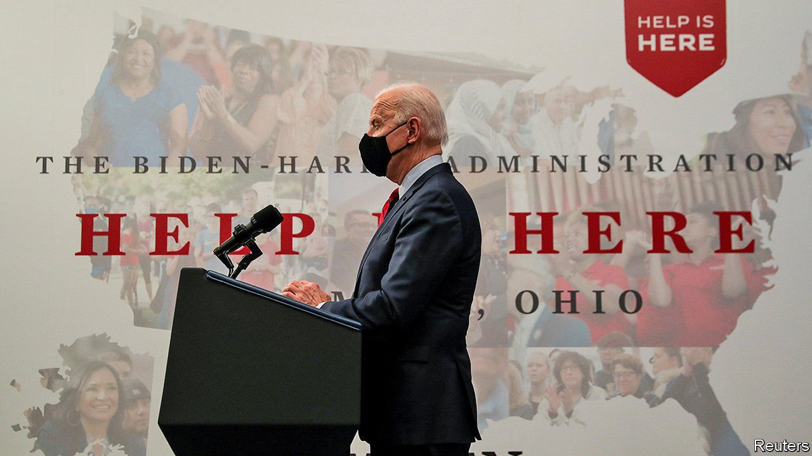

###### 

# Business this week 

#####  

 

> Mar 25th 2021 

Joe Biden is reportedly contemplating a $3trn bill on infrastructure and education. The president has said his  will be ambitious, but the size of the price tag, on top of the $1.9trn stimulus package, has rekindled concerns about an overheating economy and inflation. Larry Summers, an economic guru in the Clinton and Obama administrations, warned Democrats and Republicans that they were being irresponsible, saying that America risks a “dramatic fiscal-monetary collision”.

It’s in the oven


Deliveroo’s forthcoming IPO could see it valued at up to £8.8bn ($12bn) based on the upper range at which it intends to price its shares. That would make it London’s biggest stock debut since Glencore in 2011. Amazon holds 15.8% of the food-delivery service, which will fall to 11.5% after the IPO.

Baidu’s secondary listing of stock in Hong Kong was a damp squib. The tech giant follows other Chinese internet companies by listing in the city, though its shares barely rose on the first day of trading, and fell subsequently.

Canadian Pacific, which operates freight rail along the Canadian border and the American Midwest, agreed to buy Kansas City Southern for $29bn. The deal creates the first rail network linking Canada, Mexico and the United States. KCS transports goods in ten American states and in Mexico, where its network stretches to southern ports. America’s freight-rail regulator must first give a green light to the merger.

Pat Gelsinger, Intel’s new boss, announced a turnaround plan for the world’s biggest chipmaker, which has seen its share price sag. As well as making its own products, the company plans to produce more chips for other firms, a business model popularised by TSMC and Samsung.

General Motors and Hyundai became the latest carmakers to announce production cuts as a result of a global shortage of microchips. Those shortages, triggered by the unpredictable effects of the pandemic, may get worse before they get better. A fire at a chip plant owned by Renesas Electronics, which supplies car firms, will halt production for a month.

 


A container ship got itself wedged across the , obstructing an important supply route for goods between Asia and Europe, and oil from the Middle East and Russia. Around 12% of global trade passes through the canal. At 400 metres in length, the Ever Given is one of the world’s biggest ships.

 by almost half, to $49bn, because of last year’s plunge in demand and tumbling oil prices. The oil company still intends to pay a dividend, much of which will go to the Saudi government, its biggest shareholder. Oil prices, meanwhile, had another wobbly week on concerns that supplies would be disrupted by the blocked Suez canal. This follows the biggest weekly drop in prices since October.

According to reports, the Securities and Exchange Commission has told ConocoPhillips and Occidental to allow their shareholders a vote on targets for  used by their customers, rejecting claims that this amounts to micromanagement. Meanwhile a study by the Energy and Climate Intelligence Unit, a British organisation, warned that a lack of transparency about net zero-carbon objectives will lead to companies being accused of greenwashing. A fifth of the world’s 2,000 biggest companies now have such goals.

Cineworld said it would re-open some of its American picture houses in April, as states ease covid-19 restrictions. “Godzilla vs Kong” will be the first feature it shows. Underscoring how lockdowns have changed viewing habits, the world’s second-biggest cinema chain has had to secure an agreement from Warner Brothers, the film’s distributor, for movies to be screened in cinemas first before they are released on streaming services.

A survey of chief executives by KPMG shone a light on future work practices. A quarter think the pandemic has changed their company for ever; 90% intend to ask employees if they have been vaccinated; and cyber-security has emerged as their number one threat. But only 17% now think they will reduce their company’s physical space, down from 69% in August.

The work-life rebalance

Remote working was said to be a factor behind complaints from junior bankers at Goldman Sachs about their 95-hour work week. Grizzled veterans grouched that there was nothing new about long hours. David Solomon, the bank’s boss, said they should take Saturdays off. Capturing the zeitgeist, Jane Fraser, the new CEO of Citigroup, called for a “reset” between working from home and the office. In a move that would delight staff everywhere, she has instated Zoom-free Fridays.

