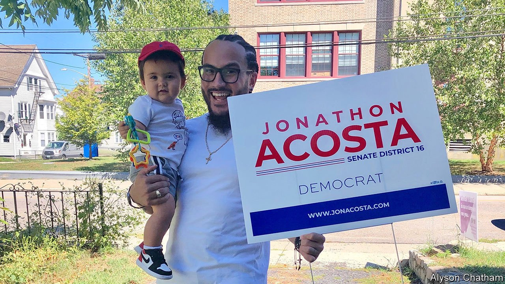

###### Fashion police

# A new dress code means Rhode Island lawmakers have to suit up 

##### A coded message 

 

> Mar 27th 2021 

J ONATHON ACOSTA wore a blazer with a guayabera, a traditional formal shirt in the Caribbean, on his first day as a senator in Rhode Island’s legislature. Since then he has worn informal attire, a better reflection, he says, of his mainly Latino constituents. He often wears knitted hats and cardigans. The only wardrobe rule said that people must be “properly dressed”. That changed on March 23rd, when the chamber passed a new dress code stipulating “proper and appropriate attire”, such as blouses and collared shirts with a jacket.

Before the vote, during a lively debate last week in the Senate Rules Committee, Mr Acosta argued that the new rule “connotes white collar, white people”. He wasn’t elected to wear “a costume”, he was elected to legislate. Dominick Ruggerio, the Senate’s president, retorted that he found it offensive when people are not dressed appropriately. Cynthia Mendes, another senator, later observed that the new dress code appears at a moment when Rhode Island has more women and more minorities than ever.


Dress codes are often a reaction to diversity, says Richard Thompson Ford, author of “Dress Codes: How the Laws of Fashion made History”. Current trends are away from formality in the workplace; Mr Acosta’s wardrobe is similar to that of a Silicon Valley boss. At the same time, the number of dress codes adopted or enforced by schools has increased. Before the pandemic, reports of children being punished for their dreadlocks prompted Cory Booker, a black New Jersey senator, to introduce legislation banning race-based hair discrimination.

Not everyone sees the suit as oppressive. The Student Nonviolent Co-ordinating Committee, a civil-rights group from the 1960s, wore their Sunday best for protests. It was a symbol of defiance. “The African-American in elegant attire was seen as a threat to white supremacy,” says Mr Thompson Ford.

Around two dozen other statehouses have some sort of dress code, as does Congress. Women have been told to cover up their bare arms in the chamber of the House. Some rules are unspoken. Sonia Sotomayor was reportedly advised to wear neutral nail polish to her confirmation hearings as a Supreme Court justice, to avoid scrutiny. After Alexandria Ocasio-Cortez wore big gold hoops at her swearing-in ceremony to Congress in 2019, she tweeted: “Next time someone tells Bronx girls to take off their hoops, they can just say they’re dressing like a congresswoman.”

