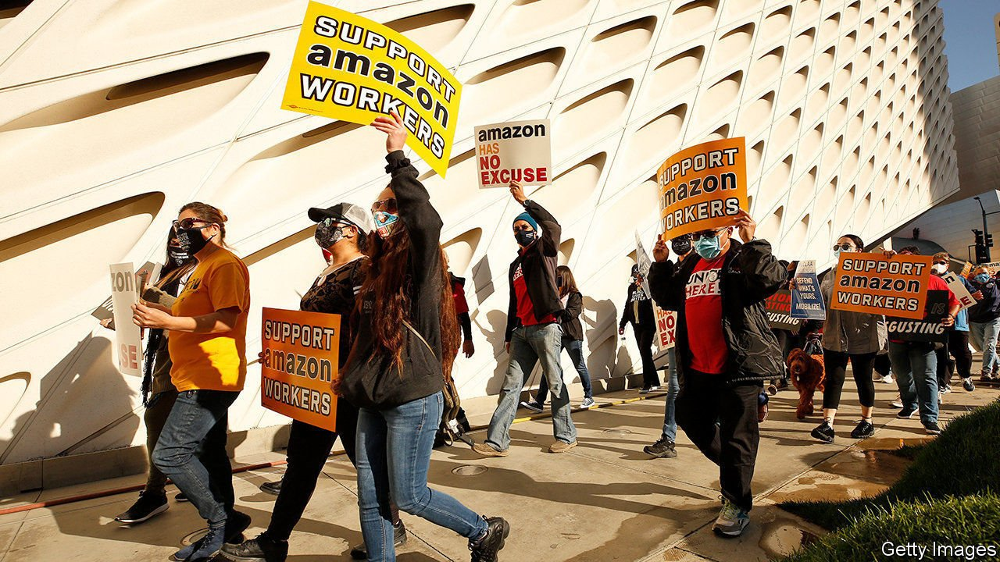

###### Politics, unions and Amazon

# Amazon could get its first unionised workforce in America 

##### Support for unions is rising again 

 

> Mar 27th 2021 

DARRYL RICHARDSON is proud of making his call. One of nearly 5,800 workers at an Amazon warehouse in Bessemer, Alabama, he says he was the one who first phoned the Retail, Wholesale and Department Store Union (RWDSU) to ask it to organise his fellow workers. As a result, since February, staff have been voting in a mail-in ballot. After that concludes on March 29th, Bessemer may become a unionised plant, Amazon’s first in America after a quarter-century of operations.

The result is uncertain, but the campaign is popular: sympathetic drivers honk as they pass placard-waving activists standing in the spring sunshine outside the Amazon plant. Barely 10% of American workers today belong to a union but, according to Gallup, a pollster, 65% of Americans approve of labour unions. They were last so well-liked back in 2003. One of the activists calls the battle in Bessemer a “David and Goliath” fight, and says the little guy might just win.


Stuart Appelbaum, head of the RWDSU, says this vote transcends efforts at a single warehouse. It has drawn national attention—out-of-state politicians and activists have for months flocked to stand on the roads outside the warehouse to show their support. Public understanding of hardships faced by front-line and essential workers in the pandemic has spread sympathy. Mr Appelbaum speculates that the vote could help shape “the future of work”.

That may be overstating it, but other youthful workers, notably in the tech and retail industries, are gripped by the contest. Workers at Amazon plants across America, Mr Appelbaum says, have been in touch to say they may follow Bessemer’s lead. And for some African-Americans, the campaign is seen as part of a wider push for better treatment. In Bessemer most workers are black and around half commute from nearby Birmingham, a city with a grim history of mistreating labourers, including prisoners who used to be hired out cheaply to toil for private employers.

The vote is happening at a moment that looks unusually ripe, politically, for unions. Organised labour has an outspoken champion in the White House. Joe Biden, who kicked off his presidential run from a union hall in Pittsburgh, vowed to be “the most pro-union president” ever. In February he released a video—timed to boost the unionisation effort in Bessemer—saying that “every worker should have a free and fair choice to join a union”.

This week the Senate confirmed Marty Walsh, a former labourer and mayor from Boston, as his labour secretary, the first time in decades an ex-union boss has held that job. Mr Biden’s administration also supported farmworkers’ unions in a case before the Supreme Court this week. The court is to decide whether to undo a 45-year-old law in California that lets unions organise, uninvited, by entering farmers’ land. Donald Trump’s administration had backed two agricultural firms that are seeking to scrap the law, saying it unfairly punished companies. Mr Biden wants to keep it.

The Biden administration is also supporting the PRO Act, a union-friendly bill that passed the House this month, after languishing in Congress for over a year. It drew only a handful of Republican backers and is widely opposed by employers, but a poll suggests that 59% of the public favour it. The act would strengthen the powers of the National Labour Relations Board, grant independent workers more rights to organise and weaken provisions that exist in many states—known as “right to work” laws—that discourage union activity.

The Senate almost certainly will not take it further. But Mr Biden’s promotion of it looks well-judged politically. Doing so helps him fend off leading Republicans who themselves have offered pro-union statements. Josh Hawley, a senator from Missouri, declared in November that Republicans were now a “working-class party”. Marco Rubio, from Florida, said this month that he supports unionisation at Amazon because the firm had waged a “culture war against working-class values”. (Republicans also heartily dislike Jeff Bezos, Amazon’s billionaire boss, who also owns the Washington Post.) Neither, however, backs the PRO Act, or the idea of unionisation at other firms.

Dan Kaufman, who has written on the politics of anti-union movements, says such pro-union comments by Republicans count as a mere “performative tribute to the working class”. Yet even tributes can have appeal. Mr Trump managed to draw votes from a healthy 40% of union households last year. Mr Biden outperformed him, winning 56% support of union voters. But Mr Biden knows that getting support from union homes is no longer easily guaranteed for Democrats as once it was.

Back in Bessemer, the mood is triumphant. Jennifer Bates, one of the union organisers, believes the labour movement has already won a victory regardless of the outcome of the vote. “We have woken up a giant,” she says. ■

