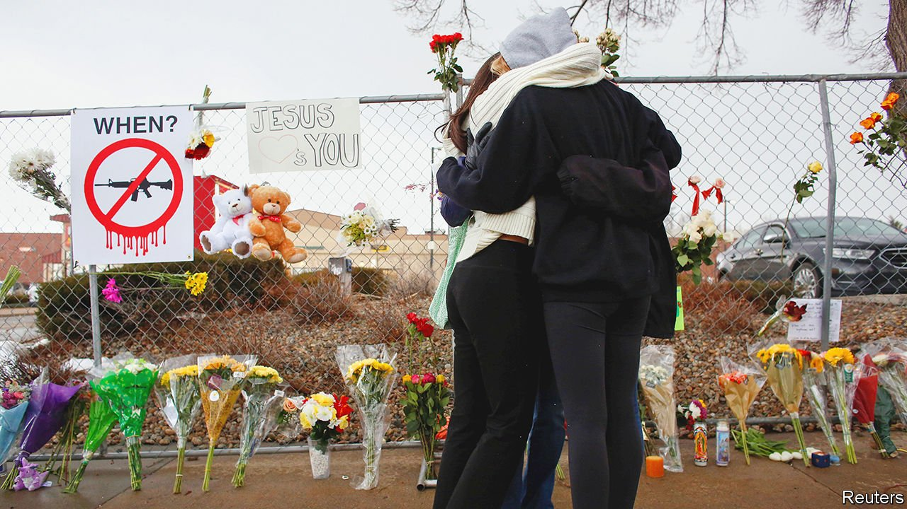
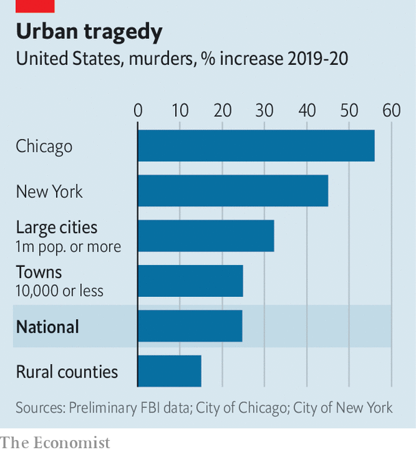

###### Violence in America

# In 2020 America experienced a terrible surge in murder. Why? 

##### A modern murder mystery 

 

> Mar 27th 2021 

IN MANY RESPECTS, the murder of Alante Hands last year on a Chicago street was sadly unremarkable. He was young, just 27, and black, like four in every five homicide victims in the city. Like nine in ten murders in Chicago, his life was taken by a gun—bullets pierced his arm, chest and leg. He had a lengthy criminal record, beginning a decade ago when he was arrested while still a minor for shooting at a police officer. He died in the violent West Side of the city on West Rice Street, where six others have been murdered in the past two decades. But for the fact that his murder occurred on December 31st 2020, the 787th and final one of an especially bloody year for the city, it might have been forgotten.

The plague year proved brutal for Chicago, already a violent city even by American standards. Murders increased by 56% from 2019—nearly three times as many victims as in all of Italy. As crime data from 2020 are compiled, one thing has become clear: American cities saw the biggest rise in homicides in decades, currently estimated at 30% in a single year. That would be the highest annual increase in more than 50 years. In New York City, murders were up by 45%. In the Bay Area around San Francisco, they rose by 36%. In Washington, DC, they climbed by 19%. Our analysis of preliminary data from the FBI suggests that it is not just a big-city phenomenon. Small towns and even rural counties experienced smaller yet sizeable increases in murder rates (see chart).


Neither does the increase appear to be subsiding. Homicides in New York City are proceeding at the same pace as the previous deadly year. Mass shootings, which were mercifully rare during the year of lockdowns, have returned. On March 16th, a spree of shooting at three massage parlours in Atlanta killed eight people. On March 22nd, ten were killed at a grocery store in Boulder, Colorado (pictured); President Joe Biden called for stricter gun-control laws. Though such shootings account for very few of the tens of thousands of annual gun homicides in America, they focus media attention on the enduring problem of violence. That could be salutary. Unlike past escalations in violence, this one has gone comparatively unremarked on by national politicians, despite its magnitude.

 


America benefited from decades of what researchers termed the “great crime decline”—the violent-crime rate was cut nearly in half from 1993 to 2019. If that 30% rise in city murders in 2020 were to hold nationwide, it would return America to a homicide rate last experienced in 1998. “It’s like 20 years of crime decline and violence decline has just disappeared,” says John Roman, a criminologist at NORC, a research institute at the University of Chicago.

What has caused this? One theory emphasises the pandemic. “The recipe for violence in any city in the world is dense clusters of young men with nothing to do,” says Mr Roman. Schools, work, churches, community centres and violence-cessation programmes all stopped, making it easy for conflict to escalate.

The dwindling of stimulus payments over the summer meant that poverty was rapidly increasing during the months when murder spiked. Patrick Sharkey, a sociologist at Princeton University, notes that sales of guns and alcohol, common precursors to violence, soared. Some 23m guns were bought in 2020, 64% more than usual. Alcohol sales were up by 25%. Drug-overdose deaths probably hit another peak in 2020; competition over illicit-drug sales often spills over into violence, perhaps offering a partial explanation for the simultaneous increase in rural America. Pandemic effects may thus may provide all the ingredients for the year’s grim cocktail.

Another explanation identifies the killing of George Floyd in Minneapolis on May 25th, and the ensuing national protests, as the turning-point. Paul Cassell, a law professor at the University of Utah, suspects a nationwide “Minneapolis effect”. Murder had been high throughout the year, but it did seem to surge around that time. In Chicago, 42 people were killed between May 27th and June 2nd, the deadliest week in the city since 2001.

This theory holds that a sudden shock in the behaviour of cops, as officers are diverted to secure protests and discouraged from proactive policing, leaves a vacuum in high-crime neighbourhoods. Arrests in New York City dropped between July and September, even though these were the deadliest months in the city in years (and arrests were down by 35% for the entire year). Loss of trust in the police may also exacerbate violence. American cities that have experienced large protests over police practices have often experienced a subsequent wave of violence. In Baltimore, after the death of Freddie Gray in police custody in 2015, homicides rose by 50%, and have remained stuck near there ever since.

A puzzle, particularly for the pandemic explanation, is America’s exceptionalism in rising murders—unlike the country’s great crime decline, which coincided with global drops in violence. Most countries went into pandemic-induced lockdown, and many have emerged with stagnant or even lower murder rates. Murders in Italy dropped sharply, and those in England seem to have remained flat. Even in the violent neighbouring country of Mexico, murders did not increase. The same was true of most of the Americas.

If the primary causes are pandemic-related, that may augur a reprieve in the coming summer months as vaccination drives fully reopen the economy. If they are instead related to a crisis in policing, the effects could well linger, as in Baltimore.

Crime is often seen as a local phenomenon, the province of mayors and not presidents. The synchronous rise of homicide across American cities and towns suggests a national problem, however. As the White House has been consumed by other crises—covid-19 and now immigration—rising violence has not been a focus of the Biden administration. Should it persist, however, the trend will become increasingly hard to ignore and could disrupt the politics of criminal justice. Progressives calling to defund police or otherwise minimise police presence may find their arguments harder to sustain.

Things certainly do not seem to be improving in Chicago. Compared with last year, murders are already up by 11%. ■

