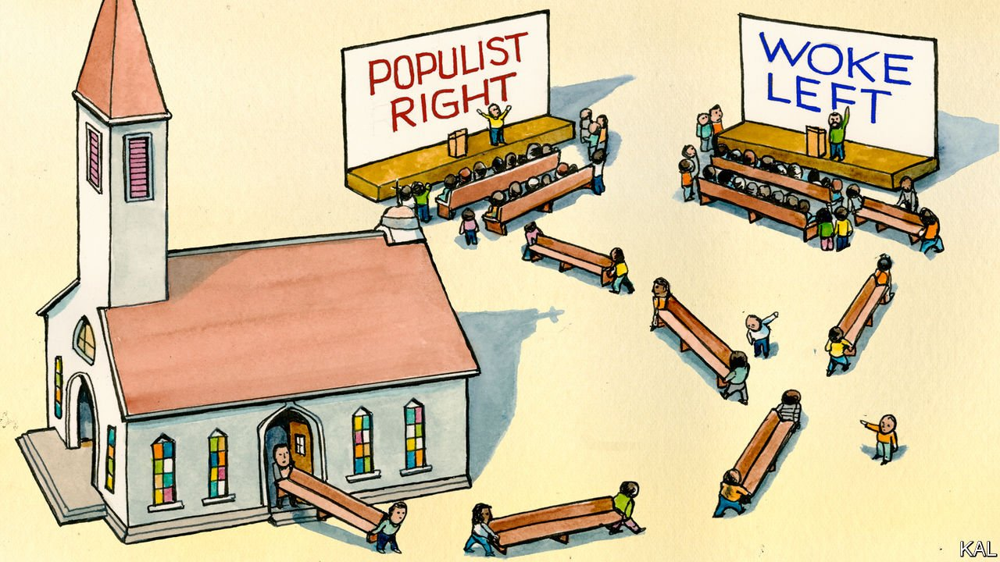

###### America’s new religious war

# Religious fervour is migrating into politics 

##### The evangelical culture warriors of the right take on the Democrats’ new Puritans 

 

> Mar 27th 2021 

TO START THE holiest week in the Christian calendar, Joe Biden is expected to attend Palm Sunday mass at Holy Trinity in Georgetown. He is the most religiously observant president since Jimmy Carter. Considering how organised religion is collapsing, this is yet another way in which his presidency is a throwback.

He presides over a country in which more people claim to have “no religion” than to be Catholic or evangelical Christian. Yet unlike European countries, America is not becoming clearly less devotional as its churches retreat. Even Americans who have abandoned churchgoing are likelier to say they pray and believe in God than German or British Christians. They have rejected the institutions of religion, in other words, but not the religious urge—including a yearning for moral certainty and communal identity—that churches and synagogues have traditionally catered to.


This is giving rise to a lot of heterodox thinking even within America’s shrunken congregations. Nearly a third of self-described Christians say they believe in reincarnation. Wilder ideas are rising among the unaffiliated, as the theologian Tara Isabella Burton has described in “Strange Rites”, a tour through the “wellness” cult, the “brutal atavism” of Jordan Peterson and the weird world of Harry Potter fandom. Politics looks increasingly like another such pseudo-religion. Righteous, moralistic, unforgiving and fervently adhered to, America’s national debate has taken on a religious complexion in both parties. A new academic paper notes that since 2018 American Twitter users have been likelier to identify themselves by partisan affiliation than religion; on that platform especially, it has been a seamless switch.

Some have hailed the displacement of religious fervour into the secular realm as proof of the “God-shaped hole”. This is a conviction, attributed to Blaise Pascal, a French polymath of the mid-17th century, that the religious impulse can never be quelled. Human history suggests he was on to something. But it also suggests outbursts of religiosity owe as much to their cultural, especially institutional, context as metaphysics. The contrasting ways in which Republicans and Democrats are practising the new religious-style politics underlines the truth of that.

The right might look more straightforwardly religious. Under Donald Trump, white evangelical Christians, a mainstay of the party for decades, became its most important group. But even if it includes some old-style values voters, this is no longer your father’s moral majority. Most white evangelicals backed Mr Trump—more zealously than they had any previous Republican—mainly for cultural reasons that had nothing to do with Christianity.

They were motivated far more by his immigration policies and racially infused law-and-order rhetoric than his judicial nominees. They have since shown little interest in Mr Biden’s faith. Or in his efforts to restore the civic religion—an age-old idea of America as a nation blessed by God and united in moral purpose—that Mr Trump disdained. Around a third of white evangelicals subscribe to the QAnon cult. This was apparent in the prominence of man-sized crosses and other Christian paraphernalia among the cultists who stormed the Capitol Building on January 6th.

This pseudo-religious makeover on the right was instigated by lapsed white evangelicals, who backed Mr Trump in the 2016 Republican primary when observant ones held back. Their continued self-identification as Christians, though they do not attend church, is often a proxy for ethno-nationalism. The same religious appropriation is evident, Tobias Cremer of Oxford University has shown, among Europe’s Christian nationalists, who often do not even believe in God. Yet on the American right, unlike Europe’s, it has received mainstream backing. Christian leaders, confusing the decline of their congregations with the cultural threat of liberalism, made common cause with Mr Trump and the pseudo-evangelicals. For partisan reasons, the rest of the Republican coalition followed them. The party has never been more avowedly Christian or more clearly out of line with gospel doctrines.

The situation on the left is roughly the opposite. The most avowedly secular Democrats—well-educated “woke” liberals—are also the likeliest to moralise. Their Puritanical racial and gender politics sit in a long tradition of progressive Utopianism, rooted in mainstream Protestantism. Barack Obama’s Messianic first presidential campaign was also in that vein. Yet these new Puritans of the left, though (or perhaps because) they are more secular than earlier progressives, are far more extreme.

Their view of social justice has no place for forgiveness or grace—as Alexi McCammond recently learned, when the 27-year-old’s editorship of Teen Vogue was cancelled because of some bigoted Tweets she sent as a teenager. It is also more focused on purity and atonement within the liberal tribe (as that example also suggests) than making society less discriminatory. A clue to that is the fact that the Democrats’ many African-American voters largely ignore such activism. They are more concerned to get better health care. Not coincidentally, many also still go to church.

Never mix, never worry

Woke liberalism is less prevalent than many conservatives claim. The Democrats would not have nominated the pious, grandfatherly Mr Biden otherwise. His pragmatic espousal of social justice is different in kind from the woke fringe. His appeals to America’s better angels therefore went down with white liberals almost as badly as they did with white evangelicals. Yet on the cultural questions that now define American politics the Puritanical left is often as influential as the zealous right.

No wonder political compromise has become impossible. Not since the 1850s, when New England’s Puritans embraced the abolitionist case and southern Baptists preached a divine justification for slavery to thwart them, have politics and religion been so destructively confused. It is not a reassuring parallel. ■

