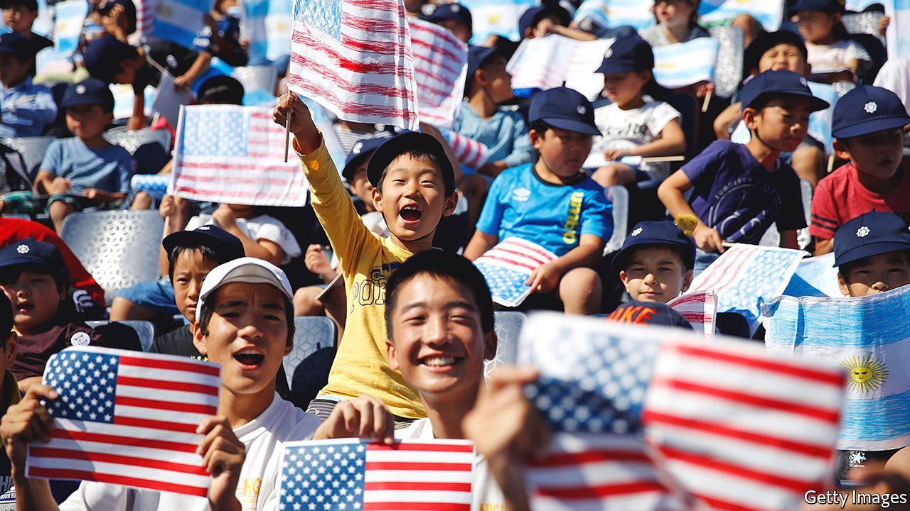

###### BFFs once more

# America rediscovers its alliance with Japan 

##### The pair are getting on better than ever, with Japan taking more of the initiative 

 

> Mar 31st 2021 

IT IS CUSTOMARY for new American presidents to lavish attention on their closest neighbours, Canada and Mexico. But since Joe Biden took office a much more distant country has hogged the limelight: Japan. At the first international summit hosted by the president, a virtual gathering of a club called the Quad—America, Australia, India and Japan—Japan’s prime minister, Suga Yoshihide, filled the screen closest to Mr Biden during the video-conference. For their first trip abroad, America’s secretaries of state and defence went to meet their counterparts in Tokyo. And in April Mr Suga is expected to become the first foreign leader to visit Mr Biden at the White House.

“Twenty years ago we couldn’t have imagined that,” says Miyake Kunihiko, a foreign-policy adviser to Mr Suga. The intense hobnobbing shows not only the scale of the challenge China poses to both countries but also the importance of alliances in dealing with it. Whereas Barack Obama was slow, in Japanese eyes, to grasp the first point, Donald Trump never accepted the second. Mr Biden, to Japanese officials’ elation, seems to agree with both. The two countries have already concluded a new agreement governing the decades-old deployment of American troops to Japan, talks about which had stalled since Mr Trump’s demand that Japan should pay more to defray the cost. After their meeting in Tokyo, the two countries’ grandees issued an unusually explicit condemnation of China, quelling Japanese fears that Mr Biden would adopt a softer stance.


The challenge from China is also provoking a reconsideration of roles within the alliance, a creation of the cold war. “It’s not the Soviet Union, where confrontation was total and military was the only language,” says Kanehara Nobukatsu, a former deputy national security adviser. Instead, competition with China is as much economic, technological and diplomatic—realms where Japan can contribute more. “When we traditionally talk about the division of labour, we tend to think in narrow terms—how much money is spent on defence?” says Sasae Kenichiro, a former Japanese ambassador to America. “But there is a new regional dimension in terms of what Japan can do.” In December Richard Armitage and Joseph Nye, two American foreign-policy hands, declared: “For the first time in its history, Japan is taking an equal, if not leading, role in the alliance.”

On trade and diplomacy in Asia, Japan has stepped forward, especially as America retreated under Mr Trump. Japan resuscitated the Trans-Pacific Partnership, a big trade deal, after Mr Trump withdrew America from it. It also championed the Regional Comprehensive Economic Partnership, an Asian free-trade pact concluded last year. It has invested more in infrastructure in South-East Asia than China has through its Belt and Road Initiative. As a result, South-East Asians trust Japan more than any other foreign power, according to a survey by the ASEAN Studies Centre, a think-tank in Singapore.

Japan has also been strengthening military ties with other friendly countries. In September it signed a logistical-support pact with India. Two months later it initiated negotiations with Australia on a deal to allow forces from both countries to operate on each other’s territory. A British aircraft-carrier will take part in joint exercises with America and Japan later this year. 

The reinterpretation of Japan’s pacifist constitution by Abe Shinzo, the previous prime minister, has made military co-operation easier with America, too, allowing more detailed planning about how to respond to a Chinese attack on Taiwan, for example. “That’s as much the Japanese pushing us as it is us pushing them,” says Randall Schriver, a former point man for Asia at the Pentagon. Although there would be “a big political debate” about what Japan should do if China invaded Taiwan, thereby threatening Japan as well, there are no longer big legal or constitutional barriers constraining what Japan could do, says Mr Sasae. 

The main barrier would be practical. Although Japan’s defence budget has risen for nine years running, it still amounts to only around 1% of GDP, a big share of which goes on salaries and maintenance. The Self-Defence Force (SDF), as Japan’s army is called, boasts an impressive navy and capable coast guard. In response to Chinese jets and warships’ frequent probing around the Senkaku Islands, uninhabited specks that China also claims (and calls Diaoyu), it has been bolstering its forces inthe string of islands that stretches to the south of the Japanese mainland, towards Taiwan and China. It has also created a new amphibious brigade. Yet change has been slow. Some big new initiatives, such as a planned missile-defence system, have been bogged down by local opposition. The SDF’s role in a Taiwan crisis would probably be limited to assisting American forces operating from their bases in Japan. 

There will be other difficulties. America would like Japan to get along better with South Korea, a former colony with which Japan is often on tetchy terms. Japan’s business lobby does not want relations with China to get any worse, yet America will push Japan to condemn Chinese abuses more loudly. The warm glow of renewed vows of friendship will soon give way to the hard work of making good on them. ■

