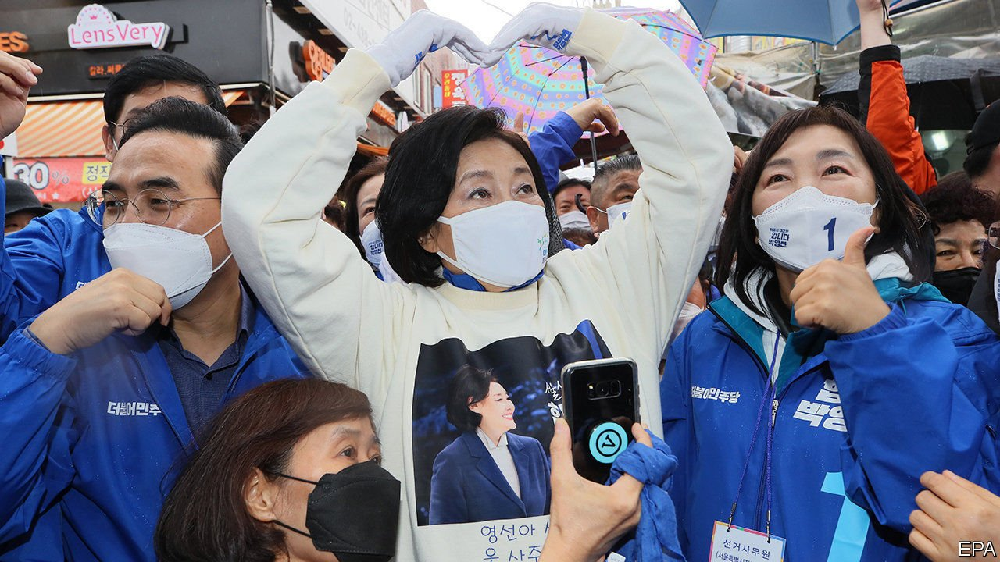

###### Masters of disillusion

# South Koreans see politics as a choice between two bad options 

##### The incumbent Minjoo party has disappointed, but the conservative opposition is out of touch 

 

> Mar 31st 2021 

OUTSIDE YEONGDEUNGPO market in southern Seoul, a campaign truck awaits the arrival of Park Young-sun, a former local MP and the mayoral candidate for the ruling Minjoo party. Campaign aides in sky-blue windbreakers are awkwardly trying to engage stallholders in conversation. In a small restaurant inside the market, patrons are digging into chicken soup and spicy octopus, unaware of the political antics outside. The mood is jolly, helped along by swigs of makgeolli (rice wine). When politics is raised, however, the jollity evaporates. “I’ve always voted Minjoo, but I’m really disappointed with President Moon Jae-in,” says a 71-year-old. “All those scandals. He said he was different but he let me down. He’s just like any other politician.” The man dislikes the conservative opposition, but plans to vote for them in the mayoral election anyway, as well as in the presidential election next year.

Four years into Mr Moon’s five-year term, such views are increasingly common. The president’s approval rating is hovering around 35%, the lowest level since he took office. His left-of-centre party is even less popular: Minjoo’s candidates are expected to lose the mayoral by-elections next week in Seoul and Busan, the country’s two biggest cities, by wide margins. If they do, it will not be because of inspired campaigning by the opposition, which is barely more popular than Mr Moon himself. The votes are widely considered a referendum on Mr Moon, and the overwhelming mood is disappointment.


At one level, that reflects the usual fatigue towards the end of a government’s tenure. Since presidents can serve only a single term, they inevitably become lame ducks. But the disillusionment with Mr Moon and his party may be particularly acute because he had promised to govern in a different way, says Kang Won-taek of Seoul National University. “They said they would focus on fairness, but people can see they’re just protecting their own.”

That by-elections are needed at all is a case in point. They became necessary because Minjoo mayors in both Busan and Seoul were accused of sexual harassment by female employees. Oh Keo-don, the former mayor of Busan, stepped down last April. He admitted to some of the allegations and is awaiting trial on related charges. Park Won-soon, the mayor of Seoul, committed suicide in July after a female aide accused him of sexually harassing her for years. (In January the national human-rights commission concluded that her claims were credible.)

Official contrition has been half-hearted. When prominent liberals attacked Mr Park’s accuser, calling her a liar, the party did nothing to stop them. Meanwhile Mr Moon’s former chief of staff published a screed on Facebook extolling Mr Park’s virtues. Female voters, many of whom had hoped that Mr Moon would make good on his promise to be a “feminist” president, are affronted. “I never really cared about politics, but the Park Won-soon case made me so angry I’m going to vote for the opposition,” says a 40-year-old office worker in Seoul. Women’s groups in Busan persuaded candidates from both the main parties to sign a pledge to improve women’s rights and to protect the ex-mayor’s victim once she returns to her job at City Hall. “Will it help? We can only hope for the best,” says Lee Da-seol, a 20-something who works with victims of sexual violence in the city.

Even those without feminist sensibilities have plenty of reasons for dismay. The government’s failure to make housing more affordable has been compounded in recent weeks by the revelation that officials from the agency in charge of new housing developments had profited from inside information on big land deals. On Monday Kim Sang-jo, Mr Moon’s top economic adviser and the architect of the government’s flagship corporate-governance reforms, resigned after it emerged that he had substantially raised the rent on a flat he owned two days before a new tenant-protection law would have limited the increase. Covid-19 restrictions, a slow vaccine rollout and a sluggish economic recovery are eroding the goodwill the government earned by managing the early stages of the pandemic well.

But voters are not enamoured with the conservative opposition, says Mr Kang of SNU. “If they win the mayoral elections,” he says, “it will not be the opposition’s victory but the ruling party’s defeat.” That is mainly because the conservatives have developed little in the way of new ideas or personalities since the previous president, Park Geun-hye, was impeached for corruption four years ago. The voices of young people and particularly of young women are woefully under-represented in both main parties. Oh Se-hoon, the conservative candidate for mayor of Seoul (pictured on previous page), held the office until ten years ago. “It says a lot that they haven’t found a better candidate in a decade,” says Mr Kang. As the government stumbles and the opposition remains stuck in its ways, disillusionment is likely only to deepen. ■

