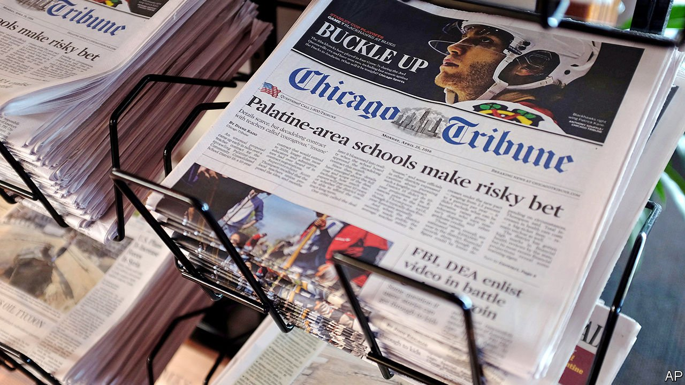

###### American newspapers

# Billionaires battle for Tribune Publishing 

##### A bidding war is under way to wrest control of the media group from a hedge fund 

 

> Apr 3rd 2021 

GARY MARX and David Jackson, two veteran investigative reporters at the Chicago Tribune, spent most of last year seeking potential buyers who might save their newspaper from Alden Global Capital, a New York hedge fund. “We need a civic-minded local owner or group of owners,” they wrote in January 2020 in an opinion article in the New York Times. The alternative was a ghost version of the paper, they warned. “Illinois’s most vulnerable people would lose a powerful guardian, its corrupt politicians would be freer to exploit and plunder, and this prairie metropolis would lose the common forum that binds together and lifts its citizens.”

With no saviour in sight, Messrs Marx and Jackson have now left the paper. In mid-February their nightmare came closer to reality when the board of Tribune Publishing, which owns the Chicago Tribune and eight other local rags, accepted a $630m bid by Alden for the 68% of the company it did not already own. But on March 27th, in a Pulitzer-worthy twist, Hansjörg Wyss, a Swiss billionaire, said he would join forces with Stewart Bainum, a hotel tycoon in Maryland, to buy Tribune Publishing for $650m. “I don’t want to see another newspaper that has a chance to increase the amount of truth being told to the American people going down the drain,” Mr Wyss told the New York Times.


Heath Freeman, Alden’s boss, would dispute this characterisation. He has said he wants to save local news by fixing a broken business model. A study last year by the University of North Carolina found that 2,100 papers, more than a quarter of the total, have gone out of business in the past 15 years. Newsrooms have half as many journalists as they did a decade ago. In pursuit of Mr Freeman’s stated goal, Alden has amassed more than 200 titles, including the Denver Post, the Boston Herald and Pioneer Press inSt Paul, Minnesota. To balance the books it has slashed costs, including by cutting staff, and sold property.

Most of Alden’s outlets now make money. But critics say this comes at the expense of good journalism. A group of 21 Democratic senators once urged Mr Freeman to stop his “reckless acquisition and destruction of newspapers”. Enter Mr Wyss. Before he made his billions in medical devices, he had a short career as a reporter, covering skiing for the Neue Zürcher Zeitung, a Swiss daily, and filing dispatches on American sports for another, Der Bund, while attending Harvard Business School. Now 85, he has settled in Wyoming. He would like the Chicago Tribune to emulate the success of the Washington Post, which has thrived under the ownership of another billionaire, Jeff Bezos, without compromising the quality of reporting. Mr Wyss has said he thinks the Tribune could in time be “a very profitable newspaper”.

Douglas Arthur of Huber Research, a firm of analysts, thinks Mr Bainum and Mr Wyss may need to raise their offer by another 10% or so to sway the other shareholders. They may be able to. On March 29th Mason Slaine, a Floridian financier with a stake in Tribune, said he is willing to put up $100m to join their bid. Mr Slaine would like to gain control of Tribune’s two Florida newspapers, the Orlando Sentinel and the Sun Sentinel in Fort Lauderdale.

This suits Messrs Bainum and Wyss just fine. Mr Bainum is primarily interested in the Baltimore Sun and two other Maryland papers; Mr Wyss in the Chicago Tribune. They were already planning to hive off the publisher’s other newspapers to local owners like Mr Slaine.

The bid hinges on Patrick Soon-Shiong, a biotechnology billionaire who owns 24.6% of Tribune. His time as owner of the Los Angeles Times, bought from Tribune in 2018 for $500m, has been rocky. Observers think he may be ready to offload some of his news assets. Managing newspaper finances is a lot less fun than bragging about your press baronetcy. ■

