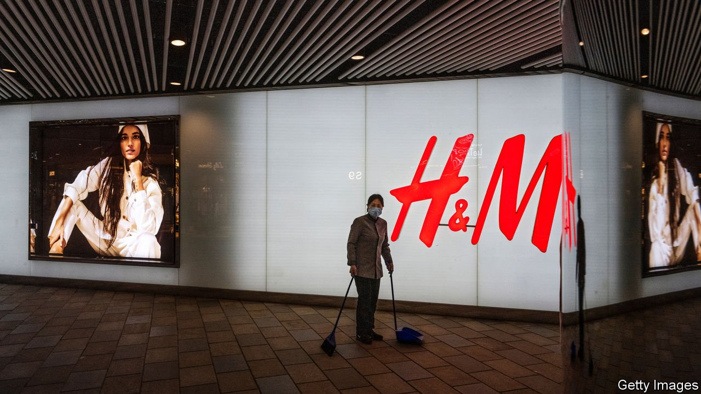
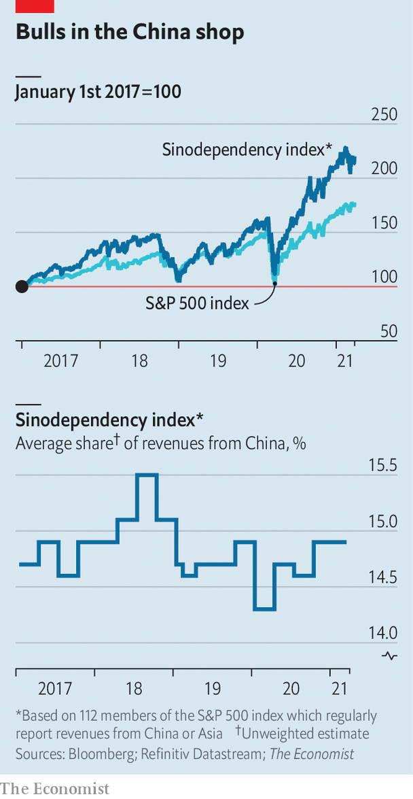

###### Swept up in a storm

# Consumer boycotts warn of trouble ahead for Western firms in China 

##### Previous spats have blown over, but the split over Xinjiang is both more intractable and more expansive 

 

> Mar 31st 2021 

BOYCOTTS OF FOREIGN brands are so common in China that managers have a ready-made playbook when caught in a storm of nationalist outrage. Start with an apology. Then stay mostly quiet, perhaps expressing respect for Chinese culture. Wait for the anger to subside. Over the past week the list of companies consulting the manual has grown. Chinese consumers, egged on by the ruling Communist Party, vowed to shun some of the world’s biggest clothing companies, from Adidas to Zara.

In the eyes of the boycotters, the firms erred by declaring concern over allegations that China’s cotton industry includes the forced labour of Uyghurs, a mostly Muslim ethnic minority in the north-western region of Xinjiang. Their bosses hope that the controversy will fizzle out. But they and other Western executives in China cannot shake an unsettling fear that this time is different. Their lucrative Chinese operations are at rising risk of tumbling into the political chasm that has opened between the West and China.


H&amp;M, a Swedish fast-fashion retailer, faces the most immediate trouble. As of March 30th, a week after it was attacked online, its garments were still unavailable on China’s most popular e-commerce apps. Its stores have disappeared from smartphone maps. Landlords in several shopping malls have terminated its leases. Its Chinese business, worth $1bn in revenues and representing 5% of its global sales in 2020, is in jeopardy.

For other companies the Xinjiang rage has not been as devastating. Even as celebrities in China cancelled endorsement deals with Nike, some 350,000 Chinese signed up for an online sale of a limited-edition pair of its swooshy shoes on March 26th. Little by little the social-media mob has dwindled amid signs that government censors were reining it in, perhaps to lower the heat. The share prices of foreign firms entangled in the boycotts have clawed back most of their initial losses.


Foreign executives, however, remain on edge. The issue at the heart of their current problems—China’s human-rights violations in Xinjiang, and the West’s newfound willingness to punish them—is one for which the tried and tested playbook is ill-suited. It may also be more expansive, seeping into many other corners of their business dealings in the world’s second-biggest economy.

The boycotts were apparently triggered by the co-ordinated announcements on March 22nd by America, Britain, Canada and the European Union of sanctions against Chinese officials for abuses in Xinjiang. China responded with sanctions of its own. The Communist Youth League, a party affiliate, then dug up a months-old statement by H&amp;M expressing concern about reports of Uyghur forced labour. Hua Chunying, a foreign-ministry spokeswoman, made the message clear. “The Chinese people will not allow some foreign companies to eat Chinese food and smash Chinese bowls,” she said.

The commercial conflagration over cotton illustrates the difficulty of even limited economic decoupling between China and the West. China’s cotton industry is worth about $12bn a year, less than 0.1% of GDP. About 90% of China’s cotton comes from Xinjiang, and the government says 70% of that is harvested mechanically. In theory it should be possible for companies to remove hand-picked fibres from supply chains. In practice that would require audits of how the cotton is produced. China will not allow free travel around Xinjiang, let alone unmonitored conversations with Uyghur workers. Last year American clothing-industry groups described the situation as “of a scale, scope and complexity that is unprecedented during the modern era of global supply chains”.

In January Donald Trump cut through the complexity with a full prohibition on cotton imports from Xinjiang. His successor as president, Joe Biden, who is less China-baiting but more concerned about human rights, has not reversed it. The trouble is that yarn from Xinjiang ends up in factories around China, making it hard to stop the taint from spreading to all Chinese cotton products, which make up a large slice of global supply. China accounts for about 40% of the world’s textile exports. “There is no way we can declare the full supply chain is clean,” observes a consultant based in Shanghai.

 


Mei Xinyu, a researcher with the Ministry of Commerce, has written that cotton is the “entry point” for America’s strategy of using the Xinjiang allegations to suppress China, which denies any forced labour is taking place. China’s only choice, he says, is to fight back forcefully. The Communist Party is confident of its abilities to do so, thanks to what it calls the “powerful gravitational field” of its market. American-listed firms which regularly report their revenues from China or Asia, and can thus be assumed to have larger exposure to the country, have outperformed those that do not in recent years (see chart).

Yet even gravity has its limits. An apology, the first step in mending fences, is untenable this time. Many people inside foreign companies “recognise the moral gravity of what’s happening in Xinjiang”, says Scott Nova of the Worker Rights Consortium, a labour-monitoring organisation. Those that do not must still comply with the American ban on cotton imports if shipping to America. This earns them little sympathy in China. Foreign firms have found it virtually impossible to get audiences with Chinese officials to explain their legal obligations in America, says a government-relations expert.

Those obligations may soon multiply. The Uyghur Forced Labour Prevention Act, currently wending its way through Congress with bipartisan support, assumes that all Xinjiang products are made with forced labour. Companies will have to prove otherwise if they want to export to America. “It’s like having to prove a negative,” sighs one representative of American industry. The consequences could be dramatic. Nearly half of the polysilicon in solar panels globally comes from Xinjiang. China’s largest wind-turbine maker, Goldwind, is based there. Xinjiang’s oil and gas power factories around China.

Europe has so far refrained from banning products from Xinjiang. China’s decision to focus its ire on H&amp;M rather than on an American firm may be a warning to EU officials to keep it that way. But the aggression poses a risk. In December the EU and China signed an investment deal which would give European industrial and financial firms greater access to the Chinese market. The European Parliament may now have second thoughts when asked to ratify it. “After seven years of negotiations, we hoped for seven years of wellness. Now it looks like it might be seven years of drought,” says Joerg Wuttke, president of the EU Chamber of Commerce in China.

China still wants some foreign firms to feel welcome. On March 26th Li Keqiang, the prime minister, visited a plant part-owned by BASF, a German chemicals giant. Such comity will almost certainly become rarer as the authorities promote home-grown business, from chipmaking to electric vehicles. China’s newest five-year plan, unveiled in March, is focused above all else on the pursuit of self-sufficiency in the face of a “hostile external environment”, as party leaders describe it. Western bosses had hoped that the fissures between China and the West would start to close under Mr Biden’s administration. Instead they are getting deeper and wider. ■

A version of this article was published online on March 30th 2021

