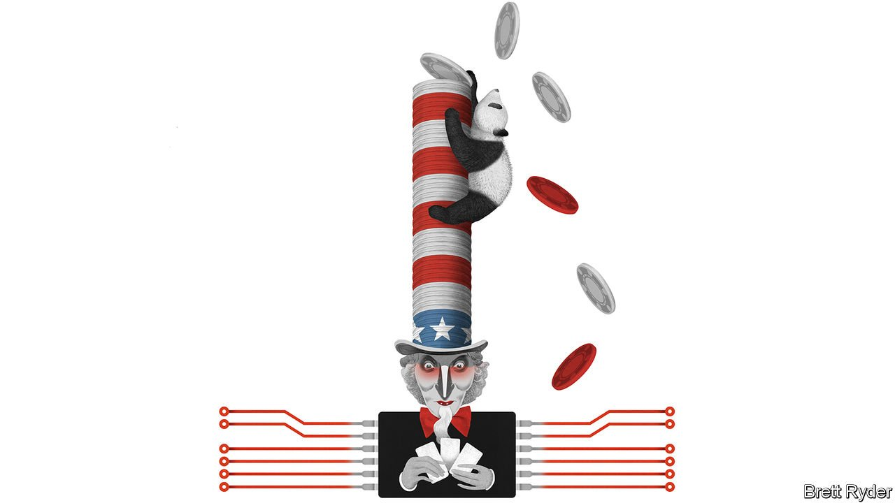

###### Schumpeter

# Intel should beware of becoming a national champion 

##### Its bet on making semiconductors in America is a big gamble 

 

> Mar 31st 2021 

DATA MAY be the new oil, but it is semiconductors—the brains of the data economy—that these days vie with hydrocarbons as the business world’s biggest economic flashpoint. Like crude, the $500bn computer-chip industry is essential to industrial economies. It is regularly buffeted, as are oilmen, by excesses of supply and demand. And it is at the vortex of intense geopolitical rivalries. Its main wellspring, though, is not in the Persian Gulf, but on an island about 175km (110 miles) across the water from China. What is more, the Communist Party in Beijing claims the island in question, Taiwan, as part of its territory. That puts the semiconductor industry at the heart of the Sino-American power struggle—a uniquely uncomfortable place to be. 

It is in this context that the recent $20bn commitment by Intel, America’s biggest chipmaker, to revitalise semiconductor production in America should be seen. With some fanfare, its new boss, Pat Gelsinger, is placing a flag on his home turf, hoping to help reclaim the dynamism that the country which invented semiconductors has lost to chip factories in Taiwan and South Korea. It comes amid a surge of “chip nationalism”, in which governments from East to West are offering lavish subsidies for such “fabs”. It coincides with a severe chip shortage that—though it mostly affects microprocessors used in cars, which Intel does not sell—has brought home the danger of supply disruptions. And it follows America’s kneecapping of Huawei, a Chinese maker of networking gear, by restricting its access to American technology, including semiconductors.


No one could accuse Intel of squandering a geopolitical tailwind. But Mr Gelsinger’s plan to build two new fabs in Arizona is also a gamble. It extends Intel’s traditional business of making its own chips to making those blueprinted by other American companies, including Amazon, which designs the processors used in its cloud-computing data centres, and Qualcomm, which specialises in semiconductors for mobile telephony. The decision to become part contract manufacturer rather than designing chips and outsourcing production, which rivals such as AMD have done successfully, requires a huge outlay that investors may find hard to stomach. Intel already spends about $28bn a year on capital investments, research and development.

Intel’s move also marks the start of a new era of public funding for chipmaking in America that could dangerously distort the market. The industry is lobbying for $50bn of federal support over the next decade, which it says is necessary to spur construction of 19 new fabs, requiring $280bn of private investment. Mr Gelsinger’s bet puts Intel in the vanguard of America’s mission to strengthen its position as a semiconductor superpower. But if it does not play its cards carefully, it could be the first Silicon Valley firm to suffer the curse of being a national champion.

It is already one of the first in line for public largesse. American politicians loudly grumble about how dependent the country has become on two firms in China’s backyard, Taiwan Semiconductor Manufacturing Company (TSMC), and Samsung, a South Korean conglomerate. Although American firms lead the world in developing and designing chips, they manufacture just 12% of them at home, down from 37% in 1990. They blame the Asian countries’ subsidies, which help defray the huge cost of fabs, which these days can exceed $10bn apiece. That may be so, but TSMC and Samsung have also outdone Intel in recent years in their ability to produce state-of-the-art chips. When he was president, Donald Trump pressed the two Asian companies to expand production on American soil. Both say they will. Intel, though, is a more obvious recruit for the home team. 

Heeding the call, Mr Gelsinger has vowed to get the firm back into the game, displaying a chutzpah not seen since his mentor, Andy Grove, stepped down as chief executive in 1998. The government is squarely behind him. Intel is likely to be an early recipient of part of the $37bn Mr Trump’s successor, Joe Biden, has earmarked to support America’s chipmakers. It also plans to expand in Europe, where countries hope to lure as much as €50bn ($59bn) in semiconductor investments, partly with state support.

In economic terms all this is a mixed blessing. Free money is always nice. If America’s government insists that American companies buy more American-made chips, Intel stands to benefit. But government backing can encourage over-expansion; building factories takes years, while demand for chips changes quickly, fuelling regular boom-and-bust cycles. Support can also unexpectedly be snatched away. Investors, already nervous about the sliding profitability of Intel’s core business, may fret about the impact of over-investment on margins. And there is no guarantee customers will flock to the company as a contract manufacturer. It has dabbled in this business before with little success, chiefly because it had put its own chipmaking interests over its customers’. Mr Gelsinger now talks of “co-opetition” rather than competition, and promises to keep contract manufacturing at arm’s length from Intel’s own chipmaking. Clients may still prefer TSMC, unburdened by any such conflict. 

The silicon curtain

The trickiest task for Intel will be to balance a state-backed expansion in America and Europe with cordial relations with China, its biggest market, accounting for 26% of last year’s sales. For now China probably needs Intel as much as Intel needs China. But if Mr Biden pursues his predecessor’s policy of restricting chip exports to Chinese firms, the risk is not just lower sales, but retaliation. As geopolitical tensions mount, so does the pressure to renationalise supply chains, or turn them into competing webs of Chinese and American allies. Intel should discourage this at all costs. It would be disastrous for one of the world’s most globally integrated industries. It would be no picnic for Intel, either. ■

