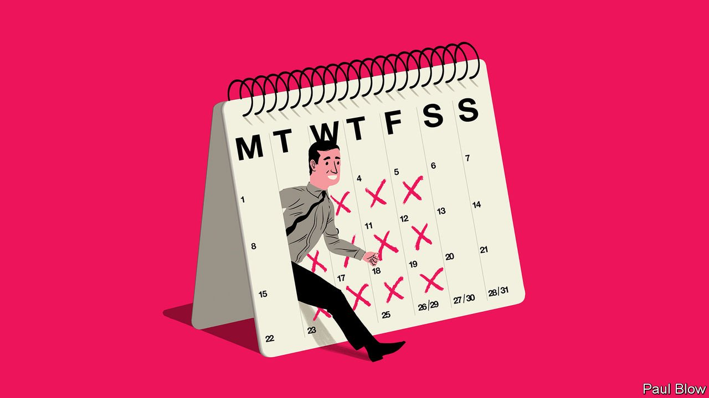

###### Bartleby

# The benefits of part-time work 

##### Happiness on just a day a week 

 

> Apr 3rd 2021 

PEOPLE’S RELATIONSHIP with work is complex. For all the complaining about the tedium and bureaucracy, the power-crazed bosses and recalcitrant colleagues, individuals need the security of a job. A century of research has shown that unemployment is bad for mental health, leading to depression, anxiety and reduced self-esteem. On average, it has an even greater effect than divorce.

But how much work do you need to do? A recent paper* by the Centre for Business Research at Cambridge University took the opportunity of the pandemic to examine the impact of reduced working hours on well-being. Many British employees were placed in a furlough scheme, under which their hours were reduced and their wages were subsidised by the government. “We found that people working reduced working hours or being furloughed do not have poorer mental health,” the authors conclude. This suggests that social welfare would be improved if governments adopted furlough schemes in future recessions, even when they are not triggered by a virus.


What was particularly surprising is how little work was needed to keep people happy. The threshold for good mental health was just one day a week—after that, it seemed to make little difference to individuals’ well-being if they worked eight hours or 48 hours a week. The boost from working clearly comes from the feeling of purpose, from the social status it creates and from the camaraderie of colleagues engaged in the same tasks.

A little bit of work may be satisfying but too much is not. An enterprising junior analyst at Goldman Sachs recently surveyed his peers and fashioned his report in the style of a research presentation from the investment bank itself. The survey found those first-year analysts had worked an average 98 hours a week since the start of 2021, and only managed five hours of sleep a night. It found that 77% of them had been the subject of workplace abuse, that 75% had sought, or considered seeking, counselling, and that, on average, the cohort had suffered sharp declines in mental and physical health. Unsurprisingly, the analysts thought it was unlikely they would still be working at the bank in six months’ time.

To be fair to Goldman Sachs, the survey had only 13 respondents. Discontented workers may have been the most likely to respond. And the bank’s reaction was restrained. “A year into covid, people are understandably quite stretched, and that’s why we are listening to their concerns and taking multiple steps to address them,” a spokesperson said.

Nevertheless, the general reaction to the story was remarkably unsympathetic. In some people’s eyes, the young analysts should have expected to be treated in such a fashion; after all, that is why they were being paid so well. Veterans of the investment-banking industry reminisced along the lines of “It was the same in my day. Never did me any harm.” But it is hard to see why young Goldman analysts (or indeed, anyone) should expect to suffer workplace abuse. They joined a bank, not the Mafia.

Nor does it make much business sense to have employees working so long that they only get to sleep five hours a night. They can hardly be operating at full efficiency when they are dog-tired. Surely it is better to hire more analysts, and pay each of them a little less. That junior professional staff have always worked long hours is not a good explanation for piling stress onto young people at the start of their careers. It smacks of the legendary navy motto: “The beatings will continue until morale improves.”

Clearly, economies cannot prosper if everyone works one day a week. But the need to limit excessive working hours was realised back in Victorian times. For much of the 20th century the length of the average working week fell while output continued to climb.

There will be occasions when people have to work late or rise early to finish a project (Bartleby writes this on a day when the needs of The Economist required him to get up at 5am). Day after day, however, a long-hours lifestyle is bad for workers’ health. Some organisations may see the appetite for slogging it out as a sign of an employee’s willingness to put their job ahead of their families and friends. If so, they don’t need to have better employees. They need better managers.


