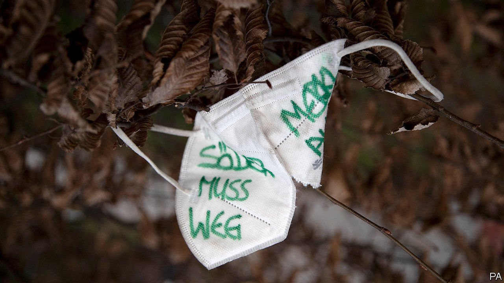

###### Don’t mention the virus

# Germany’s management of covid-19 is growing shakier 

##### As infections rise, state and national governments are bickering 

 

> Apr 3rd 2021 

A COMMUNIST-ERA joke, in updated form, has been doing the rounds on German social media. “Are there no vaccines here?” someone asks, to be told: “No, there are no vaccines over there. There are no tests here.” The gag captures the dismay many Germans feel about their state’s inability to fend off the third wave of the pandemic, even as other countries vaccinate their way towards freedom. 

Two factors explain the descent into misery. The first is that much of the lockdown armoury is already deployed. In October, politicians could close restaurants, bars and museums to battle the second wave. But most restrictions have only tightened since, leaving Germany to countenance hitherto untried options like compulsory testing and curfews. Meanwhile, an ever changing tangle of rules leaves citizens confused and businesses in despair.


The second is a fraying of Germany’s federal model. Throughout the pandemic, national and state leaders have thrashed out lockdown rules at regular summits, ensuring decisions that could be implemented consistently by local leaders. The system had its flaws, not least in sidelining parliament. But now it is creaking. Meetings run late into the night, as ill-considered ideas are batted around in the hunt for compromise. (Last week Angela Merkel had to apologise for one, a short-lived plan to tighten restrictions over Easter.) Politicians are briefing against each other via leaks. Now several states, including North Rhine-Westphalia, the largest, have ignored a national agreement to pull an “emergency brake” when covid numbers exceed a certain threshold, preferring instead to expand testing capacity or limit restrictions to the hardest-hit areas.

On March 28th Mrs Merkel attacked the freelancing state leaders, hinting that their intransigence would be met with changes to federal law. She extended her rebuke to Armin Laschet, the premier of North Rhine-Westphalia who hopes to succeed her as chancellor after an election in September. Yet he and others vowed to stick to their guns. As authority drains from Mrs Merkel a vacuum has developed at the heart of German decision-making. Add sluggish vaccinations, and pandemic policy has never known such disarray.

The fallout is visible not only in soaring caseloads and dwindling beds for intensive-care units. The polling lead enjoyed by Mrs Merkel’s Christian Democratic Union (CDU) and its Bavarian ally, the Christian Social Union (CSU), is evaporating. Soon after Easter the two parties must pick a single candidate to lead them into the election. The main rival of Mr Laschet, who was recently anointed as the CDU leader, is Markus Söder, his CSU counterpart. Straight after Mrs Merkel’s interview, Mr Söder backed her tougher line. Voters find him the more appealing candidate. ■

Dig deeper

All our stories relating to the pandemic and the vaccines can be found on our . You can also listen to , our new podcast on the race between injections and infections, and find trackers showing ,  and the virus’s spread across  and .

