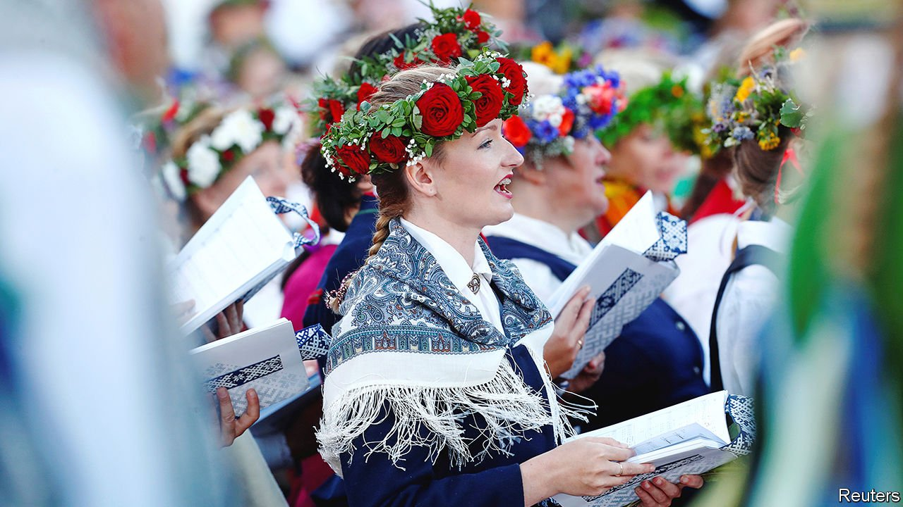

###### Baltic bards

# Latvia’s ancient poetry is getting its first major translation 

##### Dainas are just four lines long, but offer “wisdom to the world” 

 

> Mar 31st 2021 

OVER THE years, Swedes, Germans and Russians have all had a go at conquering Latvia and imposing their flavours of Christianity on it. Today Lutherans worship mainly in the country’s west, and Russian Orthodox in the east. But Latvia’s deepest rituals are still inspired by its home-grown brand of paganism. They include wild summer-solstice parties and a national song-and-dance festival every five years.

The hymns of this prehistoric faith are folk poems, typically four lines long, called dainas. Thanks to Krisjanis Barons, a folklorist who encouraged Latvians to note down such quatrains in the 19th and early 20th centuries, over a million of them are on file at the national library in Riga, the capital. Some have musical notation, but since dainas follow predictable schemes the tunes tend to be repeated, as in Celtic jigs and reels.


For the past 22 years, Ieva Szentivanyi has been rendering dainas into English. Her first volume was published in 2018 and the second is ready for the press. The rhythm of Latvian is hard to translate, but more difficult is conveying the affection of the language’s diminutive suffixes. The English diminutive of “book” is “booklet”; in Latvian, she explains, it more like a “dearest, sweetest, most beloved book”. Dainas are short, but rich in metaphor and symbolism:

Birch tree, dear, thou art so ample All the way to the ground; Dearest wife, thou art so lovely All the way to deep old age.

Aficionados say this canon of folk poems is as significant as any body of classical literature. Ms Szenivanyi calls them Latvia’s wisdom to share with the world. Some scholars claim a few could date from the Bronze Age: in one a warrior duelling with his sister’s abuser breaks his sword against a gatepost, something an iron weapon would be unlikely to do.

There is one class of daina that Mrs Szentivanyi dares not touch, mythical ones that speak of melting seas and waves of sunshine, which are confusing enough in the original Latvian. She aims to finish 2,000 of them. It is a daunting challenge: as one of her favourite dainas has it, “the words go on and on”.

