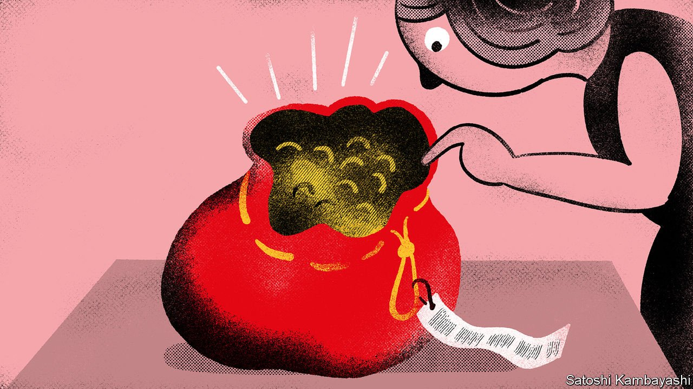

###### Neither predator nor pal

# What 100 contracts reveal about China’s development lending 

##### Loans are not obviously predatory; secrecy is sometimes a condition 

 

> Mar 31st 2021 

WHAT DO THE following have in common? Subway cars in Argentina; digital TV in the Republic of Congo; thermal power in Kyrgyzstan; turboprop planes in Vanuatu; and the Queen Elizabeth II quay in Sierra Leone? All have benefited from Chinese lending, which has helped finance transport, power and telecommunications projects across the developing world.

China insists it is helping poor countries follow in its own debt-financed footsteps, offering the kind of patient capital other lenders are now too wary to provide. China’s critics instead accuse it of drenching countries in red ink, then grabbing strategic assets, such as ports or mines, as collateral when a country defaults.


Judging these claims can be tricky because the terms and conditions of loans are mostly hidden from view. Mostly. An enterprising team including Brad Parks at AidData, a research centre at the College of William and Mary in Virginia, has scoured parliamentary websites, official registers and debt databases in over 200 countries, looking for any loan documents that might have slipped out into the open. They have found 100 contracts signed by 24 borrowing countries, mostly with two state-directed “policy banks”, the Export-Import Bank of China (China Eximbank) and China Development Bank.

The contracts suggest China’s loans are not conspicuously expensive. China Eximbank’s commercial loans charge a rate of 0.5-4.5% above a floating benchmark rate (the London Interbank Offered Rate, which averaged about 1% over the past decade). These are “in line with market terms”, say the authors.

Nor are the loans obviously predatory. In 99 out of 100 cases, China does not require the borrower to pawn a physical asset as collateral. This should not be a surprise. Taking possession of physical assets is “a pain”, points out Anna Gelpern of Georgetown University, one of the study’s authors. (The one potential exception is the port loan to Sierra Leone, which mentions “equipment and other assets” detailed in another, unlocated document.)

China’s lenders are, however, keen on less painful forms of collateral. They sometimes insist that countries maintain a separate bank account that the lender could seize or block in a dispute. When combined with unusually broad confidentiality clauses (in some cases, borrowers cannot even reveal the existence of the loan), these accounts make it harder for a country’s other creditors, or indeed its citizens, to keep track of the government’s financial standing.

Chinese lenders do not play nicely with other creditors. They typically insist on being left out of any broader efforts to provide debt relief to a stricken borrower (although any demand for special treatment may not be enforceable in practice). Chinese banks do, however, show solidarity with their compatriots. They can recall a loan if the borrower damages the interest of any Chinese entity, including, but not limited to, other banks.

China lends more than most to inhospitable corners of the world. The 100 contracts include loans to some countries with awful credit ratings (Venezuela) and some with no rating at all (Sierra Leone). Countries like this sometimes struggle to borrow because they have too much freedom to default and cannot convince a lender otherwise. The unusual terms in China’s loan contracts make it harder for countries to bilk it. But that presumably also makes it easier for countries to borrow from it. ■

