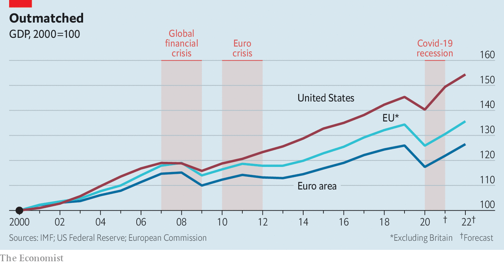

###### Free exchange

# What if Europe’s fiscal largesse were as generous as America’s? 

##### America’s rapid recovery from covid-19 offers a glimpse of what could be 

 

> Mar 31st 2021 

IT CAN BE easy to forget that Europe might reasonably be expected to outperform the American economy. True, population growth in the former is slower. But because Europe remains far less integrated than America—politically, economically and culturally—it has room to exploit efficiencies that the latter has already realised. And because parts of Europe remain economically underdeveloped (nominal GDP per person in Bulgaria, the EU’s poorest member, is roughly a quarter of that in Mississippi, America’s poorest state), the scope for rapid catch-up growth in poorer places is substantial. Yet Europe has struggled to realise its potential in the 21st century. Chronic underperformance is now more or less taken for granted; the experience during the pandemic, and the likely recovery from it, could reinforce its reputation for mediocrity. But a dose of American-style stimulus—more appropriate to economic conditions in Europe anyway—could change that. 

From 2000 to 2007 the EU’s economy (excluding Britain) grew by a decent 2.1% per year, on average, while America’s grew by 2.5%. Alas, the comparison has never since so flattered the Europeans. They lost ground after the global financial crisis, having stumbled through a secondary debt crisis. On the eve of the pandemic, GDP in theEU was only 12% above its 2007 level; American output was 22% higher. Then, in 2020, covid-19 took nearly 8% off the EU’s GDP, almost twice the decline in America. Looked at in purchasing-power-parity terms, Europe’s economy was roughly the same size as America’s in 2000. It limped into 2021 7% smaller.


A day late and a euro short

Yet the most startling phase of transatlantic divergence may be about to begin. According to the European Commission’s most recent forecasts, the EU is likely to grow by 3.7% this year (and at a similar rate in 2022). America, by contrast, is now projected to grow by 6-7% in 2021. Indeed, by the end of next year the American economy is expected to be 6% larger than it was in 2019—and, remarkably, bigger than forecasters in 2019 had thought it would be in 2022—while Europe will scarcely have regained its pre-pandemic level of output. Just as important, America appears to be poised to escape the low-growth, zero-interest-rate trap that has ensnared so much of the rich world over the past two decades, and which seems likely to maintain its grip on Europe. Indeed, the pandemic may represent the third crisis to deal a blow both to Europe’s level of output and also to its subsequent growth rate. 

Europe’s problems are manifold. An ageing, slow-growing population limits its potential, as does slower productivity growth than what America typically manages. Some of its trouble reflects bad luck: that a once-a-century financial crisis struck while euro-area macroeconomic institutions remained cripplingly underdeveloped, for instance, or that a devastating pandemic hit before European growth had made a full recovery. During the global financial crisis, the European Central Bank played a destructively hawkish role (one that it has not reprised in the pandemic, thankfully). Yet there is no ignoring the damage done to European fortunes by persistently inadequate fiscal policy. 

 


In the great recession of 2007-09, America’s federal budget deficit reached nearly 10% of GDP, or almost two-thirds more than the central government deficit across the EU. Borrowing on both sides of the Atlantic subsequently fell much faster than economic conditions warranted. But America’s deficit began widening again from 2016 while European deficits shrank. Europe loosened its purse strings far more in the fight against covid-19 than it did during the financial crisis; across the EU government borrowing rose to nearly 10% of GDP in 2020. But America, again, did more, notching up a budget deficit of 19% of GDP last year. And borrowing will only drop a smidgen this year, to about 15%, thanks to the passage in March of another stimulus package, of $1.9trn. A new proposal to spend an additional $2trn on infrastructure may widen the deficit further, though Joe Biden’s administration seeks to fund at least part of that initiative with new tax revenue.

Europe is hardly re-embracing austerity. Budget rules intended to limit member states’ borrowing, which were suspended last year, will not be reimposed until at least 2023. Borrowing across member governments may thus reach about 5% of GDP this year. Crucially, the EU itself has fiscal firepower to wield now, courtesy of the Next Generation EU fund agreed by member states last year, and backed, in a first, by European bonds. This pot of €750bn ($880bn, or about 6% of the EU’s GDP in 2020) will direct large sums of money towards recovery efforts and growth-boosting investments over the next five years. Such spending is badly needed given Europe’s pitifully weak levels of investment in recent years. While in America gross fixed capital formation grew by just under 1% a year in 2016-20, in Europe it shrank, according to an analysis by Christian Odendahl and John Springford of the Centre for European Reform. But current plans are simply far too modest. The EU’s economy is currently about 20% smaller than it would have been had it expanded from 2008 onwards at the same pace it managed from 2000 to 2007. That is a gap in output of about €3trn. 

American-style fiscal expansion is not without risks. Critics warn that too much borrowing and spending could lead to worryingly high rates of inflation. But Europe, where inflation has been lower for longer, would have comparatively little to fear from a similarly bold fiscal programme. While some European economies carry unnervingly high debt loads, the EU as a whole has a much lower level of debt to GDP than America. Low interest rates are more firmly entrenched in Europe. While America’s overnight interest rate rose as high as 2.4% before the pandemic, Europe’s remained stuck at zero. The yields on some European ten-year government bonds remain in negative territory. 

And though Eurosceptic sentiment has receded in recent years, existential threats to the EU could stage a swift and powerful return if a robust American recovery exposes the gratuitous nature of anaemic European growth. Europe’s governments have done well to do better than they managed a decade ago. Imagine what could be, though, if they were to do enough. ■

