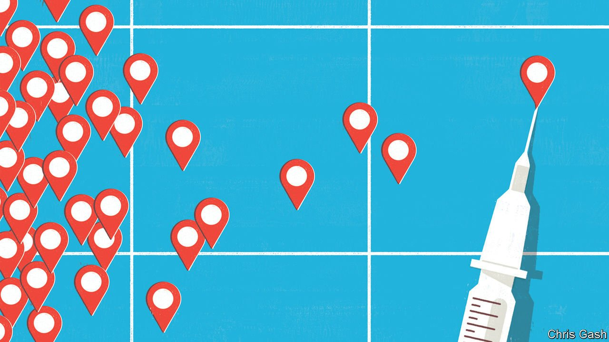
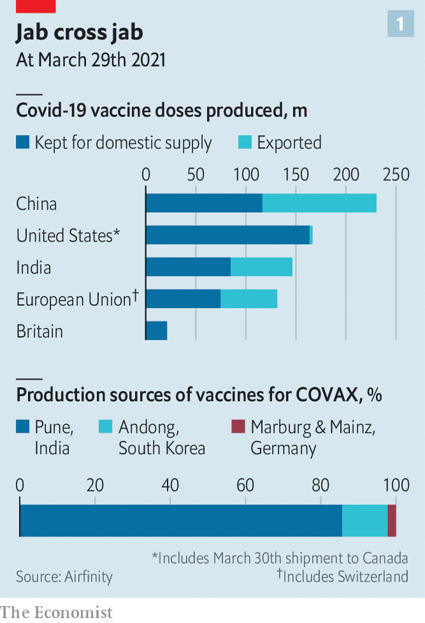
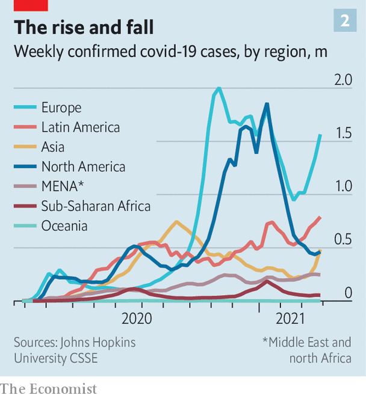

###### Spreading the needle

# Almost one billion doses of covid-19 vaccines have been produced 

##### The world is working out how to share them 

 

> Mar 31st 2021 

FLIGHT EK 787 touched down in Accra at 7.39am on February 24th. It was carrying 600,000 doses of AstraZeneca’s covid-19 vaccine. The shots arrived in Ghana from the Serum Institute in Pune, India—the biggest vaccine-maker in the world. It was the first delivery of jabs made through COVAX, a vaccine-sharing initiative.

COVAX was established last year to promote the supply of vaccines to countries that might otherwise struggle to obtain them. Some 192 nations joined. Each was promised enough jabs to inoculate 20% of its people. But on March 24th India put a temporary halt on vaccine exports. Since it provides 86% of supplies for COVAX, this has thrown a spanner in the works.


It is in the world’s interest to suppress transmission everywhere at the same time. New variants may emerge wherever the virus is able to spread unchecked by vaccines. The founders of COVAX started planning early. They were determined not to repeat mistakes made in 2009 in dealing with H1N1—or swine flu, a pandemic for which vaccines were difficult to obtain globally. They worked quickly to bring so many countries on board. By the end of 2020, it looked as if the extraordinary scientific effort that had produced vaccines in record time would be followed by an unprecedented co-operation to vaccinate one-fifth of the world. And yet even as growing quantities and varieties of vaccine are coming online, COVAX is now struggling to deliver.

Richard Hatchett is the head of the Coalition for Epidemic Preparedness Innovations, a charity in Norway. Along with Seth Berkley, head of Gavi, a vaccine-finance agency, he began in January 2020 to think about how to distribute any successful vaccines around the world.

Mr Hatchett worked in the White House during the H1N1 outbreak in 2009. That pandemic was far less serious than covid-19, but even then the issue of exporting vaccines was “incredibly fraught”, he says. Rich countries placed advance orders for vaccines, leaving poorer nations to depend on donations which were slow to arrive. He was determined to avoid the same thing happening with covid-19.

In early 2020 hundreds of covid-19 vaccine candidates were being concocted. “We had no idea whether any of these vaccines were going to work,” recalls Mr Berkley. Historically about 10% of vaccine candidates have proved successful. Experts feared that covid-19 vaccines might be particularly difficult to make. Rich countries made multiple upfront investments, guaranteeing their access to early doses.

The world needed a vaccine-buying club. The result was COVAX. It has secured at least 2bn doses, enough to protect health-care workers and the oldest and most vulnerable in all 192 of its members. Rich countries are paying for vaccines for poor ones. Before India’s export ban, COVAX had delivered 32m doses—mostly to low-income countries. So far the efforts to distribute vaccine in poor countries are looking more like the H1N1 forerunner than had been hoped. That picture should, however, change as the year goes on.

Rich nations representing just 14% of the world’s population had bought up 53% of the most promising vaccines, calculated Oxfam, a charity, in December. Nine out of ten people in poor countries, it added, would miss out in 2021. The EU has ordered 2.6bn doses for its 450m citizens. Too few have been delivered, so it has been considering banning the export of vaccines made in Europe. This will, its says, help it get its “fair” share.

 


Rich countries are not the only ones holding on to doses. The decision of India, a poor country that is currently the world’s third-largest vaccine-maker, to halt exports is a particular blow to COVAX. The alliance relies on India for most of its supplies (see chart 1). Some 40m doses expected in March and up to 50m doses in April will be delayed, crippling the scheme’s modest ambition of distributing 350m doses in the first half of the year.

It is true that rich countries have vaccines in far greater supply than poor ones. But it is also true that rich and middle-income countries, with their older and fatter populations, have been much harder hit by covid-19 (see chart 2).

 


Many poor countries are in Africa. The continent as a whole appears to have been less badly affected by covid-19, with a few big exceptions such as South Africa. This may be because of the relative youth of the continent’s population. Some worry that African cases and deaths are being dramatically undercounted. But Salim Abdool Karim, a South African epidemiologist, notes that the proportion of positive tests across the continent has been consistently below 10%. Colleagues across the continent are not reporting queues of patients with respiratory distress, says Dr Karim. None of this means that Africa should not get the vaccine it wants, but it may lessen the impact of the slow arrival of its vaccines.

In January Winnie Byanyima, the head of UNAIDS, the United Nations agency charged with dealing with the disease, said the world was witnessing “vaccine apartheid”. Yet at that time there was little enthusiasm among the mostly low- and middle-income countries of COVAX for the two vaccines, Pfizer and Moderna, that were available at that point, says Mr Berkley. They are costly and hard to distribute, since they must be kept unusually cold.

Instead the vaccine of choice for members of COVAX was the cheap and easy-to-distribute jab from AstraZeneca. Because the world was slow to fund COVAX, rich countries ordered many millions of doses before the alliance was able to start buying. But COVAX was able to obtain supplies from the Serum Institute in India and a manufacturer in South Korea. COVAX countries were also keen on shots being developed by Novavax and Johnson &amp; Johnson. Both were inexpensive and could be kept in normal refrigerators. The Johnson &amp; Johnson vaccine also looked as if it would require just one shot. These will arrive, but not until later this year.

One of the main problems for COVAX is that the AstraZeneca vaccine has taken longer to arrive than had been hoped. The World Health Organisation (WHO) did not grant emergency authorisation for its use globally until February 15th. Eight days later, the vaccine was being packed up in Pune for export to Ghana and Ivory Coast. And so it was that at the start of March the distribution of COVAX doses seemed at last to be under way.

Given COVAX’s limitations it has been galling to many experts to see rich countries snaffling doses of AstraZeneca from the Serum Institute—pushing COVAX supplies further down the queue. Britain has already taken 4.5m doses, and recently sent an envoy to India to try to secure another 5.5m. The EU is sniffing round, too.

Other countries are also far from blameless. Anxious to speed up their vaccine roll-out, various low- and middle-income countries have bypassed COVAX and obtained supplies directly from the institute or through the Indian government. According to Airfinity, an analytics company, Argentina, Brazil, Myanmar, Saudi Arabia and South Africa have between them taken 12m doses. Canada has snagged 500,000, and the UAE 200,000. India is keen to donate shots for political gain.

Emmanuel Macron, France’s president, has said that Europe and America should donate 4-5% of their supplies to developing countries. The Biden administration rejected this idea and opted to send money to COVAX instead. Meanwhile, America has millions of doses of AstraZeneca sitting unused. The national medicines regulator has not yet approved its use, but America has not donated its stockpile, either. When countries have shared any spare doses their donations seem to have been driven by politics and economics, rather than necessity or fairness. On March 18th America said it would loan 4m doses to Mexico and Canada, its closest neighbours.

Judging COVAX’s success has become difficult because the goalposts have shifted since last year. More vaccines are available for distribution than had been expected. That has helped, but the high efficacy of the new vaccines means that many countries are now keen to offer vaccines to most of their citizens—rather than just the most vulnerable ones. Indeed, with highly effective vaccines, something close to herd immunity might be possible.

I am not givin’ away my shot

The prospect of some countries deciding to give additional shots is further complicating attempts to work out how much vaccine is available to share. Last week Britain said that, from September, those aged over 70, health workers, and the clinically very vulnerable could get booster shots to protect against variants. Producing new variant vaccines will diminish the capacity to produce vaccines against the original strain. There is also talk of vaccinating children as well—when trials are completed. If rich countries decide to vaccinate children, this would further eat into what is available to suppress the virus globally.

COVAX has shown that a new medicine can be launched in rich and poor countries at about the same time, and that the supply of new medicines can be driven by pooling demand from the many small countries that are usually last in line for them. New deals mean COVAX may be able to supply its members with 27% of their doses this year. But without more support it will be unable to meet its most basic aim: to supply them with the first 3% of their jabs—enough to jab every health-care worker in the world.

Tedros Adhanom Ghebreyesus, the head of the WHO, wants all countries to start this task by April 10th, the 100th day of this year—and, as it so happens, the day by which the world is expected to have produced 1bn doses of vaccines, according to Airfinity. Inoculating only health-care workers will require only a small portion of the vaccines that the world is creating. Yet the year is rolling on and that task has barely begun. The world, warns Dr Tedros, is on the brink of “moral failure”. ■

Dig deeper

All our stories relating to the pandemic and the vaccines can be found on our . You can also listen to , our new podcast on the race between injections and infections, and find trackers showing ,  and the virus’s spread across  and .

