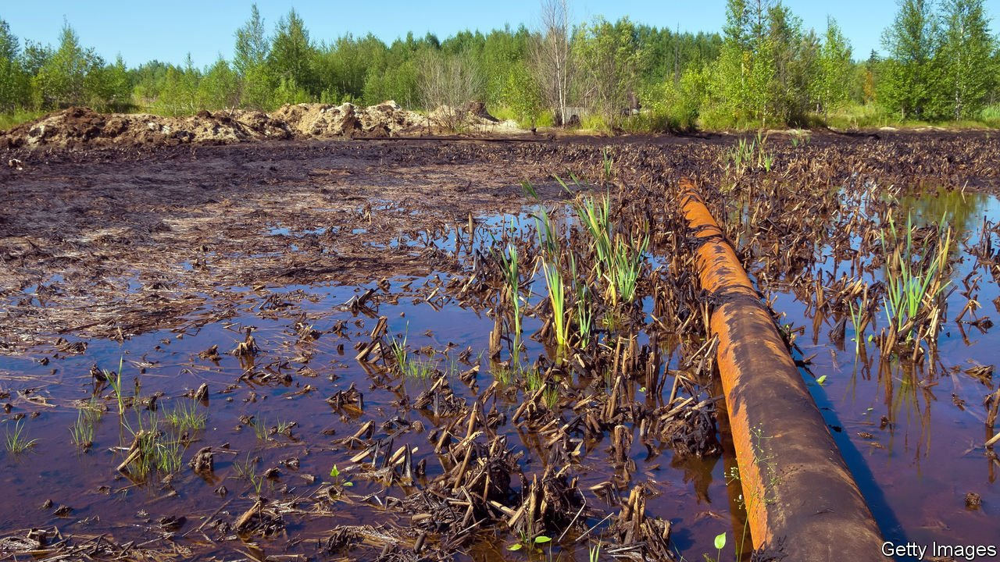

###### Put a plug in it

# Governments should set targets to reduce methane emissions 

##### It would rapidly make a difference to climate change 

 

> Apr 3rd 2021 

THE ORACLE of Delphi’s trance-like state is thought to have been induced by gases seeping into her chamber through a crack in the ground. Some say methane was part of the cocktail. If true, the gas has shaped the course of civilisations at least three times: in ancient Greece when wars were waged and kingdoms fell on the strength of the Oracle’s prophecies, in the 20th century when methane-fuelled machines helped power industrialisation, and today, when the gas is a central but under-appreciated part of the fight against climate change.

Human activity emits far less methane than carbon dioxide, but methane packs a heavier punch. Over the course of 20 years, a tonne of the gas will warm the atmosphere about 86 times more than a tonne of CO. As a result methane, sometimes called carbon dioxide on steroids, is responsible for 23% of the rise in temperatures since pre-industrial times. Carbon dioxide gets most of the attention, but unless methane emissions are limited there is little hope of stabilising the climate.


Unfortunately methane emissions have been anything but stable. After briefly stalling in the early 2000s, atmospheric concentrations of the gas started rising again in 2007. A global inventory, concluded last year, found that humans were largely to blame. Chief among the reasons for the rise are the gassy output of livestock farming (cows belch it), rice cultivation (soggy environments harbour micro-organisms that make it) and the fossil-fuel industry (pipelines and rigs leak it). Agriculture and energy each account for roughly one-third of annual methane emissions. China, America, Russia and other big energy producers and consumers are heavy polluters. Countries with lots of livestock produce a disproportionate share of farming-related emissions, too.

By how much do methane emissions need to fall? Carbon dioxide lingers in the atmosphere for centuries, making it hard to reduce its atmospheric concentrations. By contrast, methane has a half-life of roughly ten years, which means that it degrades quickly. If new emissions can be cut to below the rate at which old emissions deplete, the concentration of methane lingering in the atmosphere will soon fall, slowing global warming. The Intergovernmental Panel on Climate Change estimates that, to keep temperatures between 1.5°C and 2°C above pre-industrial levels, human methane emissions must drop to 35% below where they stood in 2010 by mid-century.

That is entirely plausible. A big step would be to stop millions of tonnes of methane from leaking out of fossil-fuel infrastructure each year, through pipes with holes, leaky valves and carelessness. Natural-gas operators will be able to sell more gas in exchange for a moderate investment in monitoring and repairing leaks. The International Energy Agency, a global forecaster, estimates that 40% of methane emissions from fossil fuels, equivalent to 9% of all human methane emissions, can be eliminated at no net cost for firms. The harder task is to reduce emissions from agriculture, but even here farmers can draw on new ideas, including  for livestock, and altering how rice is irrigated.

Natural gaps

Politicians and the public tend to worry about carbon-dioxide emissions and neglect the effects of cutting methane. But dealing with the gas would have a large effect rapidly and at relatively low cost. Governments are busy firming up their commitments to cut emissions under the Paris agreement, as they prepare for the COP26 climate summit in November. On April 22nd President Joe Biden will convene his own summit. America is expected to make its targets public around that time, which will almost certainly include a pledge to reduce emissions to net zero by the mid-2000s. It should go further and include a specific target for methane. Then other nations should follow its lead. ■

For more coverage of climate change, register for The Climate Issue, our fortnightly , or visit our 

