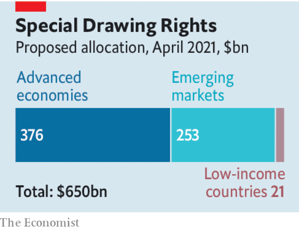

###### Special drawing wrongs

# Issuing special drawing rights will be a sign of failure for the IMF 

##### Poor countries need more help, but it should be transparent and targeted 

 

> Apr 3rd 2021 

THE IMF exists to provide emergency credit to solvent governments and to help insolvent ones regain creditworthiness. During the pandemic it has disbursed about $107bn to poor and middle-income countries which face the twin budgetary challenges of a big hit to growth and the need to spend on health care and vaccines. More is needed, particularly for the poorest countries. So the fund, which on April 5th will kick off one of its bi-annual jamborees, is readying additional financial firepower: a $650bn issuance of new “Special Drawing Rights”, or SDRs. The fund is doing the right thing, but with the wrong tool.

SDRs are often described as money or currency reserves, but the instrument is really an emergency overdraft. A country holding an SDR can exchange it for dollars or other hard currency at a fixed exchange rate and pay only a low interest rate, currently 0.05%, on the borrowing. Even better for the recipient, there is no date at which the debt must be repaid. The cash is stumped up by other IMF members, which the fund can compel to engage in the exchange (a power that it last used in 1987).


The appeal of issuing new SDRs is the relative ease of doing so. The credit lines they offer are unconditional, sidestepping the time-consuming negotiations that often precede IMF lending. Everyone gets them, so recipient countries and regimes have no reason to fear the stigma, political and economic, that can come with an IMF loan. And because the fund’s members are on the hook to honour SDRs, issuing them does not drain IMF programmes of resources. The usual political obstacle is the agreement of America’s government, which has enough votes at the fund to veto a new issuance. However, Janet Yellen, the treasury secretary, has recently given the nod, and the proposal is just small enough to avoid a vote in Congress.

 


Unfortunately the political simplicity of issuing SDRs stems partly from their economic complexity. They are a relatively opaque instrument which obscures the underlying transfers they make possible. (Whereas bondholders demand interest in proportion to risk, SDRs charge borrowers a uniform, artificially low interest rate.) The mechanism may get more complex still, should rich countries agree to lend their new SDRs to poor ones, in effect lending the right to borrow dollars. The universality of any issuance means that unsavoury regimes will benefit unless sanctions stop them from converting SDRs. Insolvent countries may use the cash to pay off Chinese creditors. Argentina will find it easier to  over its unpayable debts.

The bar to issuing SDRs should therefore be high. In the spring of 2020, when a widespread financial crisis looked possible, that bar was cleared, but the Trump administration opposed the idea. Today the economic and financial situation is more stable. It would be better to provide help in ways that are more transparent and targeted. The fund could rewrite the eligibility rules for its existing programmes. It could set up a relief fund that is specific to pandemic-related needs like health care and the purchase of vaccines, with the aim of . Rich countries could provide more aid.

Alas, these mechanisms would be more likely to spark disagreement between the countries involved and between governments and their voters. The SDR issuance is a technocratic workaround that, as a result, may end up as the primary channel of IMF support for many poor countries during the crisis. SDRs are better than nothing, but it reflects badly on the IMF and on the rich world that they have not found a better way to increase support for poor countries battling the pandemic. ■

