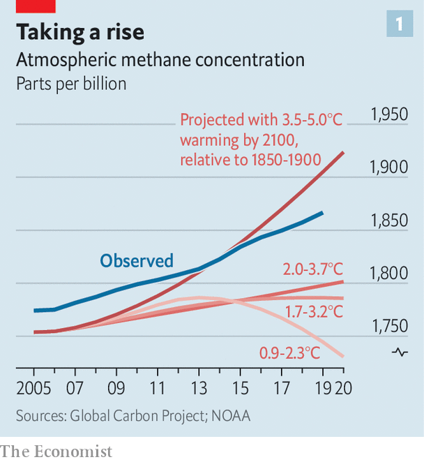
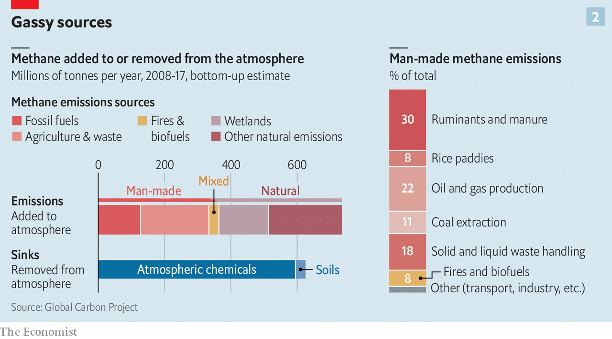

###### Global warming

# Those who worry about CO2 should worry about methane, too 

##### It’s the other greenhouse gas 

 

> Apr 3rd 2021 

POLITICS, OTTO VON BISMARCK is supposed to have said, is the art of the possible. And one of the most depressing features of discussions about global warming is their tendency to take place in a fantasy land of the politically impossible. Few people in those parts of the world made rich by carbon-dioxide-emitting enterprise are going to volunteer for a cut in living standards. And it is hard to ask those from parts of the world that are not yet rich to sacrifice the chance to become so.

That being the case, it makes sense to concentrate on doing things which affect neither the comforts of the former nor the aspirations of the latter. Technological change that shifts economies away from using fossil fuels as their principal energy sources may be able to achieve this in the long term. But some sort of effective action is also needed now.


Fortunately, one such course of action may indeed be available. For carbon dioxide is not the only cause of global warming. About a quarter of the effect is a consequence of a different gas, methane. And the methane problem looks a lot more tractable in the short term than does the carbon-dioxide one.

CO2 v CH4

Going after methane, a compound of one carbon atom with four hydrogens, makes sense, for it is a potent greenhouse agent. Over the 20 years subsequent to its emission a tonne of methane causes 86 times more warming than does a tonne of CO. Also, it does not hang around. It has a half-life in the atmosphere of about a decade, so what is released soon vanishes. By contrast, CO lingers for hundreds, or even thousands, of years. The Climate and Clean Air Coalition, a collaboration of governments and environmental lobby groups, therefore reckons that halving anthropogenic methane emissions over the next 30 years could shave 0.18°C off the average global temperature in 2050. That may not sound much, but it is between 20% and 45% of the gap between current temperatures and the goal, agreed on in Paris in 2015 by most of the world’s countries, of stabilising temperatures between 1.5°C and 2°C above pre-industrial averages.

Moreover, in many cases the cost of stopping emissions of methane can be offset against the fact that, unlike carbon dioxide, it is a valuable commodity. The International Energy Agency (IEA, an intergovernmental organisation based in Paris) estimates that 75% of emissions from the oil and gas sector—some 16.5% of total human emissions—could be avoided with technologies available today, and that 40% (9% of total human emissions) could be eliminated at no net cost.

 


The importance of tackling methane has become more apparent in the past decade and a half. After a plateau which began in 1999, concentrations of the gas in the atmosphere started rising again in 2007, a trend that continues to this day. At the moment, more than 300m tonnes are emitted every year as a consequence of human activity, and that rate is growing. As a result, methane concentrations are now more than two-and-a-half times what they were before the Industrial Revolution, and are rising faster than allowed for in all but the most pessimistic climate projections for the 21st century (see chart 1).

The rise after 2007 prompted a rush to understand methane’s sources and how it degrades in the atmosphere. That rise was originally seen as an anomaly, says Marielle Saunois of France’s Climate and Environmental Sciences Laboratory, “but now that it has been going on for 13 or 14 years, we see the plateau as the anomaly”.

Both ground-based and aerial studies show that leaky natural-gas pipes are one culprit. In 2018, for example, instruments mounted on planes flying downwind of Washington, Baltimore, Philadelphia, New York and Boston found that 850,000 tonnes of methane a year was wafting from these cities. That is roughly ten times the official estimate of the American government’s Environment Protection Agency (EPA). A bigger source of emissions, though, is further up the fossil-fuel supply chain—at the points where natural gas, oil and coal are extracted from Earth’s crust, processed and moved around the globe.

A study published in Science in 2018 measured leaks from a third of America’s natural-gas supply chain and oil-production sites. Extrapolating from this sample, the team involved estimated that some 13m tonnes of methane escaped from these facilities each year, approximately 60% more than the EPA’s official figures.

The IEA, meanwhile, estimates that each year the world’s coal mines liberate roughly 40m tonnes of methane that was once trapped in the coal being extracted. As a source of power, coal is on its way out, but not fast enough. It maintains a stronghold in Asia, and in China in particular, where it could stymie efforts to stabilise the climate. Researchers at Global Energy Monitor, an environmental lobby group that maintains a log of coal-related operations around the world, estimate that planned new mines will emit a further 13.5m tonnes a year. Their report, published in March, surveyed 432 mining projects, more than 100 of which are already under construction in China. As soon as a seam is opened it starts to emit methane. While a mine is active its methane is vented deliberately into the atmosphere to avoid explosions. But even once it has been closed it can carry on leaking the gas for decades.

The task of putting together all the data on sources of methane has fallen to an international collaboration called the Global Methane Budget, led by Dr Saunois. This seeks to understand what might be called the methane cycle, by tracing how much CH makes its way into and out of the atmosphere every year (see chart 2), and developing a model that describes this.

 


Gas pains

As the chart shows, besides leaky wells and pipelines, and gassy coal mines, methane is also emitted by belching cattle, rice paddies, forest fires, slash-and-burn agriculture, rubbish dumps, wastewater-treatment plants, cars and lorries, and natural ecosystems such as swamps, rivers and lakes. A perfect inventory would require knowledge of the size, nature and locations of all such sources around the globe—currently an impossible undertaking. Instead, researchers at the Global Methane Budget combine two methods, one bottom-up, the other top-down, to arrive at the best estimate they can.

The bottom-up approach is to scrape national and international sets of data for information on all possible sources of the gas (numbers and sizes of cattle herds, sizes and locations of paddies, inventories of fossil-fuel operations and so on), and then combine this with estimates of how much methane each type of source emits. The top-down approach employs direct satellite and ground-based measurements of methane concentrations. The two are reconciled by plugging the list of sources into a computer model intended to simulate the flow of methane from its sources and the way it is broken down in the atmosphere. This produces hypothetical atmospheric concentrations which can be checked against the real measurements. Mismatches are reduced by adjusting the modelled flows to arrive at a best estimate of what is actually happening.

Dr Saunois’s team published their first results in July 2020. They found that between 550m and 880m tonnes of methane per year were emitted between 2008 and 2017—roughly 9% more than the average between 2000 and 2006. Between 50% and 60% of this came from human activities, depending on whether the bottom-up or top-down method was used. Of these, roughly speaking, fossil fuels and agriculture each account for a third (see chart 3 for their global distribution), with the remainder coming from a combination of emissions from things like cars, fires, landfills and waste-water processing.

 


The post-2007 uptick in methane levels, the team found, was caused by extra human emissions, though there may also be some diminution in the atmosphere’s ability to destroy the gas. Thankfully, there was little sign of increased release of methane from Arctic tundra, which some fear may happen as the tundra warms.

Fossil-fuel emissions increased a lot in China over the decade that followed 2007, and to a lesser extent in other Asian countries, America, Africa and the Middle East. China, indeed, is the world’s largest methane emitter, an accolade it owes partly to its continued exploitation of coal. In spite of regulations brought in to encourage mine operators to use methane from their mines for such purposes as power generation, rather than venting it into the atmosphere, a study published in Nature, in 2019, found that the sector’s activities were still driving China’s methane emissions up. Europe was the only region to achieve a drop in emissions, in part thanks to policies to reduce the amount of biodegradable waste that is sent to landfill. 

The largest increases in agricultural emissions came from Asia, Africa and the Middle East—and agricultural sources, specifically livestock and rice paddies, are the most difficult of all to deal with. In both cases, the gas is produced by methanogenic microbes that live, respectively, in the animals’ guts and decomposing excrement, and in oxygen-poor waterlogged soil. Paddies (many of them in China, another reason for that country being top of the emissions league) account for 8% of man-made methane emissions. Varieties of rice that yield more grain for the same amount of methane could help reduce this, but a technologically simpler approach would be to switch to irrigating paddies for less time, which comes with the added bonus of saving water too.

The lion’s share of agricultural methane, though, comes from ruminant livestock—cows and sheep, mainly. Such husbandry generates 79% of the sector’s contribution. That amounts to 30% of all anthropogenic emissions.

Asking people to eat less meat and drink less milk, while fashionable at the moment in rich countries, probably goes against the Bismarckian principle of realism in the wider, middle-income world where discretionary spending is rising and diets are improving. But another option is to attack the methanogens themselves. This is now being investigated experimentally, to see if changing what the animals eat can damp down methanogenic activity.

Though it is probably not a practical solution at scale, some studies suggest a diet rich in certain seaweeds can decrease an animal’s methane emissions by as much as 80%. A compound called bromoform, abundant in these algae, inhibits the chemical reactions that produce methane inside the animals’ rumens.

Unfortunately, cattle fed enough seaweed to experience the 80% cut produce less meat or milk than they otherwise would. But another, more benign, dietary change does seem to help without side-effects. This is to add vegetable oils to ruminants’ diets. These are calorie-rich, but do not ferment in the rumen and therefore do not encourage methanogens. This approach can cut emissions by 11-18%.

More radically, methanogen activity can be disrupted by adding synthetic chemicals to animals’ diets. One such is 3-nitrooxypropanol, which gums up an enzyme the bugs use to generate methane. DSM, a Dutch firm, has turned this into a product, now awaiting approval for use in Europe, which it claims can reduce the amount a cow emits by 27-40%.

Just do it

That methane emissions are a prime target for reduction is an idea which has caught on with politicians, at least in rich countries. In October, the European Commission adopted a “European methane strategy”, the implementation of which will be thrashed out this year. The previous plan had been to cut the EU’s emissions in 2030 to a level 29% below those of 2005. That target has now been increased to 35-37%.

In America, meanwhile, methane policy has been yo-yoing. In 2020 Donald Trump, who was then the president, repealed regulations on monitoring and plugging methane leaks introduced by his predecessor, Barack Obama. Mr Trump’s successor, Joe Biden, says he will reverse this reversal, but is also under pressure from environmental lobby groups to go further, by setting a target of reducing emissions by as much as 65% by 2025.

 


Such lofty goals are worth little, though, if their consequences are not measured. Fossil-fuel companies naturally gather their own data privately. And several environmental organisations hunt for leaks in pipelines and so on using instruments mounted on cars and planes. Their goal is to shine a light on the issue, but their data are also frequently fed back to oil and gas operators, to help them patch up their pipelines. The Environmental Defence Fund says responses vary, but many firms are grateful for the additional feedback.

The Oil and Gas Methane Partnership (OGMP), a UN-led project, standardises methods for measuring and reporting methane emissions in the fossil-fuel industry. At the last count, it had recruited 66 companies which, collectively, produce 30% of the world’s oil and gas. Data collected through the OGMP will be fed into a new International Methane Emissions Observatory being cooked up by the UN Environment Programme and the European Commission. This will combine them with other measurements, including from the growing number of satellites that measure methane sources from above, to verify national and corporate accounting.

The jewel in that crown is MethaneSAT, scheduled for launch next year by an eponymous not-for-profit firm. This satellite will scan Earth’s surface every few days with a resolution of 1km, allowing it to monitor and report point-sources of gas from fossil-fuel operations. Its owners are also in discussions with the government of New Zealand to map the country’s agricultural infrastructure, including the location of herds of cattle, in order to track emissions there as well.

Better, more transparent data do, generally, lead to better outcomes. The Intergovernmental Panel on Climate Change envisages a 35% drop in methane emissions below 2010 levels by 2050. The IEA’s numbers suggest that 14% of this is possible in the oil and gas sector alone, at no net cost. Anything on top of that would help offset failures (which seem likely) to limit CO. And that, surely, is the stuff of excellent Bismarckian politics. ■

For more coverage of climate change, register for The Climate Issue, our fortnightly , or visit our 

