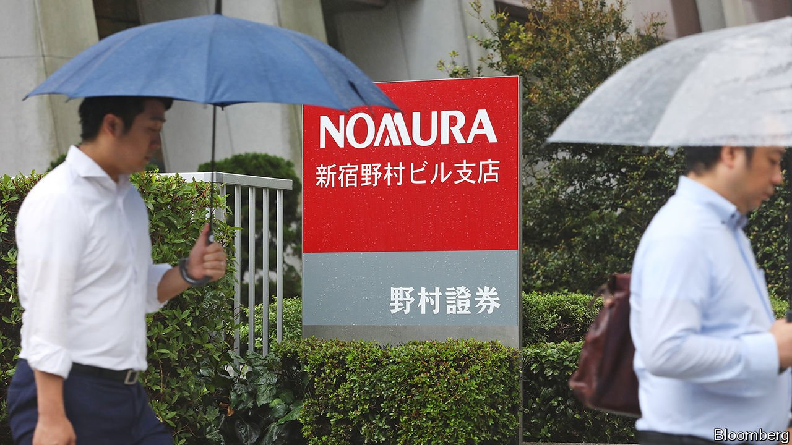

###### 

# Business this week 

#####  

 

> Apr 3rd 2021 

Banks scrambled to sell assets on behalf of , which manages the assets of Bill Hwang, an investor. Archegos has emerged as the firm that sparked a fire sale of $20bn-worth of technology shares, after its trading losses led its banks to make margin calls. Baidu, China’s biggest search engine, and ViacomCBS, a media giant, were among the affected shares that slumped. Credit Suisse and Nomura, two banks, have warned that they could incur hefty losses from their dealings with Archegos.

The Federal Reserve said that on June 30th it would lift the remaining restrictions on banks from buying back shares and paying out dividends, measures it brought in during the covid-19 crisis. Banks may still face such curbs if they do not have the capital to pass the next round of stress tests.


South Africa’s central bank left its main interest rate unchanged at 3.5%, in contrast to central banks in Brazil, Russia and Turkey, which have all raised rates recently.

Voting closed among workers hoping to join a union at an Amazon warehouse in Alabama. The effort to unionise all the employees at one of the retailer’s facilities is a first, and adamantly opposed by the company. Strikes by unionised Amazon workers in Europe over pay and conditions, such as in Germany this week, are becoming more commonplace. Amazon is the current bad face of Big Tech for Democrats. Elizabeth Warren, a trustbusting senator, accused it recently of exploiting tax loopholes, and once again warned that she would fight to break the company up.

We support “the motherland’s cotton industry”, said one Chinese clothing firm, as it and other Chinese domestic retailers benefited from a  for raising concerns about forced labour in  Xinjiang, which produces a fifth of the world’s cotton. The nationalistic backlash is aimed at companies such as Adidas, Burberry, H&amp;M and Nike. These Western firms are caught between the Chinese boycott and pressure from government and consumers back home not to kowtow.

All afloat

Vessels began sailing through the Suez canal again, after a giant container ship that had got stuck was freed. The  held up an estimated $9.6bn-worth of goods each day. Human error on board the Ever Given is now thought to have caused the ship to become wedged—not strong winds, as first reported.

The Biden administration launched an ambitious plan to boost America’s wind-power industry. Its goal is to deploy 30 gigawatts of offshore-wind capacity in the United States by 2030, generating enough power for 10m homes for a year. America presently has only two small offshore farms, but a new wind-energy area is proposed for the New York Bight, shallow waters between Long Island and New Jersey.

Volkswagen ended its six-year investigation into the emissions-cheating scandal that wiped billions off its market value in 2015, and decided to pursue claims for damages against Martin Winterkorn, the carmaker’s chief executive at the time, and Rupert Stadler, the former head of Audi, VW’s luxury brand. VW alleges that Mr Winterkorn failed to clarify the circumstances behind the use of unlawful software functions in diesel engines between 2009 and 2015.

Lloyd’s of London swung to an annual loss in 2020, because of a surge in claims related to the pandemic. The insurance and reinsurance market estimates that the global insurance industry will have to fork out $203bn because of cancelled events and other disruptions.

Deliveroo’s IPO started badly, when its share price dropped at the start of the first day of trading. The flotation of the British food-delivery firm was the most hotly anticipated IPO on the London Stock Exchange for years. However, some asset managers have shunned the stock amid worries that Deliveroo might face the same crackdown in Britain as Uber has on its gig-economy conditions for workers.

Cazoo, another British online-success story, said it would go public on the New York Stock Exchange by merging with a special-purpose acquisition company through a $7bn business combination. SPACS enable startups to list shares without the grind of an IPO.

The end of the paper chase

Generating a buzz on a par with last year’s flotation of Snowflake, UiPath, a maker of business software that eliminates the need for employees to carry out “low-value, manual tasks”, such as filling in forms, filed for its IPO in New York. Founded in Bucharest and based in New York, UiPath develops “robotic process automation” technology, using artificial intelligence to replicate a worker’s actions. That could help UiPath’s own finance department, which has disclosed accounting errors stretching back to 2018.

