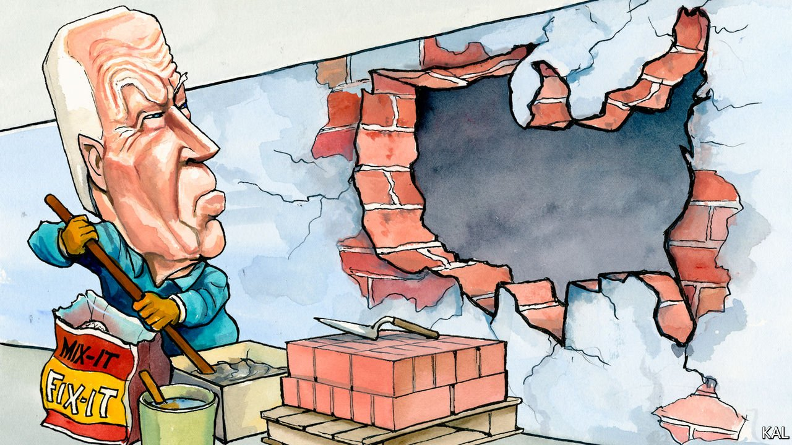

###### Lexington

# Joe Biden’s strong start 

##### The administration unveils a plan to rebuild America 

 

> Apr 3rd 2021 

DONALD TRUMP’S most encouraging promise in 2016 was his pledge to splurge a trillion dollars on America’s roads, railways and “many, many bridges that are in danger of falling”. Federal spending on infrastructure was at the lowest level in six decades. The need for such investment was as pressing as he claimed. And it seemed plausible that a non-ideological Republican, with a love of grand projects and debt, could be the man to get it done.

All that came of this was a rather tiresome joke. “Infrastructure week”, an event the White House press team announced valiantly from time to time, became an intra-beltway euphemism for the Trump administration’s incompetence and efforts to distract from its many scandals. By contrast Joe Biden’s unnamed but actual “infrastructure week”, which he was due to mark with a speech in Pittsburgh shortly after this column went to press, points to his administration’s far greater seriousness.


He wants to spend an additional $2trn on infrastructure, hard and soft, over the next eight years. He envisages fixing 20,000 miles of road, stripping lead piping from 400,000 schools and installing 500,000 charging outlets for electric cars. He would spend $400bn on the care industry; and $180bn on research and development in low-carbon technologies. Such a spurge, which the administration claims it will pay for by hiking corporation taxes, would be unprecedented in recent decades. It would be more than twice as big as the stimulus Mr Biden oversaw in 2009. It would be in addition to the nearly $2trn of covid relief he has just approved.

The historical parallels this is encouraging sound even more audacious. After an Oval Office meeting with Mr Biden, Michael Beschloss, a historian, suggested “the Biden era” would stand comparison with two of the most transformative Democratic presidencies of the past century, those of Franklin Roosevelt and Lyndon Johnson. How seriously should such talk be taken?

There are a few reasons to think Mr Biden will be able to pass his plan. The covid-19 crisis has exposed deep vulnerabilities and normalised vast federal expenditures. It has increased the friction with China that he offers as part of the rationale for his push on economic competitiveness. His plan’s promise of incentives for firms that build supply chains at home points to that directly.

The crisis has also afforded Mr Biden an early opportunity to build momentum. Impressive as his administration’s messaging and grip have been, he inherited the pandemic at an opportune time, with vaccines available and unemployment dipping. And if the Trump administration set the conditions for progress, it also set a low bar for it. Merely by offering sensible advice and consolation to the bereaved, Mr Biden has presented a strong positive contrast with his predecessor. Over 70% of Americans approve of his handling of the vaccination roll-out and covid relief package.

The post-Trump landscape is helping him in other ways, too. Most important, it has united Mr Biden’s party behind him in fear and gratitude, giving him the wherewithal to pass legislation despite the fragility of its majority. The Republicans are meanwhile spiralling rudderless into cultural grievance—which, though not helpful in itself, is nevertheless usefully clarifying. Unlike Barack Obama, who is considered to have squandered his opportunity in a doomed search for bipartisan compromise, Mr Biden knows he must look to his party to pass laws. His infrastructure plan appears to have been drafted largely on that basis. A last-minute change to cover it through tax rises, not deficit spending, appears to have been in response to Mr Biden’s most demanding Democratic colleague, Senator Joe Manchin.

Thus has the administration made headway and, at this early stage, shown a clearer sense of purpose than perhaps any since Ronald Reagan’s. Mr Biden has not been distracted by events, including the latest gun massacres and border mess. Even Republicans say his modest talents have never looked better. Hill Democrats expect to pass three substantial pieces of legislation, including the covid package and probably an infrastructure one, before the mid-term elections. Such a record would compare very favourably with that of Mr Obama, who has not always given Mr Biden the respect he felt he deserved. Yet some of the bigger claims being made for his putative “New New Deal” require qualification. 

A decade of political dysfunction since the last big economic reform—Mr Obama’s health-care policy—has put Americans expectations of their government at a record low. Most of the investment Mr Biden is calling for would represent not trailblazing but catch-up. In 5G telecoms, transport networks and much else, America lags behind China, among many other countries. The fact that it has taken such unusual post-plague, post-populist circumstances for Mr Biden to stand a fighting chance of closing that gap underlines how constrained American politics has become. Especially as Mr Biden’s fiscal solutions—occasioned in part by the near impossibility of getting non-budget bills through Congress, given the higher vote-threshold they require—are not sufficient to address some of the problems he is aiming at.

The stimulus of 2009 created thousands of jobs and boosted renewable-energy firms. But because Congress did not pass the carbon-pricing scheme Mr Obama wanted, it probably did not reduce emissions much. Mr Biden envisages Congress passing a renewable-energy mandate to go with his spending; it probably won’t.

Where the rubber hits the road

Roosevelt and Johnson changed the political order. FDR’s economic policies created a new settlement between government and society that lasted four decades. LBJ enfranchised millions of black Americans. By comparison with such titans, Mr Biden’s spending plans appear more a case of trying to cram in change before the mid-terms than changing the paradigm. But set that aside. Compared with any of his recent predecessors, the new president’s ambitions are monumental. ■

See also: 

