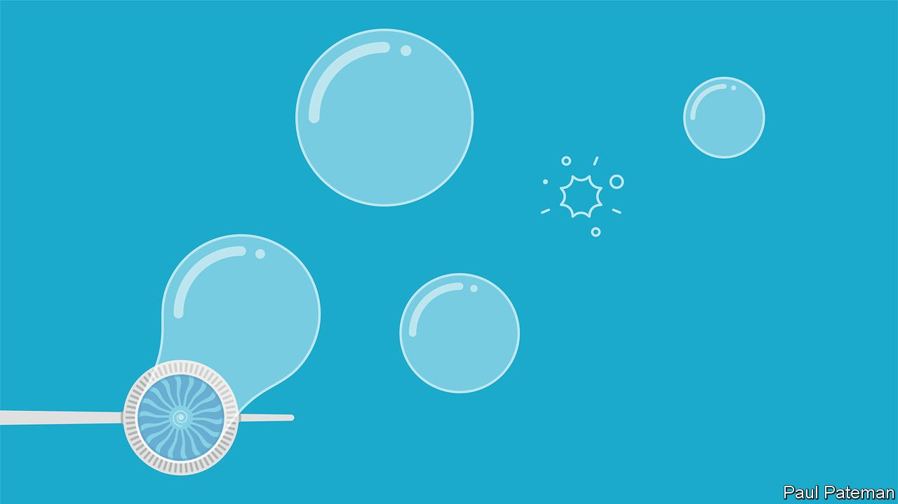

###### Banyan

# Asia’s air bridges and travel bubbles will expand only slowly 

##### Resuming travel between Australia and New Zealand has been hard enough 

 

> Apr 10th 2021 

MORE THAN a year after they shut their borders, Australia and New Zealand will soon have a go at quarantine-free travel. From April 19th residents of the two countries can fly across the Tasman Sea to do business, see family and friends—or just revel in the novelty of holidaying in another country.

The trans-Tasman bubble is not the first between countries that have brought cases of covid-19 infections close to zero. That prize goes to Taiwan and the closest country with which it has diplomatic relations, Palau. On April 1st 96 Taiwanese tourists and the jubilant president of Palau, Surangel Whipps, took off from Taipei for the tiny Micronesian state, where the tourism industry has been hammered. Yet it is hardly unfettered travel. Taiwanese holidaymakers must test negative for covid-19 at the airport. In Palau they may travel only in approved tour groups, stay in designated hotels and follow specific itineraries. Back in Taiwan they must eschew public transport, restaurants and crowded places for five days. They cannot even share rooms with family members at home. Still, it beats the only other reason to get on a plane: two-hour “flights to nowhere”.


The trans-Tasman bubble is a bigger deal. Before the pandemic, the 1.5m Australians who visited New Zealand each year accounted for 40% of all international visitors. For months New Zealand’s prime minister, Jacinda Ardern, who has vigorously policed covid-19 at the country’s borders, resisted Australian pressure for a bubble so long as localised outbreaks persisted in Australia. “As much as I know that our tourism cities and towns really want the return of Australians,” Ms Ardern said this week, justifying the long wait, “I know they equally do not want the return of covid, full-stop.”

Yet the trans-Tasman bubble, for which neither tests nor vaccinations are needed, will not be just like flying was in the old days. There are contact-tracing forms to fill out. Mask-wearing in airports and on flights will be compulsory. On landing, passengers will be sequestered from arrivals from other places. Above all, any fresh outbreak of the coronavirus in Australia could mean Kiwi travellers are stranded or, upon return, subjected to a full 14 days of supervised quarantine. Some of Banyan’s Aussie acquaintances express reluctance to book a Kiwi skiing holiday in case the air bridge buckles.

Getting the trans-Tasman bubble going hints at the challenge of expanding bubbles across Asia. Cook Islanders are free to go to New Zealand without any quarantine, and Kiwis may soon be allowed to go the other way. A planned Hong Kong-Singapore bubble, which popped at the last minute because of a new wave of infections in Hong Kong late last year, may yet be reinflated. Thailand, meanwhile, wants to welcome holidaymakers from Hong Kong. But it is awkward for Hong Kong to allow travel to too many other places before it is possible to go to the rest of China—a step the authorities on the mainland are not yet ready to allow.

Singapore, meanwhile, has talked with several places about bubbles. But it does not want to move before it hosts the World Economic Forum in August. It plans to use that event to showcase its handling of the pandemic and is loth to risk spoiling the story.

Singapore and Australia, like other Asian countries with good pandemic records, may not start blowing multiple bubbles until their populations have reached herd immunity through vaccinations. Qantas, an Australian carrier, does not expect flights to Singapore and beyond before October. Yet that raises two other complications. One is bureaucratic. It will be impossible, says an airline executive, to resume travel when relying on “bits of paper” as proof of covid-19 vaccination or negative tests. Yet governments have been slow to agree on a digital standard, although Singapore signed up to the International Air Transport Association’s this week.

The bigger stumbling block is the slow roll-out of vaccines across Asia, both because of shortages of supply and because of reluctance to get the jab. In Hong Kong,  is driven by abysmal trust in government. Vaccination programmes in Singapore and Australia are also going more slowly than hoped. And so a paradoxical prospect: travel in North America and Europe, which have handled the pandemic badly but are doing better with vaccinations, may resume more quickly than among countries in Asia, which have handled the pandemic well but struggle to get shots in arms.

Dig deeper

All our stories relating to the pandemic and the vaccines can be found on our . You can also listen to , our new podcast on the race between injections and infections, and find trackers showing ,  and the virus’s spread across  and .

