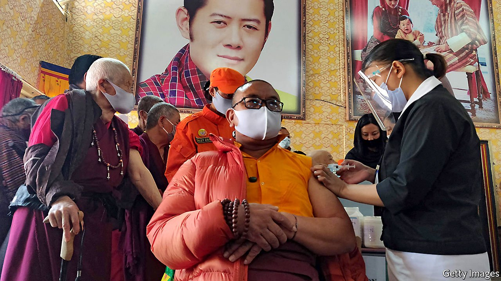

###### One-week wonder

# Bhutan vaccinated almost all adults against covid-19 in a week 

##### Only Israel and the Seychelles have inoculated a higher share of the population 

 

> Apr 10th 2021 

WHEN INDIA presented Bhutan with a generous gift of covid-19 vaccines in January, the neighbouring kingdom made an unusual choice. Rather than rush to inoculate all 800,000 of its citizens, the government sought advice from the Zhung Dratshang, a body of Buddhist monks. The stars were not auspicious, they ruled. Better to wait two months, and then to make sure that the first dose be both administered by, and given to, a woman born in the Year of the Monkey.

So Bhutan waited until March 27th before Tshering Zangmo administered the first jab to Ninda Dema. The injection took place at a school in the capital, Thimphu, at the auspicious hour of 9.30am, after prayers were chanted and butter lamps lit. But then there was no dallying. Within a single week a world-beating 85% of Bhutan’s adult population had received a first shot. Only two countries, Israel and the Seychelles, have vaccinated a (slightly) higher proportion of people, but both took months to do so (see chart).


Credit is due not only to Bhutan’s astrologers, but also to its political leaders. Jigme Khesar Namgyel Wangchuck, the “Dragon King”, formed the Guardians of Peace, an orange-jumpsuited national-service corps that has helped to set up and staff more than 1,200 vaccination stations across the country. The prime minister, Lotay Tshering, is himself a doctor and the health minister, Dechen Wangmo, holds degrees in cardiology and epidemiology from prestigious American universities. 

 


Elected in 2018 on a platform that emphasised public health, their government has responded vigorously to the pandemic. Quarantine measures have been strict: in March the king himself spent a mandatory week in isolation after returning to Thimphu from a tour of southern provinces, and the prime minister locked himself away for 21 days following an official trip to Bangladesh. 

Mr Tshering, whose Facebook page is largely devoted to keeping the public informed about covid-19, explains that because the logistics of vaccine storage and delivery are complex, and because some people suffer side effects and everyone will need a booster shot, it made sense to foster popular acceptance by turning the campaign into a lively national event. The tight schedule was sensible for another reason, too. India, Bhutan’s traditional benefactor, did not provide its tiny ally with a full vaccine supply all at once. Waiting for enough to arrive allowed the Bhutanese to avoid rationing. By vaccinating everyone quickly, Bhutan has also put subtle pressure on India, which is facing its own supply troubles, to deliver the required boosters soon. 

Although Bhutan has suffered only a single death from covid-19, it is not without troubles. Unemployment is at a record high, albeit of only 5%. The cost of green chillies, a main ingredient (along with yak cheese) of ema datshi, the staple dish, has reached an eye-watering 700 ngultrum a kilo—nearly $10. The home minister recently resigned after allegedly making a false insurance claim on his car. Another scandal, involving army officers and judges, plus a lady go-between, is making tongues wag. Then again, these are problems the rest of the world would love to have. ■

Dig deeper

All our stories relating to the pandemic and the vaccines can be found on our . You can also listen to , our new podcast on the race between injections and infections, and find trackers showing ,  and the virus’s spread across  and .

