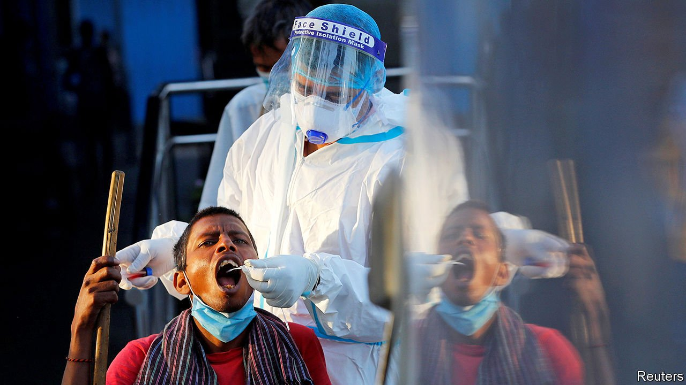
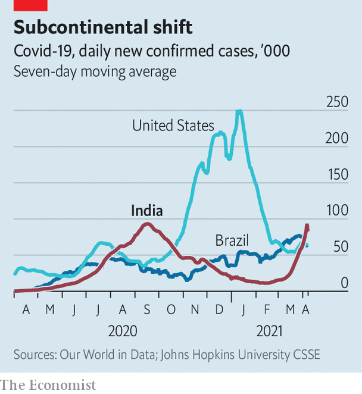

###### Indian brink

# India is recording more cases of covid-19 than any other country 

##### South Asia is becoming the hub of the pandemic 

 

> Apr 8th 2021 

ON APRIL 7TH India detected more than 125,000 new cases of covid-19—more than any other country in the world. The same day neighbouring Bangladesh registered far fewer—just over 7,600—but that was nonetheless a record for the country. Pakistan, too, is suffering a surge in infections, with the president, prime minister and minister of defence among those afflicted. In all three countries, testing in rural areas is almost non-existent, so the official tally of cases is likely to be a drastic undercount. On its current trajectory, South Asia, home to a quarter of humanity, will soon eclipse the European Union as the centre of the pandemic. Having suffered almost 200,000 known deaths from the disease already, the region is on the verge of further tragedy.

Cases in India have been rising shockingly fast. They leapt from 15,000 a day to 100,000 a day in just a month. India now eclipses America and Brazil, the two next most afflicted countries, in terms of new infections (see chart). Just one of India’s 28 states, Maharashtra, accounts for half of these cases, suggesting that overall numbers will continue to surge as the wave spreads more widely around the country.


Bangladesh, India and Pakistan are all vaccinating as fast as they can, but given the scale of the task their efforts are too little and too late. India, a big producer of vaccines, is taking the lead. Starting in January, a phased roll-out prioritised first doctors and nurses, then the elderly and those at high risk. As the urgency grew, private hospitals were invited to join the campaign, which was widened on April 1st to everyone 45 or older, even as vaccination centres were instructed to remain open seven days a week. The government has also ordered the biggest maker of vaccines, the privately owned Serum Institute of India, to suspend exports. 

 


To date, India has dispensed about 90m doses. It is administering more than 3m a day. But, experts say, in a country of 1.4bn this is not fast enough to flatten the curve of infection. That would take more like 10m a day. Pressure has mounted for the government to open the spigot further by licensing new vaccines, by allowing private dispensers to charge a price determined by the market and by removing age as a criterion for eligibility. But until more of the half-dozen or so vaccines under development in India are certified and enter mass production, perhaps by midsummer, demand will outstrip supply. 

It does not help that the current wave appears to be powered by more virulent strains of covid-19. Genetic sequencing of virus samples from the Indian state of Punjab in March found that 80% of patients were infected with the fast-spreading B.1.1.7 strain first detected in Britain last year. Other worrying variants have emerged, including one in Maharashtra dubbed the “double mutant”. 

Happily, India’s capacity to test for and treat the disease is also growing rapidly. Uddhav Thackeray, the chief minister of Maharashtra, says that over the past year the number of labs in the state that can test for covid-19 has risen from two to more than 500, and hospital beds equipped for covid patients have multiplied by a factor of 37. Most Indian health workers are vaccinated, and doctors say they are getting better at treating covid-19 patients. 

Yet labs and hospital beds are heavily concentrated in India’s largest metropolises. In an urgent circular on April 2nd the central government warned that it was smaller towns and “peri-urban areas” that are now experiencing the biggest surge in cases. Hospitals in Nagpur, Nashik and Pune, big cities in the interior of Maharashtra, report a distressing rise in numbers of villagers arriving with advanced illnesses, too late to be helped. Chhattisgarh, a poor, overwhelmingly rural state adjacent to Maharashtra that was relatively untouched in the first wave of the pandemic, has also seen a big spike.

Pune, ironically the headquarters of the Serum Institute, is currently India’s worst-afflicted district, reporting some 13,000 new cases a day. Almost a third of tests there are positive—a strong indication that covid-19 is far more rampant than the official numbers suggest. The municipal authorities have announced a week-long shutdown from April 3rd, halting public transport, closing all shops and places of worship and imposing a nightly curfew. 

Similar local measures are slowly spreading across the country. Delhi, which had begun a staged reopening of schools only in February, has abruptly shut them all again. But the central government is not likely to repeat the harsh nationwide lockdown that it imposed a year ago. Then, tens of millions of poor migrant labourers were left stranded and the economy contracted by 24% in a single quarter. It has since limped back to life, but the government is wary of making any moves that could delay recovery. Similarly nervous, Bangladesh has ordered a week-long lockdown, but has exempted garment factories, the country’s main export earner. 

Vimal Bhatt, an IT worker in hard-hit Mumbai, the capital of Maharashtra, says he can count 40 people in his extended family alone who have had covid-19, though luckily none with serious symptoms. “All of them work from home,” he shrugs, “But you have to pop out now and then if only to buy vegetables, and that’s when it gets you.” Hersh Kapadia, who is employed by a large brokerage in the city centre, says his company has refused to allow work from home, even though a dozen of his colleagues have fallen ill. Avoiding the crowded canteen, he takes lunch at his desk. Will he complain? “Are you crazy?” he says. “All of us just keep our heads down and work. I’m lucky to have a job.”

Luckily for India and its neighbours, death rates from covid-19 appear relatively low, even allowing for significant undercounting. That is probably in part because South Asia’s population is relatively youthful and thus less susceptible to the disease. Diet, climate and previous exposure to pathogens may also play a role. But there is also a natural lag of several weeks between infections and deaths, so fatalities are likely to rise substantially across the subcontinent later this month. The pandemic’s second wave in South Asia will get worse before it gets better. ■

Dig deeper

All our stories relating to the pandemic and the vaccines can be found on our . You can also listen to , our new podcast on the race between injections and infections, and find trackers showing ,  and the virus’s spread across  and .


