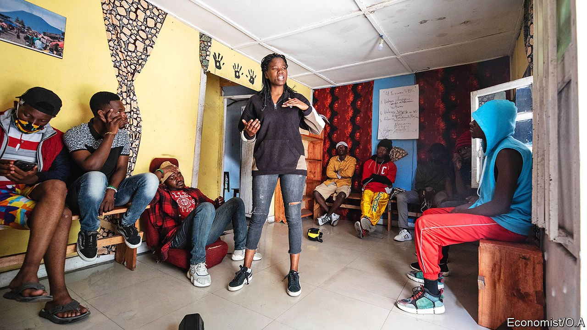

###### Rhyme for your life

# Spoken poetry finds fans in eastern Congo 

##### Young people put their anger and hopes into slam 

 

> Apr 10th 2021 

IN A SMALL, dimly lit room one recent Saturday morning, a group of Congolese slammers are chanting about politics and art, poverty and sex. They tower over the seated audience, gesticulating wildly. The listeners laugh, jeer and occasionally join in by repeating refrains or clapping. This is exactly how slam is meant to be. Marc Smith, an American former builder who hosted the world’s first slam event in Chicago in 1984, would be impressed.

Mr Smith promoted slam, a form of spoken-word poetry, as a way of liberating rhymes from the page and making them accessible. Like rappers, slammers do battle, but they are judged by the audience. As well as giving marks out of ten at the end of performances, attendees express their opinions by cheering or heckling. Slam reached Goma, a city of some 1m people in embattled eastern Congo, five years ago when a handful of young men began watching YouTube videos of slammers across the world. They were inspired by the raw, uncensored rhymes of artists such as Grand Corps Malade (Large Sick Body), a tall French slammer with spinal injuries who writes about racism and loneliness in suburban Paris.


“There was a lot of appetite for slam here,” says Ben Kamuntu, one of Goma’s early slammers. “Young people wanted to break away from silence, we wanted to express ourselves.” With its sprawling tin-roofed houses and unpaved side-streets, Goma is a far cry from Chicago’s skyscrapers, but the same slam fervour spread among its youth as it did when Mr Smith first promoted the idea in America. Soon, more than a hundred people were meeting to practise, clubbing together to rent a small house where they could slam. Before the pandemic hit, the best exponents put on shows in Goma’s bars and restaurants.

When one slammer, a slight 22-year-old called Rita Zaburi (pictured), was asked by a friend why she spent so much time alone in her room, she decided to respond in verse. On the morning of your correspondent’s visit, she stands up, shyly at first, and slams about what it means to be a poet. “It is not about being a sorcerer, healing wounds with the magic of your creativity,” she begins in French. “It is about denouncing the evils that swallow our society.”

Actually, Goma’s slammers do both. Their city has been surrounded by warring armed groups for over 20 years. Rebels, who generally fund themselves by smuggling gold, coltan and wood, often kidnap people on nearby roads. In February men wielding Kalashnikovs intercepted two UN cars less than 30 miles from Goma; they hauled out the Italian ambassador, his bodyguard and driver and shot them. People in the region are slaughtered with machetes and guns every month. Militiamen terrorise women by raping them.

Ms Zaburi and four other female slammers help women who have been raped or beaten in weekly “slam-o-therapy” workshops. The participants—some attacked by rebels, others by their husbands—learn to write about their experiences. One of their number, Deborah, slams about what the group means to her: “I love you, you respect me, we give each other advice, we are working together to build a community,” she intones in Swahili. When Deborah was 15, her parents forced her to marry a man who came home drunk and beat her most nights. She gave birth to a child who died in infancy and eventually ran away from the abuse. Slam helps her relax, she says. “It is a way to have fun, to de-stress, it helps me to put the pain behind me.”

The men who established the slam scene in Goma are also among the city’s most prominent activists. Mr Kamuntu, for example, wrote some of his best slam in prison, where he was locked up for two months after protesting against the refusal of Joseph Kabila, a former president, to leave power. But slam in Congo is about more than airing political anger. Goma’s young slammers are exuberant. “People tell tales about what has happened in their neighbourhoods, recount love stories, make jokes,” Mr Kamuntu says. “Even if there is no electricity in a street, there is still life in that street and a joy at being alive that must be expressed.” ■

